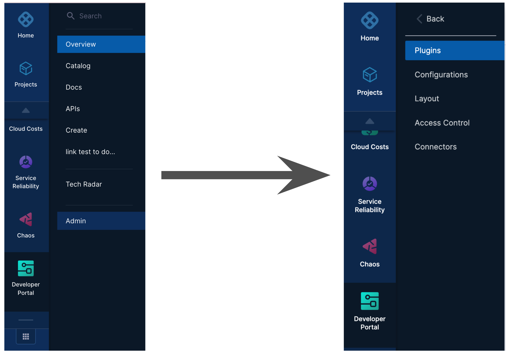
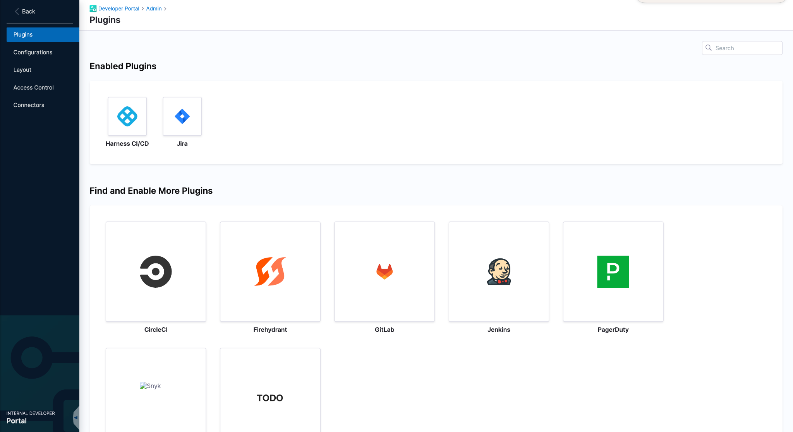
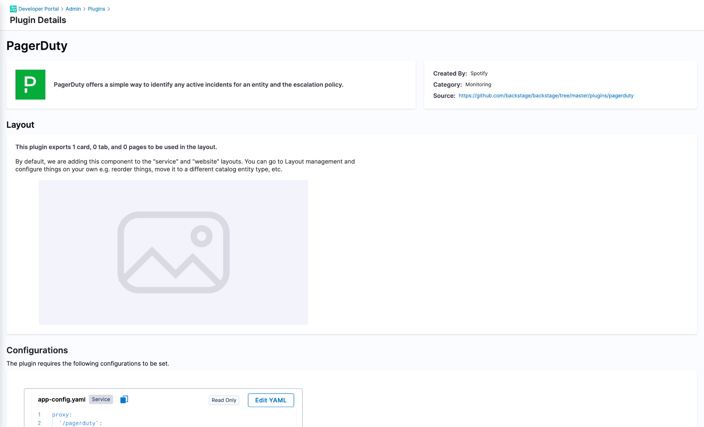
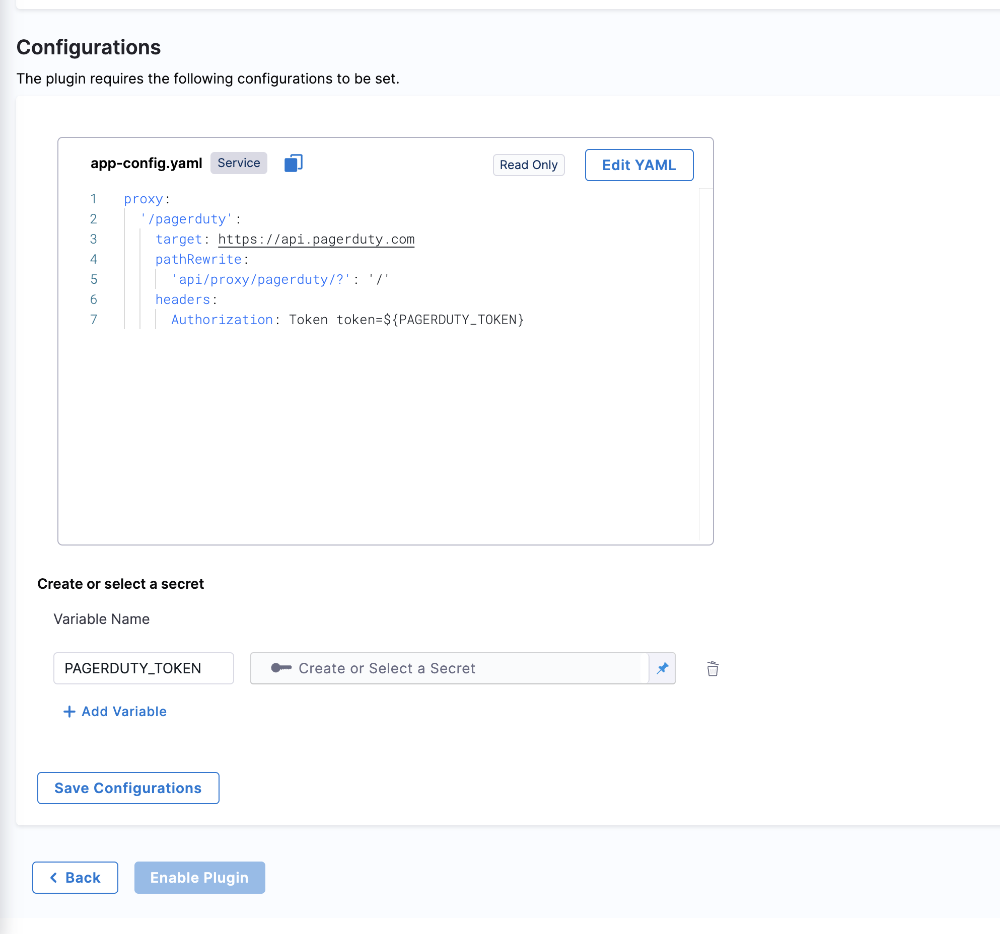

You can use plugins to extend the functionality of Harness IDP and to customize IDP to suit your needs. This article provides step-by-step instructions on how to enable a plugin in Harness IDP.

**Prerequisites**

Before you enable a new plugin, ensure that the following prerequisites are met:

- Harness IDP is provisioned and accessible.
- Onboarding for your Harness account is completed.

**Plugin types**

Harness IDP offers a set of curated plugins that can be enabled. Here are some plugin types that you can consider:

- A card in the Catalog - e.g. Pagerduty
- A plugin with a tab in the catalog - e.g. GitHub insights
- A plugin with both cards and tabs (multiple components) - e.g.
- (Optional) A plugin with both UI and backend parts
- A plugin with both UI and backend as well as a DB e.g. TODO plugin
- A full page plugin - e.g. GraphiQL

These are just a few examples of plugin types available in Harness IDP. Depending on your requirements, you can choose the plugin type that best aligns with your needs and enables the desired functionality in your IDP.

**Next Steps:**

Once you have selected the desired plugin type, you can proceed with enabling the plugin following the specific instructions provided by Harness IDP. The enabling process may involve configuration, activation, and updating layout steps which will vary depending on the plugin.

**Process:**

To enable a plugin, users can follow these steps:

1. All the admin configurations are provided in the Admin panel. Once users with admin permissions are onboarded, they can access the Admin option in the side nav. Clicking on the Admin section will navigate the user to the Admin view, where they can see multiple options such as Plugins, Layout, Connectors, Configurations, Access Control, and more.

2. The "Plugins" navigation option will direct the user to the plugins list page, which showcases a collection of curated plugins. On this page, there are distinct sections dedicated to both enabled and disabled plugins, providing a clear differentiation between the two categories.

3. In the Plugins navigation, click on the desired plugin card. This will redirect users to the Plugin details screen, which provides information about the plugin such as its name, details, plugin layout, configurations, and the option to add a plugin secret.

4. The plugin's layout section is read-only and displays the exported cards, tabs, or pages provided by the plugin.

5. In the configuration section, a default config YAML is provided, which can be edited using the YAML editor. Users have the option to customize the configuration based on their requirements.

6. Below the configuration, users can update the plugin secret token value as specified in the config YAML. Make sure the secret token name is the same as given in the config YAML.

7. After verifying all the configurations and secret details, users can save the configuration. If the config YAML is valid, the plugin configuration will be saved successfully. Otherwise, appropriate error messages will be displayed.

8. Upon saving the configuration, the "Enable Plugin" button will automatically be enabled. Users can enable the plugin by clicking on this button.

9. Once the selected plugin is enabled, it will be moved to the "Enabled Plugins" section on the Plugins List page. Users can navigate to this page by clicking on the "Back" button.

10. After enabling the plugin, users are required to ingest the layout using plugin layout management. The layout should be modified according to the exported elements from the plugin, which may include cards, tabs, and pages.

For instance, if the Jenkins plugin exports one card and one tab, in order to display them in your catalog entity, the user must update the layout accordingly. To add a dedicated tab for the Jenkins plugin, follow these steps:

- From the dropdown menu, select the domain option.
- Search for the "ci-cd" component within the domain.
- Inside the Entity Switch case, insert the following code snippet.

These are the simple steps to enable a plugin in Harness IDP. Finally, the user will be able to view the enabled plugins in the catalog section of Harness IDP. To see the enabled plugins, the user simply needs to register the plugin catalog info YAML.
