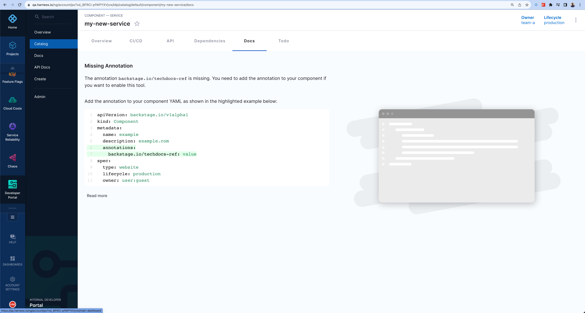

By default, the "Docs" tab in your catalog will be empty for a new software component. However, let's quickly get our markdown docs rendered for the component on the "Docs" page in the catalog.



1. Create a `docs` directory next to where you have `catalog-info.yaml`.
2. Inside the `docs` directory, create a `index.md` file with the following contents.

```
# Welcome!

This is a basic example of documentation. It is intended as a showcase of some of the
features that TechDocs provides out of the box.

## Basic Markdown

Headings:

# h1

## h2

### h3

#### h4

##### h5

###### h6

Here is a bulleted list:

- Item one
- Item two
- Item Three

Check out the [Markdown Guide](https://www.markdownguide.org/) to learn more about how to
simply create documentation.

You can also learn more about how to configure and setup this documentation in Backstage,
[read up on the TechDocs Overview](https://backstage.io/docs/features/techdocs/).

## Table Example

While this documentation isn't comprehensive, in the future it should cover the following
topics outlined in this example table:

| Topic   | Description                                                  |
| ------- | ------------------------------------------------------------ |
| Topic 1 | An introductory topic to help you learn about the component. |
| Topic 2 | A more detailed topic that explains more information.        |
| Topic 3 | A final topic that provides conclusions and lessons learned. |

## Learn more about MkDocs

TechDocs uses MkDocs as the static site generated. Visit https://www.mkdocs.org for more information about MkDocs.
```

3. Edit the `catalog-info.yaml` and add the TechDocs annotation.

In the `metadata.annotations` field, add `backstage.io/techdocs-ref: dir:.`.


4. Hit the refresh button on the catalog component page.


5. Now navigate to the `Docs` tab and your docs will be available shortly!


