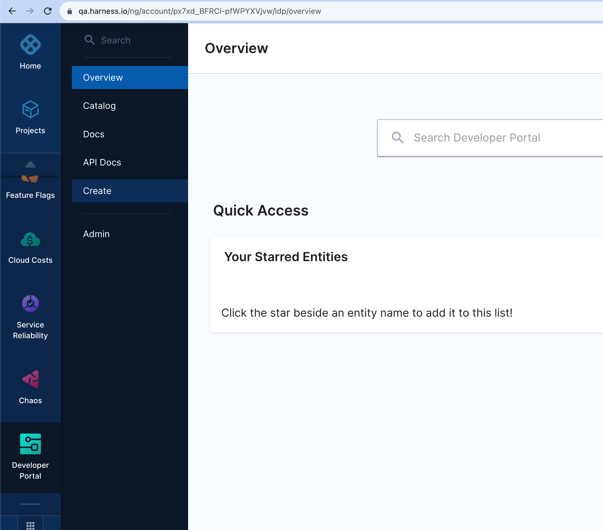

Any new Software Component can be registered in the software catalog by creating a `catalog-info.yaml` file in your Git repository and registering its url.

## Create a new `catalog-info.yaml`

If you want to register an existing software component, navigate to its repository. If it is a mono-repo, navigate to its directory and create a `catalog-info.yaml` at the root of the directory. The file can technically live at any place e.g. `.harness/catalog-info.yaml`. Feel free to use this sample YAML -

```yaml
apiVersion: backstage.io/v1alpha1
kind: Component
metadata:
  name: my-new-service
  description: Description of my new service
  annotations:
    pagerduty.com/integration-key: <sample-service-integration-key>
  tags:
    - java
  links:
    - url: https://admin.example-org.com
      title: Admin Dashboard
      icon: dashboard
      type: admin-dashboard
spec:
  type: service
  lifecycle: production
  owner: team-a
  system: project-x
```

The key fields for you to update here are

1. `metadata.name` - This should be a unique name of your component, usually the name of the service.
2. `metadata.description` - The description of your new component.
3. `spec.type` - The new software component could be a `service`, `library`, `website` or something else.
4. `spec.owner` - The user group identifier of the team who owns the component.

Once the file is created on your git, copy the full URL to the file e.g. `https://github.com/harness-community/idp-samples/blob/main/catalog-info.yaml`.

Navigate to the `Create` from the sidebar. Click on the "Register Software Component".




Enter the URL to your new `catalog-info.yaml`.


Click import.


The new component will be available in your catalog.


