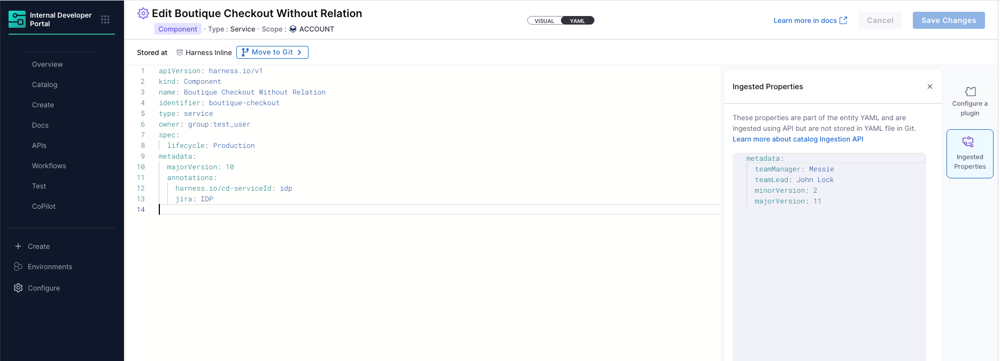

# Ingested Metadata in YAML Editor

In Harness IDP 2.0, the Git Experience (GitX) enables a seamless flow between the YAML editor in the UI and Git repositories. Entities such as services, systems, and resources are defined and version-controlled via YAML files stored in Git. However, many metadata properties—such as team ownership, versioning information, or quality scores—are frequently updated by external systems. These properties are ingested dynamically using the Ingestion API but are intentionally not written to the Git-backed YAML.

This is to avoid unnecessary commit noise and ensure live data can be attached to entities without cluttering Git history.

Starting with this release, the YAML editor in Harness IDP now includes a built-in view for displaying ingested metadata alongside the Git-synced YAML. This ensures users can see a complete picture of their service definitions—including dynamic data from tools like scanners or scorecards—without manually modifying the YAML file in Git.

This separation of Git-backed and ingested data preserves Git history accountability while providing transparency into system-managed properties. Users are still responsible for managing source-of-truth YAML in Git, while ingested metadata reflects runtime or tool-generated values that update independently of version control.

In the YAML editor, Harness now provides a way to view this ingested metadata without misleading users into thinking it’s Git-tracked. These properties are shown in a dedicated panel and not embedded directly within the YAML text.

The editor maintains a clean separation between Git-synced definitions and runtime metadata, while still offering full visibility to users.

Users can click the **Ingested Properties** button in the editor to open a side panel that shows dynamic metadata currently attached to the entity. This metadata appears in a YAML-like format but is read-only and is not committed to the Git repository.

### Behavior Summary

- Ingested metadata is attached via the Ingestion API and appears in the IDP UI.
- These properties do not appear in the Git YAML and are not committed.
- A side panel allows users to view them alongside the YAML editor.
- A static notice is shown to clarify that the data is not stored in Git.
- This ensures users are not confused about the origin or mutability of such metadata.

### Editing and Conflicts

If a property exists both in the Git YAML and via the Ingestion API, the ingested version is shown in the side panel and may override the display in IDP views. The YAML editor itself only reflects Git-tracked values. If users wish to version-control such metadata, they can manually edit the YAML to include those values.

### Viewing Ingested Metadata

To view ingested properties in the YAML editor:

1. Open any component or service in edit mode.
2. Switch to the **YAML** view.
3. Click **Ingested Properties** on the right-hand side.
4. The panel will display the metadata ingested via API in a read-only YAML-like format.

For example, metadata like `teamManager`, `teamLead`, or `minorVersion`—which are not stored in Git—will be visible here.
