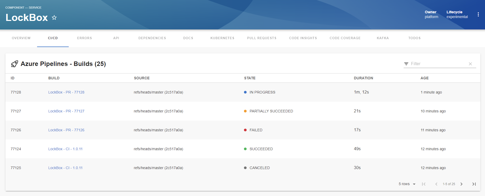
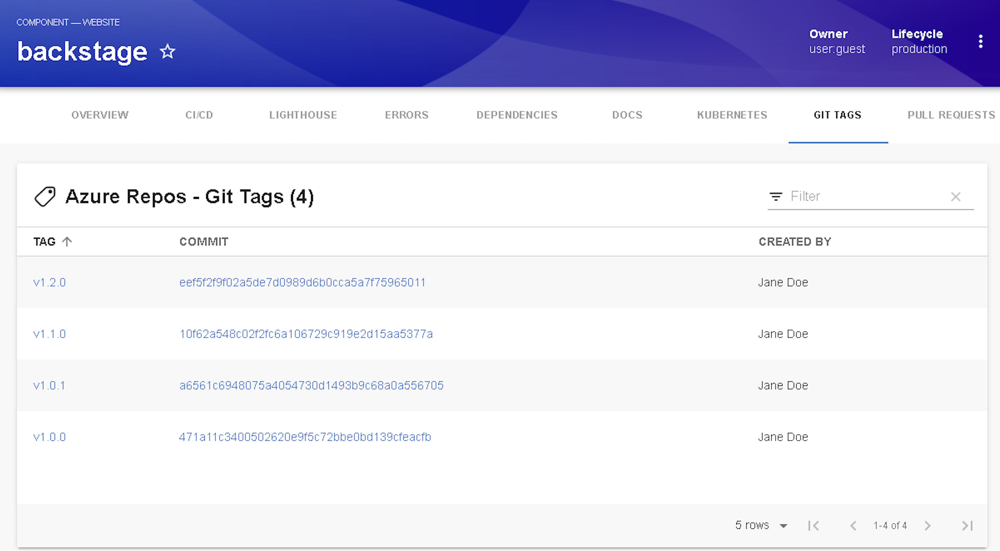

| Plugin details |                                                                               |
| -------------- | ----------------------------------------------------------------------------- |
| **Created by** | keyloop                                                                      |
| **Category**   | CI/CD                                                                         |
| **Source**     | [GitHub](https://github.com/backstage/community-plugins/tree/main/workspaces/azure-devops/plugins/azure-devops#azure-devops-plugin) |
| **Type**       | Open-source plugin                                                            |

## Configuration

### Application configuration YAML

This plugin requires a backend proxy configuration to make calls to Azure Pipelines with authentication. The following configuration is set by default, and you need to add the `host`, `token` and `organization`

```yaml
azureDevOps:
  host: dev.azure.com
  token: ${AZURE_PERSONAL_ACCESS_TOKEN}
  organization: your_organization_name
```

### Secrets

Since the `AZURE_PERSONAL_ACCESS_TOKEN` variable is used in the application configuration, you must generate a [Personal Access Token](https://docs.microsoft.com/en-us/azure/devops/organizations/accounts/use-personal-access-tokens-to-authenticate?view=azure-devops&tabs=preview-page) with read access to both Code and Build and set it as the value of `AZURE_PERSONAL_ACCESS_TOKEN`.

### Delegate proxy

If the host is on a private network, ensure that you include the host URL in this section. If the host is accessible publicly, skip this section.

After adding the host, you can select one or more delegates that have access to the host. If you leave the delegate selectors field empty, it is assumed that all delegates in the account have access to the host/cluster.

:::note

When adding the host, include only the host name. Remove the protocol (HTTP/HTTPS) and any port number associated with it.

:::

## Layout

_No Action Required_

This plugin exports an overview page card, UI tab that you can use as a new CI/CD tab for a service or for any other layout page and a Git Tags page. Go to **Admin** > **Layout**, select **Service** in the dropdown menu, and you can view this YAML code in the **CI/CD** section:

```yaml
- name: EntityAzurePipelinesContent
    path: /azure-pipelines
    title: CI/CD
    contents:
    - component: EntityAzurePipelinesContent
- name: EntityAzurePullRequestsContent
    path: /pull-requests
    title: Pull Requests
    contents:
    - component: EntitySwitch
        specs:
        cases:
            - if: isAzureDevOpsAvailable
            content:
                component: EntityAzurePullRequestsContent
- name: EntityAzureGitTagsContent
    path: /git-tags
    title: Git Tags
    contents:
    - component: EntitySwitch
        specs:
        cases:
            - if: isAzureDevOpsAvailable
            content:
                component: EntityAzureGitTagsContent
```

The `isAzureDevOpsAvailable` condition is met when the `dev.azure.com/project-repo` annotation is present in the software components' `catalog-info.yaml` definition file.





## Annotations

To configure the plugin for a service in the software catalog, set the following annotation in its `catalog-info.yaml` definition file:

```yaml
metadata:
  annotations:
    dev.azure.com/project-repo: <project-name>/<repo-name>
```
Let's break this down a little: `<project-name>` will be the name of your Team Project and `<repo-name>` will be the name of your repository which needs to be part of the Team Project you entered for `<project-name>`.

### Git Integration

Add the azure integration under git integration section. Follow this [doc](https://developer.harness.io/docs/internal-developer-portal/get-started/setup-git-integration/?Connector=azure-connector)

### Mono repos

If you have multiple entities within a single repo, you will need to specify which pipelines belong to each entity.

```YAML
dev.azure.com/project-repo: <my-project>/<my-repo>
dev.azure.com/build-definition: <build-definition-name>
```
### Pipeline in different project to repo

If your pipeline is in a different project to the source code, you will need to specify this in the project annotation.

```YAML
dev.azure.com/project-repo: <project-with-source-code>/<my-repo>
dev.azure.com/build-definition: <build-definition-name>
dev.azure.com/project: <project-with-build-code>
```
### Azure Pipelines Only

If you are only using Azure Pipelines along with a different SCM tool then you can use the following two annotations to see Builds:

```YAML
dev.azure.com/project: <project-name>
dev.azure.com/build-definition: <build-definition-name>
```

In this case `<project-name>` will be the name of your Team Project and `<build-definition-name>` will be the name of the Build Definition you would like to see Builds for, and it's possible to add more Builds separated by a comma. If the Build Definition name has spaces in it make sure to put quotes around it.

### Multiple Organizations

If you have multiple organizations you'll need to also add this annotation:

```YAML
dev.azure.com/host-org: <host>/<organization>
```

For this annotation `<host>` will match the host value in the git integrations of azure which you have set up in git integration section and `<organization>` will be the name of the Organization that is part of the host.

If the entity we are viewing lives in the my-other-org organization then the dev.azure.com/host-org annotation would look like this:

```YAML
dev.azure.com/host-org: dev.azure.com/my-other-org
```

And if the entity was from yet-another-org it would look like this:

```YAML
dev.azure.com/host-org: server.company.com/yet-another-org
```

## Support

The plugin is owned by keyloop and managed in the [Backstage repository](https://github.com/backstage/community-plugins/tree/main/workspaces/azure-devops/plugins) as an open-source project. Create a GitHub issue to report bugs or suggest new features for the plugin.
