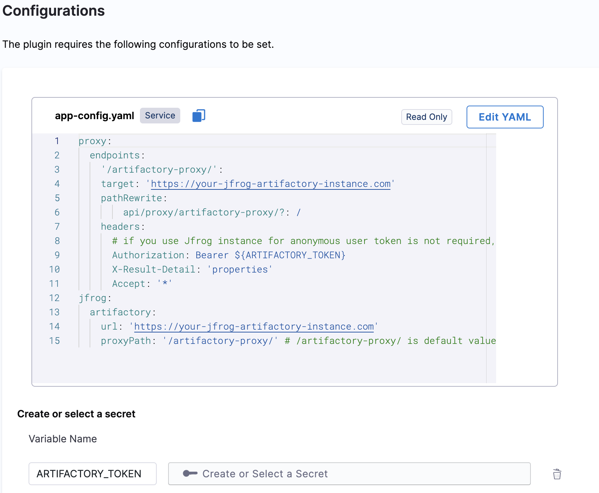
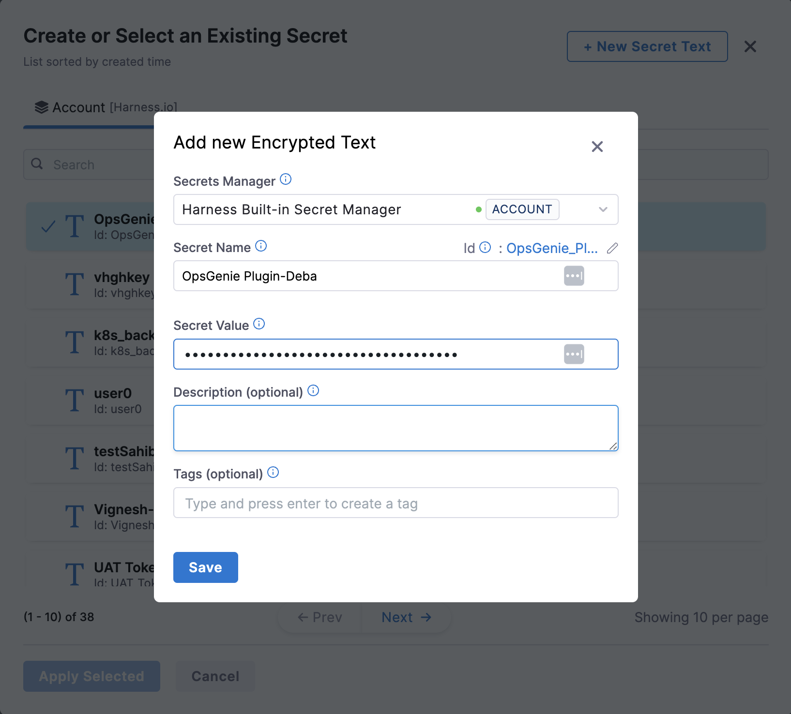

| Plugin details |                                                                                |
| -------------- | ------------------------------------------------------------------------------ |
| **Created by** | [Vity](https://github.com/Vity01)                                                      |
| **Category**   | Discovery                                                                       |
| **Source**     | [GitHub](https://github.com/Vity01/backstage-jfrog-artifactory-libs) |
| **Type**       | Open-source plugin                                                             |


## Configuration

### Application configuration YAML

This plugin requires a backend proxy configuration to make calls to JFrog with authentication.

- Under the **Plugins** tab in **Admin**, go to `app-config.yaml` and **Edit YAML** to configure your jfrog endpoint in the **target** field and add your **artifactory URL (used for UI browse links)** in the format as shown below.

```yaml
# app-config.yaml
proxy:
  endpoints:
    '/artifactory-proxy/':
    target: 'https://your-jfrog-artifactory-instance.com'
    pathRewrite:
        api/proxy/artifactory-proxy/?: /
    headers:
      # if you use Jfrog instance for anonymous user token is not required, but it is also required for Docker package type
      Authorization: Bearer ${ARTIFACTORY_TOKEN}
      X-Result-Detail: 'properties'
      Accept: '*'
jfrog:
  artifactory:
    url: 'https://your-jfrog-artifactory-instance.com'
    proxyPath: '/artifactory-proxy/' # /artifactory-proxy/ is default value
```



### Secrets

- You need to add the ARTIFACTORY_TOKEN as a Harness Secret. 

- **Create secret in Harness** to store API token, click on “New Secret Text” and enter values as shown below.



## Layout

_No action required_

This plugin exports a page that you can use as a new **jfrog** page on the **sidenav**. The following configuration is set by default in **Layout** under **Sidenav Layout** and you do not need to change anything:

```yaml
- name: SidebarItem
  props:
    to: JFrogLibVerPageContent
    text: JFrog
```

This plugin exports the `JFrogLibArtifactCard` that you can show on the **Overview** tab of a service or any other layout page.  The following configuration is set by default in **Layout** under **Catalog Entities** for **Service** and you do not need to change anything:

```YAML
- component: JFrogLibArtifactCard
```

Also you could add a conditional like `isJfrogArtifactAvailable` which is met when `jfrog.com/artifactory-artifact` annotation is present in the software components's `catalog-info.yaml` definition file.

```YAML
- name: Overview
path: /
title: Overview
contents:
- component: EntitySwitch
      specs:
        cases:
          - if: isJfrogArtifactAvailable
            content:
              component: JFrogLibArtifactCard
```

## Annotations

- Artifact details are correlated to IDP entities using an annotation added in the entity's `catalog-info.yaml` file.

```YAML
  metadata:
    annotations:
      # -- required values --
      jfrog.com/artifactory-artifact: 'artifact-name'
      jfrog.com/artifactory-repo: 'maven-local'

      jfrog.com/artifactory-group: 'com.mycompany' # optional string - can be blank for pypi, necessary for Maven repos

      # -- optional values --
      jfrog.com/artifactory-scope: 'compile' # optional string, one of these [compile, test,provided,runtime,classpath,optional]
      jfrog.com/artifactory-packaging: 'aar' #optional string, eg. `aar` 
```

And that's it! The plugin should now be integrated into your Harness IDP, and you should see the Artifact card when you navigate to the entity page where it's included.

- For a docker image you define repository and artifact name. Both formats are supported:

```YAML
  metadata:
    annotations:
      # -- required values --
      jfrog.com/artifactory-artifact: 'docker.mydomain.com/mygroup/my/artifact-name' # or simply 'mygroup/my/artifact-name' 
      jfrog.com/artifactory-repo: 'docker-local'
```

[Read more](https://github.com/Vity01/backstage-jfrog-artifactory-libs?tab=readme-ov-file#catalog-infoyaml)

## Support

The plugin is owned by Vity and managed in this [repository](https://github.com/Vity01/backstage-jfrog-artifactory-libs) as an open-source project. Create a GitHub issue to report bugs or suggest new features for the plugin.

