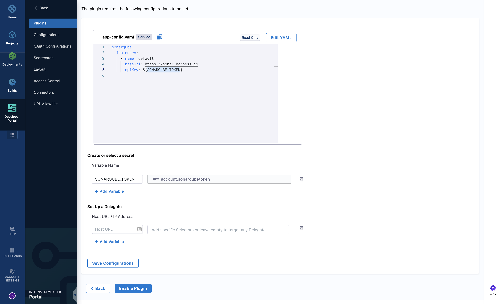
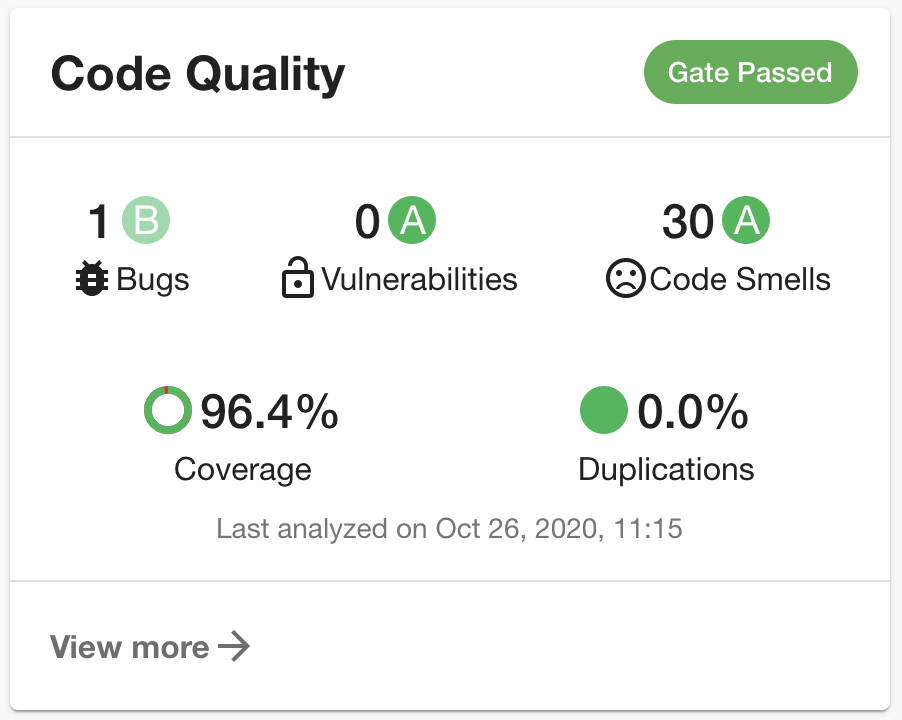

| Plugin details |                                                                                |
| -------------- | ------------------------------------------------------------------------------ |
| **Created by** | [SDA SE](https://sda.se/)                                                      |
| **Category**   | Quality                                                                        |
| **Source**     | [GitHub](https://github.com/backstage/community-plugins/tree/main/workspaces/sonarqube/plugins/sonarqube#sonarqube-plugin) |
| **Type**       | Open-source plugin                                                             |


## Configuration

### Application configuration YAML

- Under the **Plugins** tab in **Admin**, go to `app-config.yaml` and **Edit YAML** to configure your SonarQube instance in the **target** field.



### Secrets

- Go to SonarQube, "eg: `https://sonar.your-comapny-name.io/account/security`", for generating a new token, **Enter Token Name** and choose **User Token** in **Select Token Type**. 

:::info

Ensure that the user creating the token has the necessary permissions to access the specified instance and project mentioned in the [annotations](/docs/internal-developer-portal/plugins/available-plugins/sonarqube#annotations). Additional troubleshooting information can be found [here](/docs/internal-developer-portal/plugins/available-plugins/sonarqube#troubleshooting).

:::


- **Create secret in Harness** to store API token, click on “New Secret Text” and enter values as shown below.


### Delegate proxy

- If SonarQube is deployed on-prem, `sonar.mycompany.com` will not be accessible from outside, so a delegate proxy has to be selected. Please ensure you have [Harness Delegate installed](https://developer.harness.io/docs/platform/delegates/install-delegates/overview) for the same. 


## Layout

This plugin exports a UI card that you can show on the **Overview** tab of a service or any other layout page.  The following configuration is set by default in **Layout** under **Admin** for **Service** and you do not need to change anything:

```yaml
- component: EntitySonarQubeCard
          specs:
            gridProps:
              md: 6
```



## Annotations

To configure the plugin for a service in the software catalog, set one of the following annotations in its `catalog-info.yaml` definition file.

The following configuration is recommended:

```YAML
metadata:
  annotations:
    sonarqube.org/project-key: <instance-name>/<project-key>
```
The `instance-name` is optional if there is only one SonarQube instance, as the default instance from the plugin configuration will be used.

[Read more](https://github.com/backstage/community-plugins/tree/main/workspaces/sonarqube/plugins/sonarqube#sonarqube-plugin)

## Troubleshooting

### 401 Unauthorized 

- Check for the validity of the user token added as secrets.
- Ensure that the user token you have used has access permission to the instance mentioned in the annotation.

### There is no SonarQube project with key 

- We need to use the `project_id`, **not** the project name. The `project_id` can be found in the URL, where it appears as `?id=project-id`
- Ensure that the user token you have used has the permission to view the project mentioned in the annotation, because the SonarQube token configured in the secret is Base64 encoded. Non-encoded tokens will not work with this plugin and will result in authentication failures or missing project data.
- The `sonarqube.org/project-key` annotation is of the correct format `<instance-name>/<project-key>`. 

## Support

The plugin is owned by SDA SE and managed in the [Backstage repository](https://github.com/backstage/community-plugins/tree/main/workspaces/sonarqube/plugins) as an open-source project. Create a GitHub issue to report bugs or suggest new features for the plugin.
