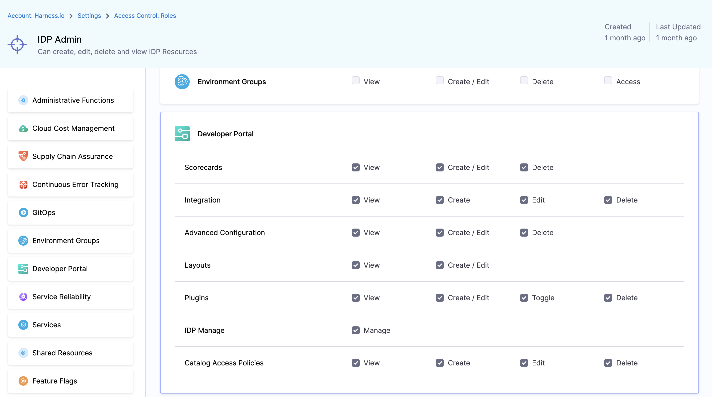
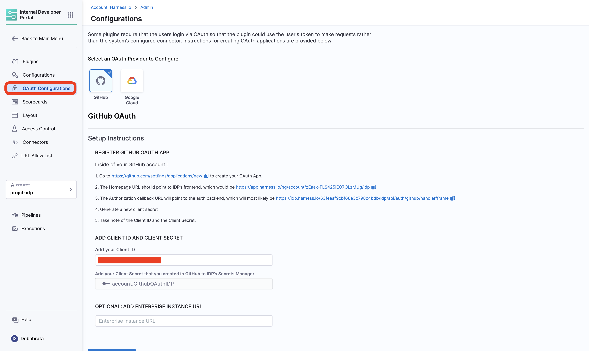
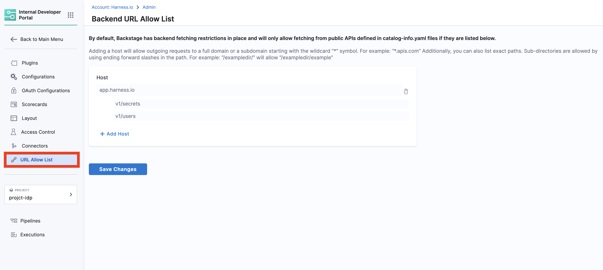
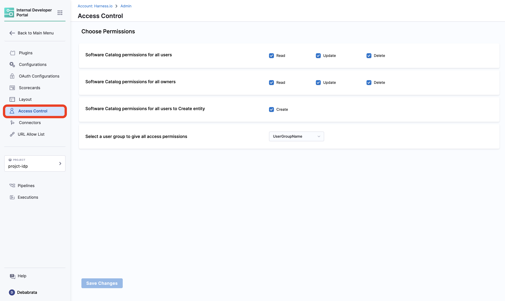

## Introduction

Role-based access control ([RBAC](https://www.harness.io/blog/rbac)) lets you control who can access your resources and what actions they can perform on the resources. To do this Harness provides a logical structure comprising of **Account**, **Organization** and **Project** that naturally aligns with how most organizations are structured and **Harness IDP is an Account Level module**. 

1. **Account:** Account is the topmost entity that can exercise control and has visibility over the entire platform. It is your Harness account and it encompasses all the resources within your Harness subscription. It provides a way to manage billing, user authentication, and global settings for all the organizations and projects within the account. Users with account-level permissions can manage the account-level settings, including billing, subscription, and SSO configuration. Resources, such as connectors, created at the account scope are available for use in all the organizations and projects within that account.

Before configuring RBAC in Harness IDP, you should have an understanding of:

1. [Role-based access control (RBAC) in Harness](https://developer.harness.io/docs/platform/role-based-access-control/rbac-in-harness)
2. [User and Role Management in the Harness Software Delivery Platform](https://harness.io/blog/continuous-delivery/user-role-management/)

In Harness, RBAC policies are defined using:

1. **Role** – A Role is a set of permissions that allow or deny specific operations on a specific set of resources.

2. **Resource Group** – A Resource Group is a grouping of resources that are managed by the same set of users using the same set of access control policies. Resource Groups can be of two types:

    1. **All Resources** – Groups all resources of a given type.

    2. **Named Resources** – Groups together a specific set of individual resources.

When a **User** or a **User Group** is associated with a **Role** and a **Resource Group**, it provides them the permission as defined in the role to the resources as grouped together in the resource group. You need [these permissions](https://developer.harness.io/docs/platform/role-based-access-control/rbac-in-harness/#required-permissions) to setup RBAC in IDP. 

## Roles

Roles are sets of [permissions](https://developer.harness.io/docs/platform/role-based-access-control/permissions-reference) that allow or deny specific operations on objects (resources). Roles are applied together with resource groups to create a complete set of permissions and access.

Harness IDP includes two built-in roles, and you can [create your own custom roles](https://developer.harness.io/docs/platform/role-based-access-control/add-manage-roles/#create-a-role), which are useful for limited and fine-grained access control. 

Roles are scope-specific and can be created at only account [scope](https://developer.harness.io/docs/platform/role-based-access-control/rbac-in-harness#permissions-hierarchy-scopes) in Harness IDP.

The two built-in roles are:

### 1. IDP Admin

This role can create, edit, delete and view **all IDP Resources**.

### 2. IDP Platform Engineer

This role can create, edit, delete and view IDP Plugins, Scorecards, Advanced configuration Resources.

## Available Permissions

### 1. Scorecards

Permissions related to [Scorecards](https://developer.harness.io/docs/category/scorecards), [Checks and Datasources](https://developer.harness.io/docs/internal-developer-portal/scorecards/checks-datasources)

#### 1. View

View Scorecards, Checks and default Datasources

#### 2. Create / Edit

[Create or Edit](https://developer.harness.io/tutorials/internal-developer-portal/how-to-track-migrations#create-a-scorecard) Scorecards, as well as add custom checks using datasources. 

#### 3. Delete

Delete Scorecards and Checks

### 2. Integration

Permissions related to integrations, like git providers based connectors, in IDP 

#### 1. View

View all the connectors setup

#### 2. Create

Create new connectors

#### 3. Edit

Edit the already present connectors, like update the secrets. 

#### 4. Delete

Delete IDP Integrations

### 3. Advanced Configuration

Permissions for OAuth and URL Allow List

#### 1. View

View OAuth configured and URL Allow list

#### 2. Create / Edit

Create or Edit Advanced Configurations

#### 3. Delete

Delete IDP Advanced Configurations

### 4. Layouts

Permissions for [Layout Page](https://developer.harness.io/docs/internal-developer-portal/get-started/layout-deepdive#layout-page) 

#### 1. View

View IDP Layout Configurations

#### 2. Create / Edit

[Add or Edit](http://developer.harness.io/docs/internal-developer-portal/get-started/layout-deepdive) IDP Layout Configurations

### 5. Plugins

Permissions for [Plugins](https://developer.harness.io/docs/category/plugins)

#### 1. View

View installed and available plugins

#### 2. Create / Edit

Create a custom plugin or Edit configuration of installed IDP plugins

#### 3. Toggle

Enable or Disable an IDP Plugin

#### 4. Delete

Delete a Plugin

## Catalog Access Policies

These policies are available apart from the above platform level RBAC, and can be used to overwrite the platform level RBAC for Catalog Entities. These are available under **Access Control** in **ADMIN** tab. 

### Use cases:

1. In case you want to restrict the creation and management of workflows for a specific user group, you can do so by selecting the specific user group name from the dropdown followed by the disabling the **Create** under **Software Catalog permissions for all users to Create entity**.

2. Also you can restrict the control of the software components to the owners only and disable the delete permission for all users this can also be controlled through the RBAC of your git-provider, if an individual doesn't have write permission for the repository your `catalog-info.yaml` file is stored, he/she can't update or delete the entities. 

