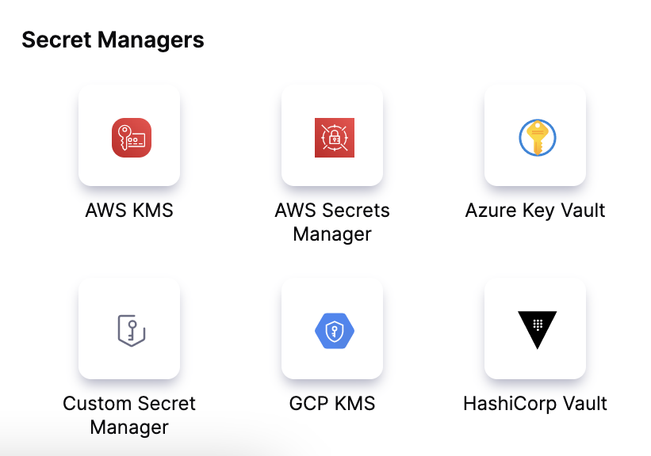

Harness includes a built-in Secrets Management feature that enables you to store encrypted secrets, such as access keys, and use them in your Harness account.

You can also access your encrypted secrets stored in third-party Secret Managers using the Harness Custom Secret Manager.

This topic explains how to add and use a Custom Secret Manager in Harness.

### Before you begin

* [Harness Secret Manager Overview](../../secrets/Secrets-Management/1-harness-secret-manager-overview.md)

### Permissions

* Create/Edit Secrets
* Create/Edit Connectors

### Important

* Harness Custom Secret Manager is a read-only Secret Manager.
* Harness can read/decrypt secrets, but it cannot write secrets to the Custom Secrets Manager.

### Harness Custom Secret Manager Overview

Harness includes a built-in Secrets Management feature that enables you to store encrypted secrets, such as access keys, and use them in your Harness Account. 

Harness integrates with the following third-party Secret Managers along with a built-in Secret Manager:

* AWS KMS
* AWS Secrets Manager
* Azure Key Vault
* GCP KMS
* HashiCorp Vault

You can also use third-party Secrets Managers that are not integrated with Harness, to store your encrypted secrets. With Harness Custom Secret Manager you can integrate Harness with your third-party Secret Managers and read or access your secrets.

Your Custom Secret Manager uses a shell script that you can execute either on a Delegate or on a remote host which is connected to the Delegate. Harness fetches and reads your secrets from the third-party Secret Manager through this shell script.

### Step 1: Create a Secret Manager Template

You can create a Secret Manager Template at Account, Org, or Project scope.

This topic shows you how to create a Secret Manager Template at the Project scope.

1. In your Harness Account, go to your Project.
2. In Project Setup, click **Templates** and then click **New Template**.
3. Click Secret Manager. The Secret Manager Template settings appear.
4. Enter a **Name** for your Secret Manager Template.
5. Enter a **Version Label**.
6. Click **Start**.
7. Enter your script in **Script**.
8. Click **Save**.  
For detailed steps to create a Secret Manager Template, go to [Create a Secret Manager Template](../../13_Templates/create-a-secret-manager-template.md).

### Step 2: Add a Custom Secret Manager

You can add a Custom Secret Manager at Account, Org, and Project scope.

To do this, go to Project setup, Organization, or Account Resources.

This topic shows you how to add a Custome Secret Manager in the Project scope.

1. In your Harness Account, go to your Project.
2. In Project Setup, click **Connectors** and then click **New Connector**.
3. In **Secret Managers**, click **Custom Secret Manager**.

   
   
   The Custom Secret Manager settings appear.
4. Enter a **Name** for your Custom Secret Manager. Click **Continue**.
5. Click **Select Template**. The Template Library appears with all the [Secret Manager Templates](../../13_Templates/create-a-secret-manager-template.md) listed.
6. Select the desired scope and select a Secret Manager Template from the Template Library.
   
   

  You can also search for a specific Secret Manager Template by entering its name in **Search**.
  Once you select the Secret Manager Template, the details are displayed in the Template Studio.  
7. Click **Use Template**.
8. Enter values for the required Input Variables.  
   Harness allows you to use [Fixed Values and Runtime Inputs](../../20_References/runtime-inputs.md).
	
	

9. Click **Fixed** to make the variable values fixed. Harness won't ask you these values when you create Secrets.
10. Click **Continue**.
11. In **Delegates** **Setup**, enter [**Selectors**](../../2_Delegates/manage-delegates/select-delegates-with-selectors.md#option-select-a-delegate-for-a-connector-using-tags) for specific **Delegates** that you want to allow to connect to this Connector. Click **Save and Continue**.
12. In **Connection Test**, click **Finish** after your connection is successful**.**

### Step 3: Use the Custom Secret Manager

Create an Encrypted Text using the Custom Secrets Manager you created earlier. Enter the name and values of all the Input Variables defined while creating the Shell Script Template. 

For more information on creating Encrypted Text Secret, go to [Add Encrypted Text](../../secrets/2-add-use-text-secrets.md).

If you want to create a secret on a Target Host Custom Secrets Manager, you must also select the Connection Attribute.

