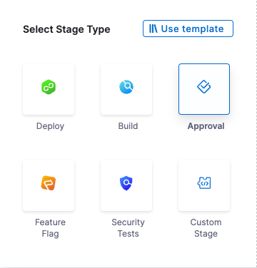
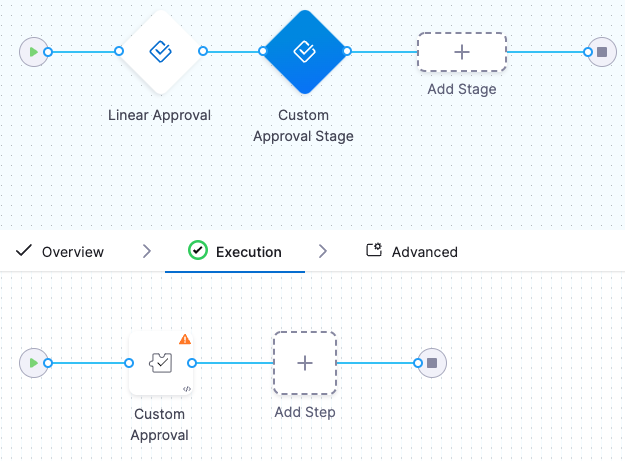
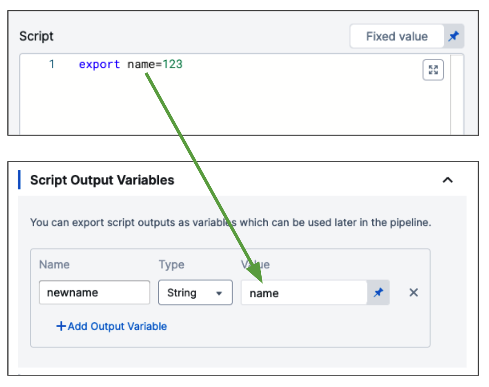
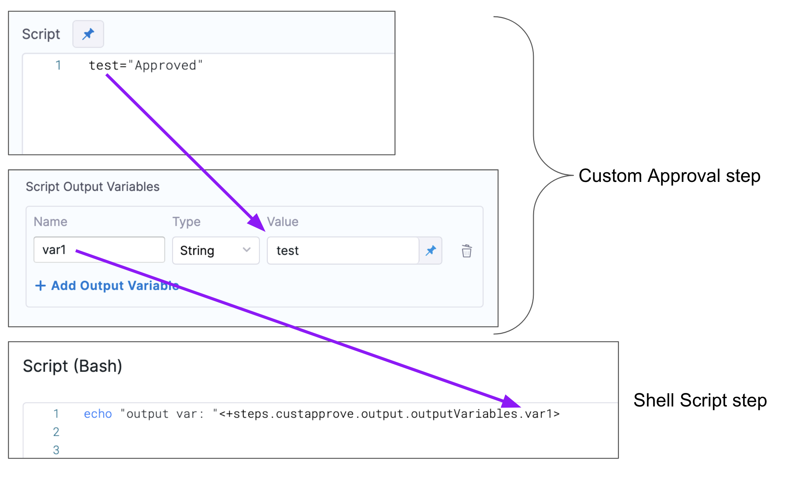
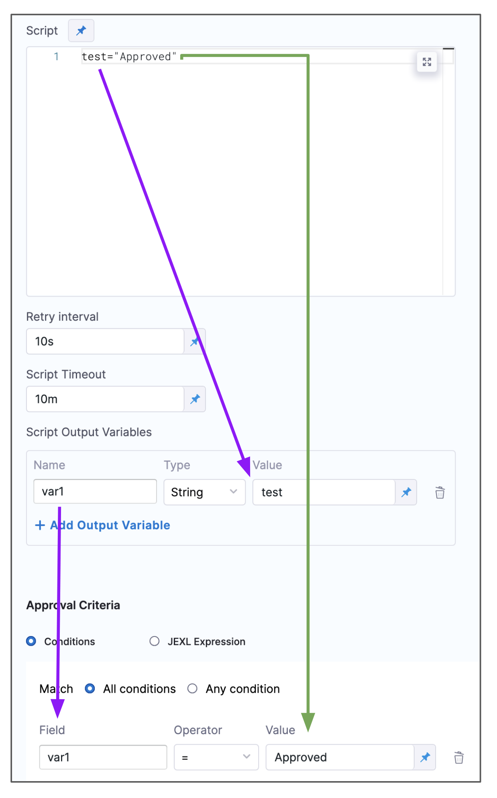

:::important
Currently, this feature is behind the feature flag `NG_CUSTOM_APPROVAL`. Contact [Harness Support](mailto:support@harness.io) to enable the feature.
:::

Custom approval stages and steps add control gates to your pipelines by allowing you to approve or reject a pipeline or stage at any point during build execution. When you add a Custom Approval step, you add a script to the step, and then use the script results as approval or rejection criteria.

You might use a Custom Approval stage and step, for example, if you have a custom shell script ticketing system or if you prefer to script your approvals.

Harness has first class support for [Jira](adding-jira-approval-stages.md) and [ServiceNow](service-now-approvals.md) approval stages and steps, and Harness has a built-in [Manual](adding-harness-approval-stages.md) approval stages and steps.


This topic describes how to add Custom Approval stages and steps.

### Before You Begin

* [Learn Harness' Key Concepts](../../get-started/key-concepts.md)
* [Add a Stage](../pipelines/add-a-stage.md)

## Requirements and limitations

* A Custom Approval stage can be added to any pipeline created in any module, such as in Continuous Delivery (CD), Continuous Integration (CI), or Feature Flags.
* A Custom Approval step can be added to a Custom Approval stage, CD Build stage, or Feature Flags stage.
* A Custom Approval step is not available in the CI stage currently.
* A Custom Approval step must have at least one Approval criteria. Rejection criteria is optional.

## Review: Custom Approval stages and steps

When you add a Custom Approval stage, a Custom Approval step is added to the stage automatically. You can also add a Custom Approval step to a Continuous Delivery (CD) Deploy or Feature Flags stage.

In the Custom Approval step, you enter a script that is executed at Pipeline runtime.

If the script fails, the step fails and the step or stage [Failure Strategy](../pipelines/w_pipeline-steps-reference/step-failure-strategy-settings.md) is initiated.

You must set approval criteria. Approval criteria can use the results of the script or other Harness features such as [Harness built-in or custom variables](../variables-and-expressions/harness-variables.md).

Rejection criteria is optional.

Criteria can be the following:

* Evaluating a script output.
	+ For example, you set a value for a variable in your script, output that variable from the script, and then use that variable in the approval/rejection criteria of the Custom Approval step.
	+ When an evaluation results in a Boolean true, the approval criteria is met.
* Evaluating a JEXL Expression.
	+ Harness supports JEXL expressions and you can use these with script outputs or Harness variables to create expressions.
	+ If the resolved JEXL expression is a Boolean true, the approval criteria is met.
	+ For example, you could evaluate the output from a previous [Shell Script](/docs/continuous-delivery/x-platform-cd-features/cd-steps/utilities/shell-script-step) step named **test** by referencing its output in a JEXL expression and comparing it to the value `Approved`: `<+execution.steps.test.output.outputVariables.status>=="Approved"`.
	+ Go to [Built-in and Custom Harness Variables Reference](../variables-and-expressions/harness-variables.md) and [Extracting Characters from Harness Variable Expressions](../variables-and-expressions/extracting-characters-from-harness-variable-expressions.md).

## Add a Custom Approval stage

Custom Approval stages automatically contain Custom Approval steps, and you can add Custom Approval steps to other Approval stages, CD Build stages, and Feature Flags stages.

### Step 1: Add an Approval stage

In a pipeline, click **Add Stage.**

In **Select Stage Type**, click **Approval**.



In **About your Stage**, enter a name for this stage, select **Custom**, and click **Set Up Stage**. The Approval Stage is set up.


Click the **Custom Approval** step to set up your **Step Parameters**.



If you were adding a Custom Approval step to a different type of stage, you would simply click **Add Step** in that stage's **Execution** and select **Custom Approval**.

### Step 2: Set up a Custom Approval Step

The Custom Approval step has the following settings.

#### Script

In **Name**, enter a name for the step.

In **Script**, enter your script.

The script is executed on the host of the Harness Delegate that runs the step. The script is not executed on the deployment target host(s).

You can select one or more specific Delegates using the [Delegate Selector](../delegates/manage-delegates/select-delegates-with-selectors.md) setting in the step's **Advanced** settings.

#### Timeout, Retry Interval, and Script Timeout

It's important to understand how the Timeout, Retry Interval, and Script Timeout settings relate to each other.

In **Timeout**, enter how long you want Harness to try to complete the step before failing (and initiating the stage or step [Failure Strategy](/docs/platform/pipelines/failure-handling/define-a-failure-strategy-on-stages-and-steps.md)).

You can use `**w**` for week, `**d**` for day, `**h**` for hour, `**m**` for minutes, `**s**` for seconds and `**ms**` for milliseconds. For example, `1d` for one day.

In **Script Timeout**, set how long the step should wait for the script to complete before timing out.

In **Retry Interval**, set how long the step should wait to run the script again if the Approval or Rejection criteria evaluate to **false**.

For example, if the **Step Timeout** is set as `10m`, **Script Timeout** is set to `2m`, and **Retry Interval** is set to `30s`, then the script will be executed at least 4 times.

How many times a script executes within the **Script Timeout** depends on how fast the script executes.

### Option: Script Output Variables

You can output variables from the script to be used in subsequent pipeline steps or in the acceptance and rejection criteria.

#### Exporting Variables

To export variables from the script to the acceptance and rejection criteria or other steps in the stage, you use the **Script Output Variables** option.

Let's look at a simple example of a script that exports the variable **name**:

```
export name=123
```

The `name` variable cannot be used outside the script unless you use **Script Output Variables**.

You do not need to export the variables with `export` to use them with **Script Output Variables**. You can simply declare them, like `name="123"`. The `export` command is for using the variables in child processes within the script.In **Script Output Variables**, in **Value**, you enter the name of the script variable you want to output (for example, `name`).

In **Name**, enter a name to use in other steps that will reference this variable. This is the output variable name that will be used in a Harness expression for referencing the output variable.



The format to reference the output variable is `<+steps.[step_id].output.outputVariables.[output_variable_name]>`.

Here's an example showing how the **Script Output Variables** references the exported variable **test**, and how you reference the output variable Name **var1** in a subsequent Shell Script step to get that value:



To find the expression to reference your output variables, execute the pipeline, locate the step, and click its **Output** tab. You can copy the Output variable there.


#### Using Variables in Approval or Rejection Criteria

You can use script variables in your approval or rejection criteria by use them in **Script Output Variables**.

First, you create the variable in **Script**, then create a variable in **Script Output Variables** that references that variable, and then use the **Script Output Variables** variable and the **Script** variable's value in the **Approval Criteria**:



## Set Approval Criteria

The **Approval Criteria** in the step determines if the pipeline or stage is approved.

Custom Approval steps must have at least one **Approval Criteria**. You can also specify **Rejection Criteria**.


Whether the pipeline/stage stops executing depends on the stage or step [Failure Strategy](/docs/platform/pipelines/failure-handling/define-a-failure-strategy-on-stages-and-steps.md). You can specify criteria using **Conditions** and/or **JEXL Expression**. If you use them in combination, they both must evaluate to a Boolean `True` for the step to be approved.

In **Conditions**, you can define approval criteria using outputs from the step script, [Harness expressions](../variables-and-expressions/harness-variables.md), or your custom ticketing system. The supported operators are `=`, `!=`, `in`, and `not in`. 
For example, 
- The condition for the script output `field` to be in `Option1`, `Option2`, or `Option3` can be specified as:
   
- The condition for the script output `field` to not be in either `Option1`, `Option2`, or `Option3` can be specified as:
   

:::important

Multiple conditions with the same Field are not allowed. Such use cases can be solved using `in`, `not in` operators, or **JEXL Expression**.

:::   


If you use Harness expressions, ensure that the expression can be resolved at runtime.

If you use custom variable expressions that reference information from subsequent steps, ensure that those custom variable expressions will be resolved.

In **JEXL Expression**, you can use [JEXL expressions](https://commons.apache.org/proper/commons-jexl/reference/syntax.html). You can use a JEXL expression if the field is set to **Fixed value** or **Expression**.

### Option: Script Input Variables

While you can simply declare a variable in your script using a Harness expression or string for its value, using Input Variables provides some additional benefits:

* You can easily identify and manage the Harness expressions used in your script.
* You can template your script.

You can declare the variable using **Name** and **Value** in **Script Input Variables** and then reference the variable in the script just as you would any other variable: `$var_name`.

You can also use expressions in **Value**. For example, if you have an Output Variable from a previous Custom Approval or Shell Script step, you can copy it from the executed step **Outputs**.

In **Script Input Variables**, you simply select **Expression** and paste the expression in **Value**.


In **Script**, you declare the variable using the **Name** value:


At deployment runtime, Harness will evaluate the expression and the variable will contain its output.

### Option: Set Rejection Criteria

In **Optional Configuration**, in **Rejection Criteria**, you can define criteria for rejecting the approval.

If you add rejection criteria it is used in addition to the settings in **Approval Criteria**. Both **Rejection Criteria** and **Approval Criteria** must evaluate to a Boolean true for the step to be successful.

### Option: Harness Expressions in Variables

You can use [Harness variable expressions](../variables-and-expressions/harness-variables.md) in your scripts and in the **Script Input Variables** and **Script Output Variables**.

For **Script Input Variables** and **Script Output Variables**, you simply select **Expression**, and then paste in the Harness variable expression.

### Option: Advanced Settings

In **Advanced**, you can use the following options:

* [Delegate Selector](../delegates/manage-delegates/select-delegates-with-selectors.md#option-select-a-delegate-for-a-step-using-tags)
* [Step Skip Condition Settings](../pipelines/w_pipeline-steps-reference/step-skip-condition-settings.md)
* [Step Failure Strategy Settings](../pipelines/w_pipeline-steps-reference/step-failure-strategy-settings.md)

## Apply and Test

Click **Apply Changes**. The Custom Approval step is added to the stage.

Run the pipeline.

When the Custom Approval step is reached, you can see its approval and rejection criteria.

## YAML example

Here's the YAML for a pipeline that demonstrates how to set up a Custom Approval stage and step.

You can paste this YAML into a new pipeline and simply update the `pipeline` settings (`name`, `identifier`, `projectIdentifier`, `orgIdentifier`) if needed.


```
pipeline:  
    name: Example  
    identifier: Example  
    projectIdentifier: myproject  
    orgIdentifier: default  
    tags: {}  
    stages:  
        - stage:  
              name: test1  
              identifier: test1  
              description: ""  
              type: Approval  
              spec:  
                  execution:  
                      steps:  
                          - step:  
                                type: CustomApproval  
                                name: custom approval  
                                identifier: custapprove  
                                timeout: 1d  
                                spec:  
                                    shell: Bash  
                                    retryInterval: 10s  
                                    scriptTimeout: 10m  
                                    source:  
                                        type: Inline  
                                        spec:  
                                            script: test="Approved"  
                                    environmentVariables: []  
                                    delegateSelectors: []  
                                    approvalCriteria:  
                                        type: KeyValues  
                                        spec:  
                                            matchAnyCondition: false  
                                            conditions:  
                                                - key: var1  
                                                  operator: equals  
                                                  value: Approved  
                                    rejectionCriteria:  
                                        type: KeyValues  
                                        spec:  
                                            matchAnyCondition: false  
                                            conditions: []  
                                    onDelegate: true  
                                    outputVariables:  
                                        - name: var1  
                                          type: String  
                                          value: test  
                          - step:  
                                type: ShellScript  
                                name: vars  
                                identifier: vars  
                                spec:  
                                    shell: Bash  
                                    onDelegate: true  
                                    source:  
                                        type: Inline  
                                        spec:  
                                            script: |-  
                                                echo "output var: "<+steps.custapprove.output.outputVariables.var1>  
  
                                                test=<+steps.custapprove.output.outputVariables.var1>  
                                    environmentVariables: []  
                                    outputVariables:  
                                        - name: foo  
                                          type: String  
                                          value: test  
                                    executionTarget: {}  
                                timeout: 10m  
              tags: {}  

```
## Notes

#### Stopping Scripts After Failures

The Custom Approval command will continue to process through the script even if a script step fails. To prevent this, you can simply include instructions to stop on failure in your script. For example:

* `set -e` - Exit immediately when a command fails.
* `set -o pipefail` - Sets the exit code of a pipeline to that of the rightmost command to exit with a non-zero status, or to a zero status if all commands of the pipeline exit successfully.
* `set -u` - Treat unset variables as an error and exit immediately.

For more information, see this article: [Writing Robust Bash Shell Scripts](https://www.davidpashley.com/articles/writing-robust-shell-scripts/).

#### Published Variables Not Available

This error happens when you are publishing output via the **Script Output Variables** setting and your Custom Approval step exits early from its script.

There are many errors that can result from this situation. For example, you might see an error such as:


```
FileNotFoundException inside shell script execution task
```
If you exit from the script (`exit 0`), values for the context cannot be read.

Instead, if you publish output variables in your Custom Approval command, structure your script with `if...else` blocks to ensure it always runs to the end of the script.

#### Using Secrets in Scripts

You can use Harness secrets in your Custom Approval steps.

See [Add Text Secrets](/docs/platform/secrets/add-use-text-secrets).

Basically, you use `<+secrets.getValue("secret_Id")>` to refer to the secret Id.

#### Shell Scripts and Security

Harness assumes that you trust your Harness users to add safe scripts to your Custom Approval steps.

Please ensure that users adding scripts, as well as executing deployments that run the scripts, are trusted.

### Notes

- For more information about approval log limitations, go to [Deployment logs and limitations](/docs/continuous-delivery/manage-deployments/deployment-logs-and-limitations).

## See also

* [Add a Custom Stage](/docs/platform/pipelines/add-a-stage.md#add-a-custom-stage)
* [Using Manual Harness Approval Stages](adding-harness-approval-stages.md)
* [Using Manual Harness Approval Steps in CD Stages](/docs/continuous-delivery/x-platform-cd-features/cd-steps/approvals/using-harness-approval-steps-in-cd-stages/)

