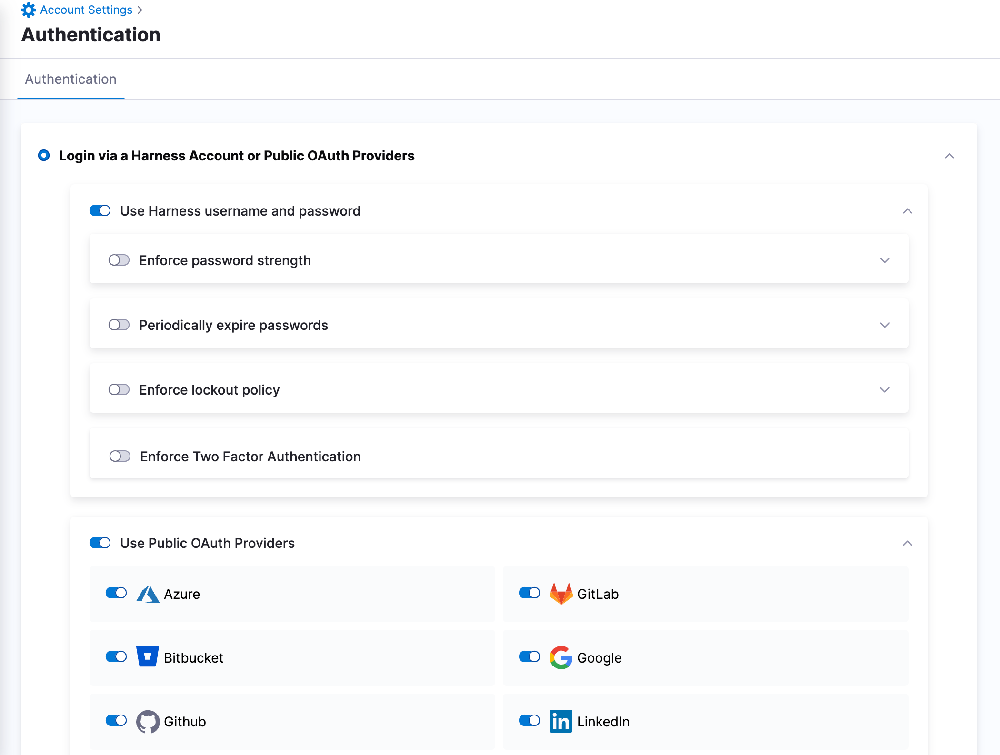
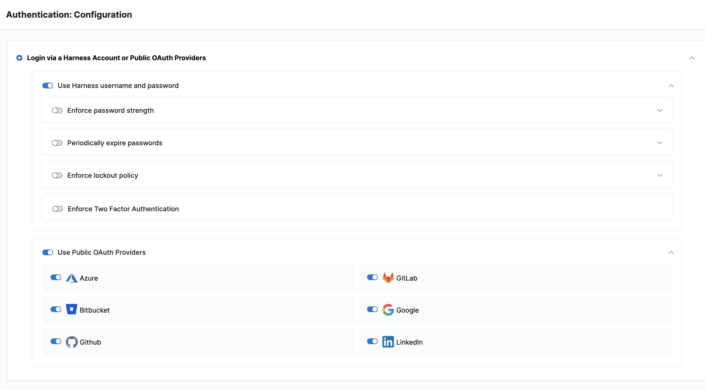
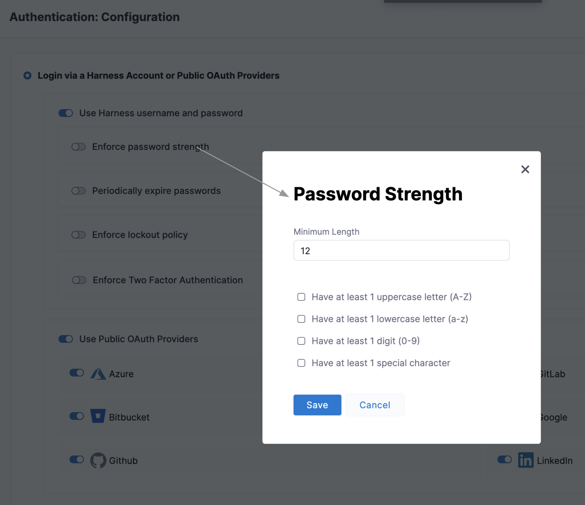
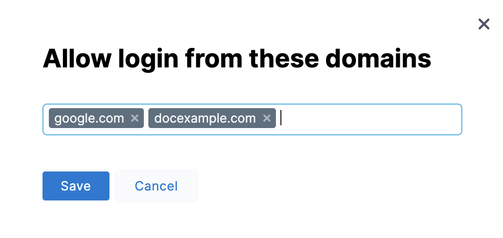
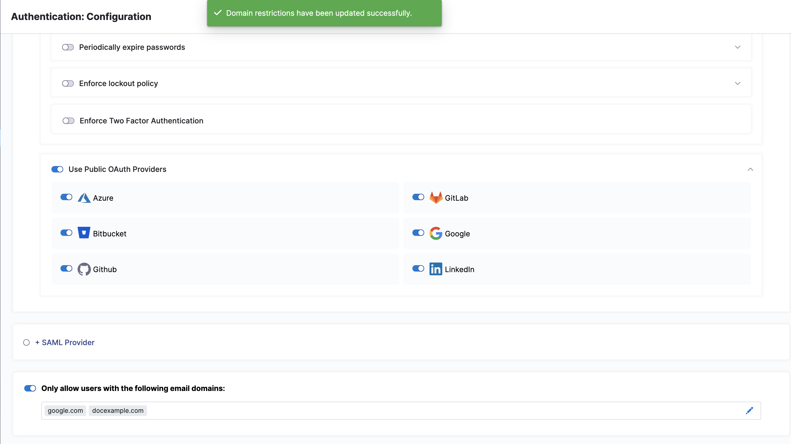
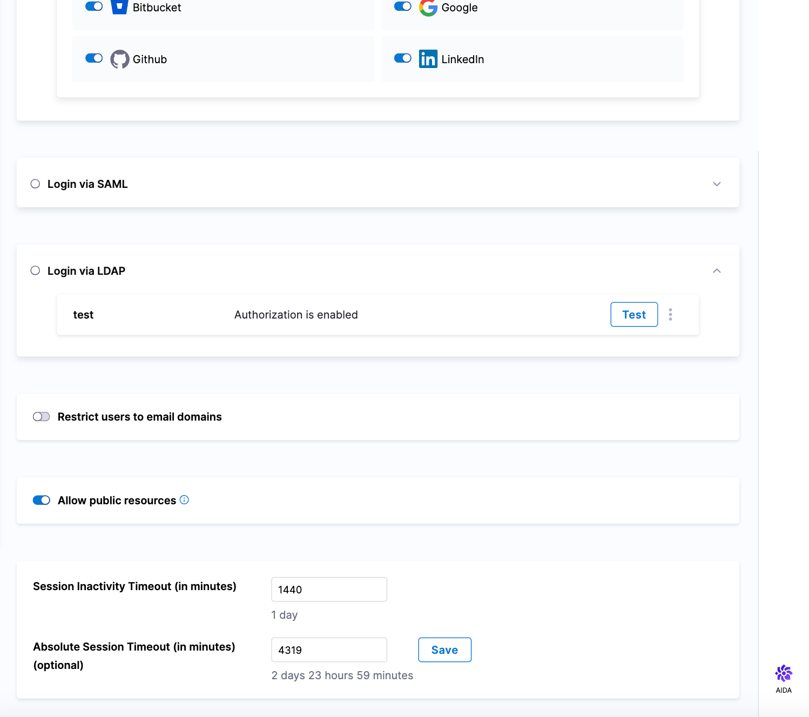

This topic provides an overview of Authentication in Harness. It describes various ways to authenticate users.

### Before you begin

- Make sure you have permissions to **Create/Edit, Delete** Authentication Settings.

### Review: Authentication Settings

Harness Access control includes:

- Authentication: Checks who the user is.
- Authorization: Checks what the user can do.
- Auditing: Logs what the user does.

This topic focuses on _authentication_. For information about _authorization_, go to [RBAC in Harness](/docs/platform/role-based-access-control/rbac-in-harness).

Users in Administrator groups can use Authentication Settings to restrict access to an organization's Harness account. The options you choose will apply to all your account's users. These options include:

- [Before you begin](#before-you-begin)
- [Review: Authentication Settings](#review-authentication-settings)
- [Configure Authentication](#configure-authentication)
  - [Enable Public OAuth Providers](#enable-public-oauth-providers)
  - [Enable Security Assertion Markup Language (SAML) Providers](#enable-security-assertion-markup-language-saml-providers)
- [Enforce Password Policies](#enforce-password-policies)
  - [Enforce Password Strength](#enforce-password-strength)
  - [Enforce Password Expiration](#enforce-password-expiration)
  - [Enforce Lockout After Failed Logins](#enforce-lockout-after-failed-logins)
- [Enforce Two Factor Authentication](#enforce-two-factor-authentication)
- [Set Up Vanity URL](#set-up-vanity-url)
- [Restrict Email Domains](#restrict-email-domains)
- [Set inactive session timeout](#set-inactive-session-timeout)

### Configure authentication

To configure authentication, do the following:

1. In **Home**, select **Account Settings**, and then select **Authentication**.

   The **Authentication** page opens.

   

2. Select one of the below default Authentication methods:

   - Login via a Harness Account or Public OAuth Providers
   - SAML Provider
   - LDAP Provider

3. Configure your settings for the selected method.

#### Enable Public OAuth Providers

In the **Use Public OAuth Providers** section, you can enable Harness logins via a range of single sign-on mechanisms. Enable this slider to expose sliders for enabling individual OAuth partners.  
For more on OAuth Providers, go to [Single Sign-On with OAuth](../authentication/single-sign-on-sso-with-oauth.md).

#### Enable Security Assertion Markup Language (SAML) Providers

Select **SAML Provider** to enable a SAML Provider. To do this, you should first disable any configured public OAuth providers.  
For more on adding a SAML Provider, go to [Single Sign-On with SAML](../authentication/single-sign-on-saml.md).

### Enforce Password Policies

You'll see specific controls to govern the following password requirements:

- Enforce password strength
- Periodically expire passwords
- Enforce Two Factor Authentication

#### Enforce Password Strength

Select **Enforce password strength** to open the dialog shown below.

- Here you can specify and enforce any or all of the below options:
  - Minimum password length.
  - Include at least one uppercase letter.
  - Include at least one lowercase letter.
  - Include at least one digit.
  - Include at least one special character.

If you enforce **Have at least one special character**, each password must include one (or more) of the following characters: `~!@#$%^&*_-+=`|\()\{}[]:;"'&lt;this-tag&gt;,.?/`

#### Enforce Password Expiration

Select **Periodically expire passwords** to set an interval at which users must refresh their Harness passwords. In the same dialog, you can also set an advance notification interval.

#### Enforce Lockout After Failed Logins

Select **Enforce lockout policy** to open the dialog shown below. It offers independent controls over the lockout trigger (how many failed logins), lockout time (in days), and notifications to locked-out users and to Harness user groups.

You can see a summary on the main Authentication page:

### Enforce Two Factor Authentication

Select **Enforce Two Factor Authentication** to enforce 2FA for all users in Harness. This option will govern all logins — whether through SSO providers or Harness username/password combinations. For more information on Two-Factor Authentication, go to [Two-factor authentication](../authentication/two-factor-authentication.md).

### Set Up Vanity URL

You can access `app.harness.io` using your own unique subdomain URL.

The subdomain URL will be in the following format, with `{company}` being the name of your account:

`https://\{company}.harness.io`

Contact [Harness Support](mailto:support@harness.io) to set up your Account's subdomain URL. The subdomain URL cannot be changed later.Harness automatically detects your Account ID from the subdomain URL and redirects you to the Account's login mechanism.

### Restrict Email Domains

Select **Only allow users with the following email domains:** to allow (whitelist) only certain domains as usable in login credentials. In the dialog shown below, build your allowlist by simply typing your chosen domains into the **Domains** multi-select field.

Select **Save**. You can see the success message - **Domain restrictions have been updated successfully** displayed on top of the page and the domains you have whitelisted in the panel.

Your resulting allowlist will impose a further filter on logins to Harness via both SSO providers and Harness username/passwords. You can modify your domain selections by clicking the Edit icon.

### Set inactive session timeout

Harness logs a user out of their account after a session timeout if there has been no activity.

To configure your account's session inactivity timeout, do the following:

1. In your Harness account, select **Account Settings**.

2. Select **Authentication**.

3. In **Session Inactivity Timeout (in minutes)**, enter the time in minutes to set the session inactivity time out.

   The default session inactivity timeout value is 1440 minutes (1 day).

   You can set this to a minimum of 30 minutes and a maximum of 4320 minutes (3 days). The field automatically converts the minutes you enter to higher units of time, and displays the result under the field. For example, if you enter 1440, the UI shows **1 day** below the field.

   

### Set absolute session timeout

When **Absolute Session Timeout  (in minutes)** is set, a Harness user is logged out of their account after the configured timeout, irrespective of any activity.

To configure your account's Absolute Session Timeout, do the following:

1. In your Harness account, select **Account Settings**.

2. Select **Authentication**.

3. In **Absolute Session Timeout (in minutes)**, enter the time in minutes to set the Absolute Session Timeout.

   The default Absolute Session Timeout is 0, which means that it is not set.

   You can set this to a maximum of 4320 minutes (3 days). The field automatically converts the minutes you enter to higher units of time, and displays the result under the field. For example, if you enter 1440, the UI shows **1 day** below the field.

When both the Session Inactivity Timeout and the Absolute Session Timeout are set, the condition that is met first will be honored.
