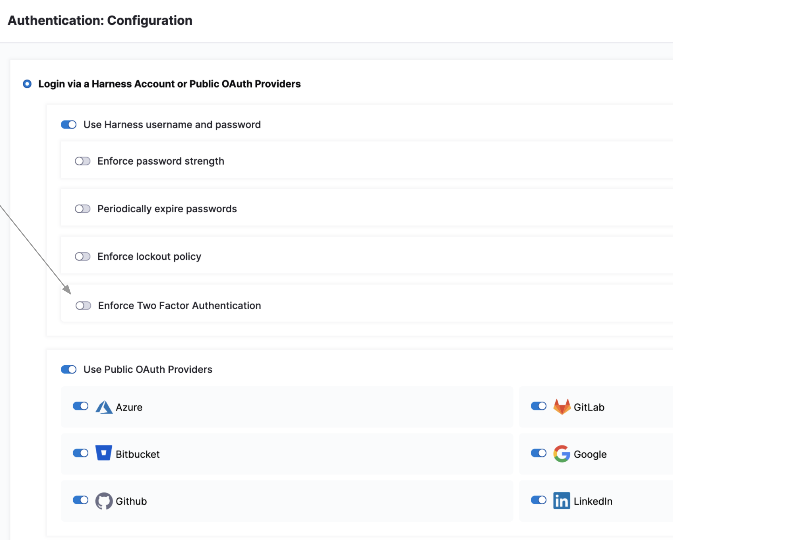
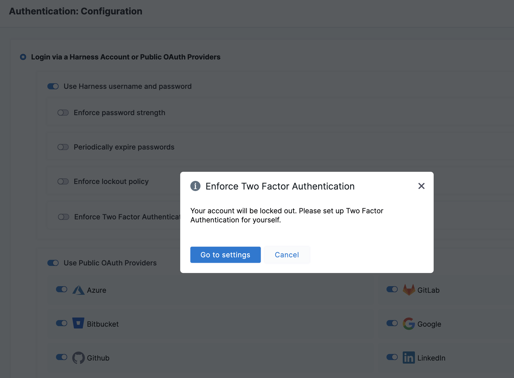
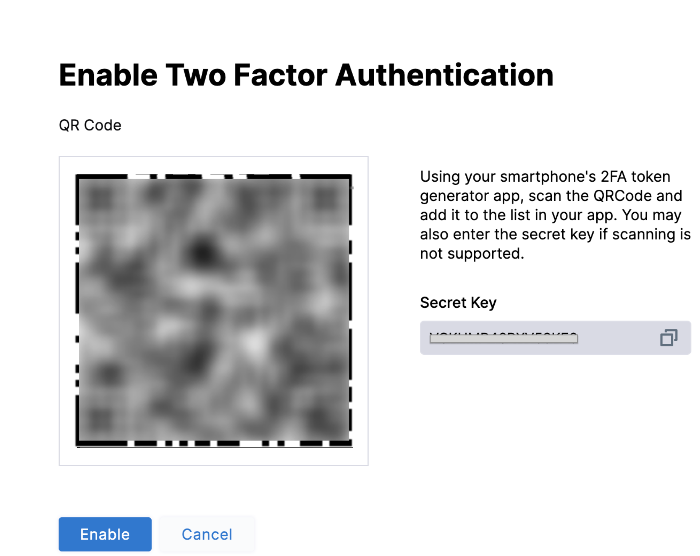
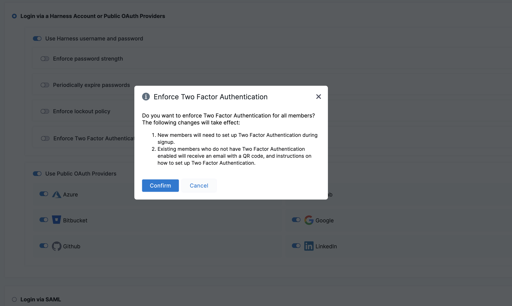

You can add an extra layer of security by using a 2-step-verification, also known as Two-Factor Authentication (2FA). 

This document explains the basic steps to set up 2FA in Harness.

### Before you begin

* Make sure you have permissions to **Create/Edit, Delete** Authentication Settings.

### Set up two-factor authentication

You can manage 2FA in two ways:

* **Individual user:** you can set up 2FA for your own **User Profile** without impacting other user accounts.
* **All account users:** if you have **Create/Edit** permissions for Authentication Settings, you can enforce 2FA for all users in Harness. First, you set up 2FA for your own account, and then you can enforce 2FA account-wide in the Harness account's **Login Settings**.

:::info note
If 2FA is disabled at the account level, you can still enable 2FA for your user account. When an administrator enables the account-level 2FA setting, Harness sends users 2FA emails but does not enable the user-level 2FA settings. Users can enable or disable the user-level setting in their profiles. When a user attempts to sign in to their account, Harness sends a 2FA challenge only if one or both of the settings (the account-level setting and the user-level setting) are enabled. If both settings are disabled, Harness does not send a 2FA challenge.
:::

### Set up two-factor authentication for your profile

1. Click on your **User Profile** icon at the bottom-left below **Account Settings** to go to the Profile page.
2. The Profile page appears.
3. Toggle the **Two-Factor Authentication** indicator. The **Enable Two-Factor Authentication** page appears.
4. Using your smartphone's 2FA token generator app, such as Google Authenticator, scan the QR Code and add it to the list in your app.  
You can now see **Harness-Inc** in your 2FA token generator app, which provides authentication codes.  
2FA token generator apps also include a method for adding a site using a Secret Key in cases where you cannot scan the QR Code. The 2FA dialog includes a Secret Key for those cases.
5. Select **Enable**. The next time you log in by entering your username and password, you are prompted to provide the 2FA authentication code.
6. Obtain the code from your 2FA token generator app, and enter it. You can then log into your Harness account.

### Set up account-wide two-factor authentication

Once you have set up 2FA for your account, you set it for all users and groups in the account. When 2FA is enforced, account users will experience the following changes:

* **New members** will be able to set up 2FA during sign up.
* **Existing members** who do not have 2FA enabled will receive an email with a QR Code, and instructions on how to set up 2FA.

To set up 2FA for all account users and groups, do the following:

1. Enable 2FA for your account as described in [Set Up Two-Factor Authentication for Your Profile](#set-up-two-factor-authentication-for-your-profile).
   
2. Select **ACCOUNT SETUP** > **Authentication**. The **Authentication: Configuration** page appears.  
   
   

3. Slide the **Enforce Two Factor Authentication** setting on.
  
   If you have not yet [set up 2FA for your own profile](#set-up-two-factor-authentication-for-your-profile), this prompt reminds you to protect your own login before proceeding:

   

4. Select **Go to settings** to display a QR Code and secret key that you can store to make sure your own ability to log in:  

5. Return to **ACCOUNT SETUP** > **Authentication** to enable account-wide, two-factor authentication.
6. Slide the **Enforce Two Factor Authentication** setting on. This prompt asks for a confirmation to enable 2FA for all the users:  
   
   

7. Select **Confirm**.

### Reset two-factor authentication

If a user loses the QR Code, an admin can reset two-factor authentication and email them a new QR Code and secret key.

To reset two-factor authentication for a user, do the following:

1. In Harness, go to your account, and then select **Account Settings**.
2. Under **Access Control**, select **Users**.
3. Select **More Options** (&vellip;) corresponding to the user for which you want to reset two-factor authentication.

   

4. Select **Email new Two Factor Auth secret**.
   The user will receive an email to reset their authentication.
