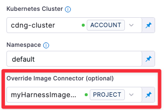

When you run a Harness CI pipeline, Harness pulls required CI images from the [Harness project on GCR](https://console.cloud.google.com/gcr/images/gcr-prod/global/harness). The [Harness CI images](/docs/continuous-integration/use-ci/set-up-build-infrastructure/harness-ci.md) are used for backend processes only.

By default, the Harness Delegate makes an anonymous outbound connection to the public GCR repo and pulls the images. If you don't want to connect anonymously, you can configure credentialed access at the account or stage scopes:

* [Account scope](#account-scope-edit-the-built-in-connector): This option changes the behavior for your entire account by editing the credentials of the built-in **Harness Docker Connector**. This is useful if your organization's security policies don't allow anonymous connections to public image repos.
* [Stage scope](#stage-scope-create-a-dedicated-connector): This option lets you override the Harness image pull behavior in individual [Build stages](/docs/continuous-integration/use-ci/prep-ci-pipeline-components.md#stages) by creating a dedicated connector you can use for these specific use cases. This is useful when the delegate for that stage's build infrastructure can't anonymously access the public repo. For example, if the build infrastructure is running in a private cloud.

:::tip

Using credentialed access, instead of anonymous access, can prevent rate limiting or throttling issues when pulling images.

:::

## Account scope: Edit the built-in connector

If a connector named **Harness Docker Connector** (Id: `harnessImage`) already exists on your **Account**, you can update the connector instead of creating a new connector. Harness gives precedence to the connector with the `harnessImage` identifier and uses it to pull the images.

To edit this connector, you need [permissions](../../role-based-access-control/permissions-reference) to create, edit, and view connectors at the account [scope](/docs/platform/role-based-access-control/rbac-in-harness.md#permissions-hierarchy-scopes).

1. Go to **Account Settings**, select **Account Resources**, and then select **Connectors**.
2. Select the **Harness Docker Connector** (Id: `harnessImage`).

   If there is no connector with the `harnessImage` identifier in your Account, you need to [create a Docker connector](/docs/platform/connectors/cloud-providers/ref-cloud-providers/docker-registry-connector-settings-reference) with the exact **Id** of `harnessImage`.

3. Go to the **Details** settings.
4. For **Provider Type**, select **Other (Docker V2 compliant)**.
5. For **Docker Registry URL**, enter `https://console.cloud.google.com/gcr/images/gcr-prod/GLOBAL`.
6. For **Authentication**, select **Username and Password**, and provide a username and token to access GCR. The token needs **Read, Write, Delete** permissions.
7. Select **Continue**.
9. For **Select Connectivity Mode**, you can choose to connect through a Harness Delegate or the Harness Platform.

   * If you plan to use this connector with [Harness Cloud build infrastructure](/docs/continuous-integration/use-ci/set-up-build-infrastructure/use-harness-cloud-build-infrastructure.md), you must select **Connect through Harness Platform**.
   * If you choose to connect through a Harness Delegate, you can allow Harness to use any available delegate or specify delegates based on tags. For more information about how Harness selects delegates, go to [Delegate overview](/docs/platform/delegates/delegate-concepts/delegate-overview.md) and [Use delegates selectors](/docs/platform/delegates/manage-delegates/select-delegates-with-selectors.md).
   * For delegate installation instructions, go to [Delegate installation overview](../../delegates/install-delegates/overview).

10. Select **Save and Continue**, wait for the connectivity test to run, and then select **Finish**.

   If the connectivity test fails, make sure your connector's credentials are configured correctly and that the token has the necessary permissions.

   

## Stage scope: Create a dedicated connector

This option lets you override the Harness image pull behavior in individual [Build stages](/docs/continuous-integration/use-ci/prep-ci-pipeline-components.md#stages) by creating a dedicated connector you can use for these specific use cases. This is useful when the delegate for that stage's build infrastructure can't anonymously access the public repo. For example, if the build infrastructure is running in a private cloud.

### Create the Docker connector

Although you will select the connector at the stage scope, you must create the [Docker connector](/docs/platform/connectors/cloud-providers/ref-cloud-providers/docker-registry-connector-settings-reference) at the account [scope](../../role-based-access-control/rbac-in-harness#permissions-hierarchy-scopes). To do this, you need [permissions](../../role-based-access-control/permissions-reference) to create, edit, and view connectors at the account scope.

1. Go to **Account Settings**, select **Account Resources**, and then select **Connectors**.
2. Select **New Connector**, and, under **Artifact Repositories**, select the **Docker Registry** connector.

   

3. Enter a **Name** for the connector. The **Description** and **Tags** are optional.

   Harness automatically creates an **Id** ([entity identifier](../../references/entity-identifier-reference.md)) based on the **Name**. You can edit the **Id** while creating the connector only. After saving the connector, the **Id** can't be changed.

   

4. Select **Continue**.
5. For **Provider Type**, select **Other (Docker V2 compliant)**.
6. For **Docker Registry URL**, enter `https://console.cloud.google.com/gcr/images/gcr-prod/GLOBAL`.
7. For **Authentication**, select **Username and Password**, and provide a username and token to access GCR. The token needs **Read, Write, Delete** permissions.
8. Select **Continue**.
9. For **Select Connectivity Mode**, you can choose to connect through a Harness Delegate or the Harness Platform.

   * If you plan to use this connector with [Harness Cloud build infrastructure](/docs/continuous-integration/use-ci/set-up-build-infrastructure/use-harness-cloud-build-infrastructure.md), you must select **Connect through Harness Platform**.
   * If you choose to connect through a Harness Delegate, you can allow Harness to use any available delegate or specify delegates based on tags. For more information about how Harness selects delegates, go to [Delegate overview](/docs/platform/delegates/delegate-concepts/delegate-overview.md) and [Use delegates selectors](/docs/platform/delegates/manage-delegates/select-delegates-with-selectors.md).
   * For delegate installation instructions, go to [Delegate installation overview](../../delegates/install-delegates/overview).

10. Select **Save and Continue**, wait for the connectivity test to run, and then select **Finish**.

   If the connectivity test fails, make sure your connector's credentials are configured correctly and that the token has the necessary permissions.

   

### Select the connector in the Build stage

In the Build stage where you want to use your Docker connector, go to the [Infrastructure settings](/docs/continuous-integration/use-ci/set-up-build-infrastructure/ci-stage-settings.md#infrastructure), and select your your Docker connector in the **Override Image Connector** field. When the pipeline runs, Harness will use the specified connector to download images from the Harness project on GCR.

