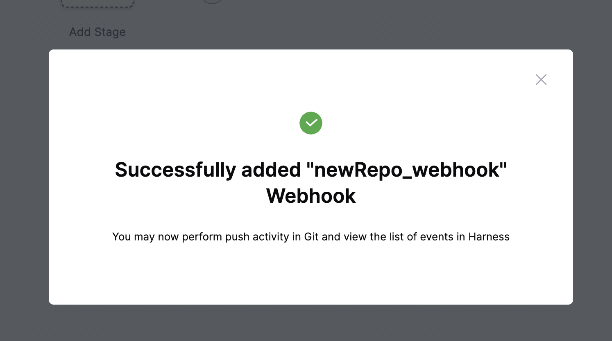
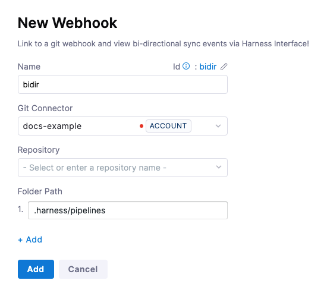

By default, Harness Git Experience syncs unidirectionally, from Harness to your Git repos. You can also have Harness Git Experience sync bidirectionally between Harness and your Git repo.

With bidirectional sync for Git Experience, changes made on either the Git repo or Harness are synced automatically.

This topic explains how to set up and use bidirectional sync.

### Supported Entities

#### Generally Available
- Pipelines
- Templates
- Input Sets
- Services
- Environments
- Infrastructure

## Important notes

- If users make changes on the Harness and Git side at the same time, precedence is given on a first come, first served basis.
- If you make an invalid YAML change to the YAML in the Git repo file an **Invalid YAML Detected** error appears in the Harness UI. You can fix the invalid YAML in Harness or in the Git repo.
- If your Git repo server is on-premise, it must have connectivity to Harness SaaS. 
- Currently, only `.yaml` and `.yml` files are supported for bi-directional sync.
- When configuring a webhook, you need to be the owner of the relevant git repository.
- Bidirectional sync is not supported for Harness Code.

## Bi-directional Sync

GitX supports bi-directional sync by capturing changes committed directly to Git using webhook events. Harness treats Git as the **source of truth**, and uses cached Git data for all operations—including pipeline execution. This ensures fast, consistent execution of remote pipelines based on the latest committed changes.

### Webhook Registration (Automatic)

Harness attempts to register webhooks automatically for GitX resources using the **Git connector** associated with the entity (e.g., pipeline, input set). This removes the need for most manual setup and helps prevent outdated pipeline configurations.

Automatic webhook registration follows these principles:

- Webhooks are registered using the **same connector** that was used to create the entity.
- Registration is performed on a **best-effort basis**:
  - If the connector has sufficient permissions (e.g., `admin:repo_hook` for GitHub), the webhook is created.
  - If not, the operation is skipped, and users can manually register the webhook.
- Harness does **not create duplicate webhooks**:
  - A webhook is only registered if one doesn't already exist for the given entity.
- Webhooks are registered at the **nearest matching scope**:
  - For example, if an entity is created at the **org level**, the webhook is registered at the **org level**.

## Manual Webhook Setup for Bi-directional Sync

There are two ways to manually set up a webhook when automatic registration is not preferred or not possible.

### Option 1: Setup via Banner Prompt

The previous manual webhook setup method is still available behind the feature flag `PIPE_DISABLE_AUTO_GITX_WEBHOOK_REGISTRATION`. If your team prefers to manage webhook creation manually, you can enable this flag.

When enabled, Harness displays a **banner** for entities that do not yet have a webhook. To register:

1. Click **Setup Webhook** on the banner.
2. The webhook will be registered using the same Git connector used during entity creation.
3. Upon success, you’ll see a confirmation message.

:::info Note: 300 File Limit
When using Git Experience with GitHub in bidirectional sync mode, **merging a commit with 300 or more files may cause some files to not sync properly in the GitEx cache**. This is due to GitHub API limitations, which parse up to 300 files between two commits. Customers may see that the webhook payload lists a full list of files, but only 300 will be processed.  

Additionally, such large merges has the potential to increase the possibility of hitting the GitHub API rate limit. This is due to the fact that each commit has three API calls correlated to each file transfer, and if multiple files across multiple pipelines are being committed at the same time, it can increase the possibility of a rate-limit situation.

It is recommended to keep the number of files in a single commit below 300 to ensure consistency and avoid potential rate limit issues.
:::

:::info note
To successfully register a webhook, ensure that the Harness Git connector you use has the necessary credentials. For example, when using GitHub, the GitHub user account must be a repo admin, and the Personal Access Token must include all repo, user, and `admin:repo_hook` scopes.

It is important to note that if you use a banner to set up the webhook, it will use the same connector that was used during the entity creation to create the webhook. Therefore, ensure that the connector has adequate permissions.
:::

To view registered webhooks:  
**Project Settings** → **Project-level Resources** → **Webhooks**

You can also explore [Git Sync Activity](./git-sync-health-page.md) to track webhook events.

### Option 2: Manual Setup via Webhooks Page

If you want full control over webhook setup or if banner setup was skipped:

#### Choose the Scope
- **Account Level:**  
  `Account Settings → Account-level Resources → Webhooks → New Webhook`
- **Organization Level:**  
  `Organization Resources → Organization-level Resources → Webhooks → New Webhook`
- **Project Level:**  
  `Project Settings → Project-level Resources → Webhooks → New Webhook`

#### Webhook Configuration Steps

1. In **Git Connector**, select or create a [Git Connector](/docs/platform/connectors/code-repositories/ref-source-repo-provider/git-hub-connector-settings-reference).
2. In **Repository**, select the Git repo where your Harness entities are stored.
3. In **Folder Path**, specify the directory (e.g., `.harness/`). This is optional.

   

:::info
Harness tracks the `.harness` folder by default in all webhooks.
:::

4. Click **Add** to register the webhook.

Once synced, Git events appear in the **Events** tab under **Webhooks**, including event IDs for troubleshooting.

### Sync a Harness entity

For this example, we'll create a new remote pipeline, sync it with the repo, make a change on the Git side, and then see the change on the Harness side.

1. In Harness, in **Pipelines**, select **Create a Pipeline**.
2. In **How do you want to setup your pipeline?**, select **Remote**.
3. Specify the **Git Connector**, **Repository**, and **Git branch** for storing and syncing the pipeline.
4. In **YAML Path**, you can enter the path to a repo folder where, if needed.
5. Select **Start**. The pipeline is created.
6. Add a CD or Custom stage to the pipeline and save it.
7. In your repo, confirm that the YAML file for the pipeline exists.
8. In your repo, open the YAML file for the pipeline and commit a change. For example, add a `description`.
9. Back in Harness, review the pipeline to see the changes.

## Troubleshooting

Harness provides the following troubleshooting features to help you diagnose sync errors:

- **Webhooks** page: In **Account Settings**, **Account Resources**, **Webhooks**, you can select the webhook for your Harness entity sync and view each event on the **Events** tab. For each event, you can select **Payload Details** to see the payload.
- **View Webhook Events**: in the Git information on your Harness entity, you can select **View Webhook Events** and see each event and payload for that entity.
  
    
- You can view the [audit trail](/docs/platform/governance/audit-trail/audit-trail.md) for webhooks that were created, deleted, or when webhook was enabled or disabled.

