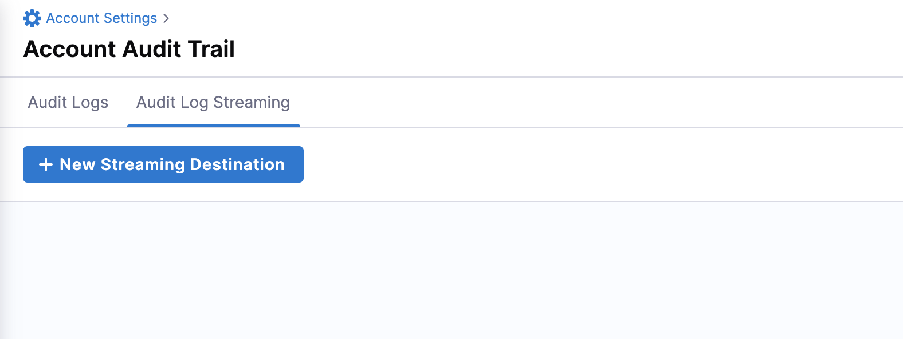
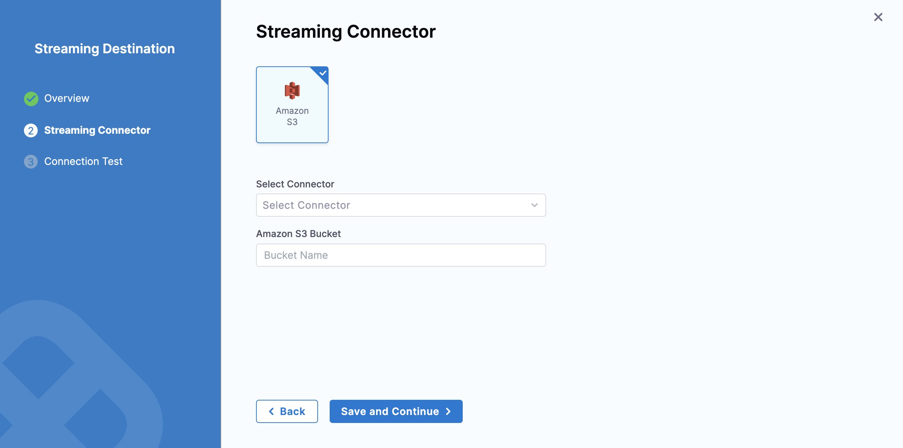
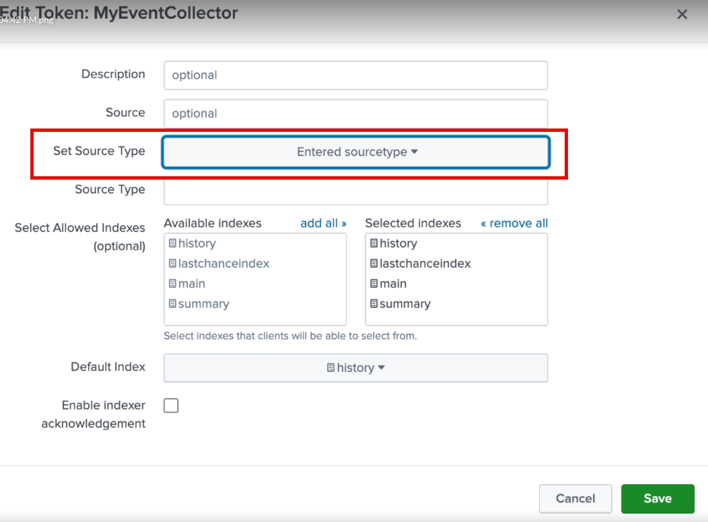
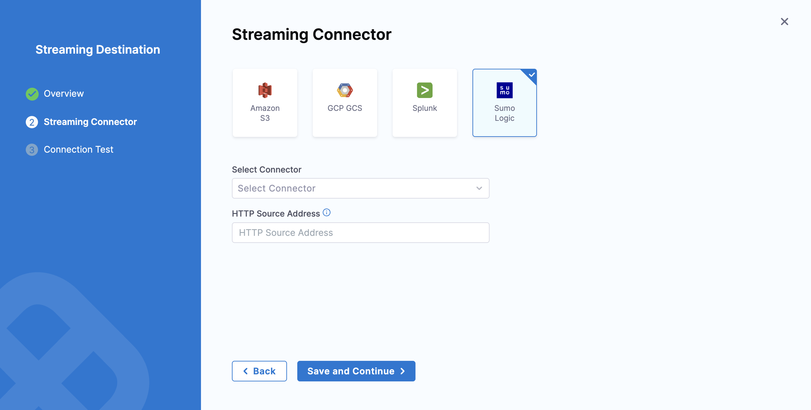
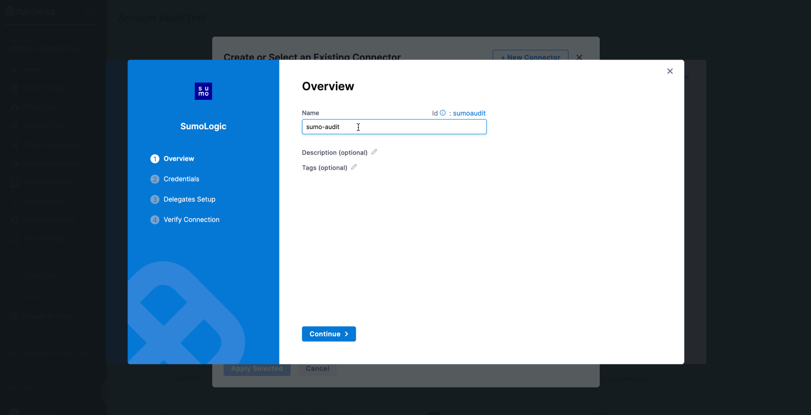
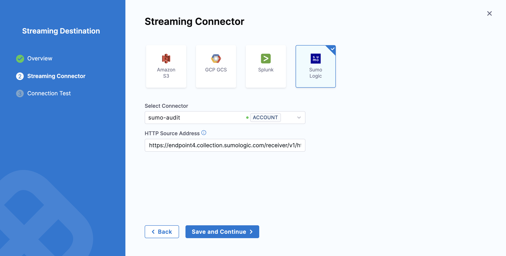
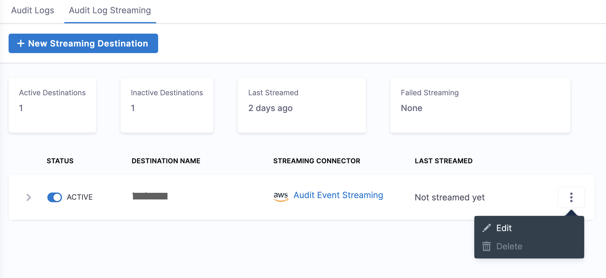
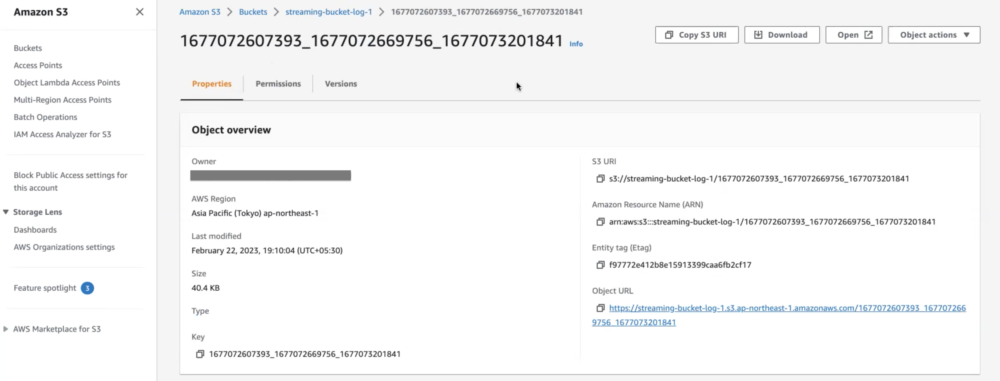

import Tabs from '@theme/Tabs';
import TabItem from '@theme/TabItem';

You can configure a streaming destination in Harness to send audit log data to another location for processing. Integrating audit data with other Security Incident and Event Management (SIEM) tools lets you do the following:

- Trigger alerts for specific events.

- Create views of audit data.

- Perform anomaly detection.

- Store more than 2 years audit data, which is the maximum amount of data that Harness keeps for your accounts.

- Keep your resources and data protected, and ensure compliance with regulations.

Harness streams the audit events to your chosen SIEM tool as structured JSON.

## Important notes about streaming

- Streaming destinations receive all audit event data, which could include sensitive information. Make sure you trust the streaming destination.
- Harness supports streaming to Amazon S3.
- You can add multiple streaming destinations in Harness.

## Add a streaming destination

Streaming destinations can only be added at the Account scope. Follow the steps below to add a streaming destination:

1. In your Harness account, select **Account Settings**.

2. Under **Security and Governance**, select **Audit Trail**. The Account Audit Trail page opens.

   

3. Select **Audit Log Streaming**, then select **New Streaming Destination** to open the configuration settings.

4. Enter a name for the streaming destination. Harness populates the destination's Id automatically. You can retain or change the Id.

5. (Optional) Enter a description and tag(s) for the streaming destination.

6. Select **Continue**.

## Configure the streaming connector

After you add your streaming destination, you're ready to configure the streaming connector.

<Tabs>
<TabItem value="GCS" label="GCP GCS" default>

:::note

Currently, this feature is behind the feature flag `PL_GCP_GCS_STREAMING_DESTINATION_ENABLED`. Additionally, if you are using OIDC credentials, you will need the `PL_GCP_OIDC_AUTHENTICATION` feature flag. Contact [Harness Support](mailto:support@harness.io) to enable the feature.

:::

To configure the GCP GCS streaming connector:

1. Follow the steps above to [Add a streaming destination](#add-a-streaming-destination).

2. Select **GCP GCS**.

3. In **Select Connector**, select an existing GCP connector or create a new one.

   You can use either the **Connect through a Harness Delegate** or **Connect through Harness Platform** connectivity mode options when setting up your GCP connector. Audit streaming supports both options.

   Go to [Add an GCP connector](../../connectors/cloud-providers/connect-to-google-cloud-platform-gcp.md) for steps to create a new GCP Provider connector.

4. Select **Apply Selected**.

5. In **Google Cloud Storage Bucket**, enter the bucket name.

   Harness writes all the streaming records to this destination.

   

6. Select **Save** and **Continue**.

7. After the connection test is successful, select **Finish**.

   The streaming destination gets configured and appears in the list of destinations under **Audit Log Streaming**. By default the destination is inactive.

</TabItem>

<TabItem value="S3" label="Amazon S3" default>

To configure the Amazon S3 streaming connector:

1. Follow the steps above to [Add a streaming destination](#add-a-streaming-destination).

2. Select **Amazon S3**.

3. In **Select Connector**, select an existing AWS Cloud Provider connector or create a new one.

   You must use the **Connect through a Harness Delegate** connectivity mode option when you set up your AWS Cloud Provider connector. Audit streaming does not support the **Connect through Harness Platform** connector option.

   Go to [Add an AWS connector](../../connectors/cloud-providers/add-aws-connector.md) for steps to create a new AWS Cloud Provider connector.

4. Select **Apply Selected**.

5. In **Amazon S3 Bucket**, enter the bucket name.

   Harness writes all the streaming records to this destination.

   

6. Select **Save** and **Continue**.

7. After the connection test is successful, select **Finish**.

   The streaming destination gets configured and appears in the list of destinations under **Audit Log Streaming**. By default the destination is inactive.

</TabItem>

<TabItem value="Splunk" label="Splunk">

:::note

Currently, this feature is behind the feature flag `PL_AUDIT_STREAMING_USING_SPLUNK_HEC_ENABLE` and requires Harness Delegate version 82500 or later. Contact [Harness Support](mailto:support@harness.io) to enable the feature.

:::

:::info
Splunk audit log streaming is compatible with Splunk enterprise and SaaS.
:::

To configure the Splunk streaming connector:

1. Follow the steps above to [Add a streaming destination](#add-a-streaming-destination).

2. Select **Splunk**.

3. In **Select Connector**, select an existing Splunk connector or create a new one.

   :::important
   When you set up your Splunk connector, you must:

   - Select HEC Authentication
   - Set up and use your Splunk HEC token.
   - Use the **Connect through a Harness Delegate** connectivity mode option. Audit streaming does not support the **Connect through Harness Platform** connector option.

4. Select **Apply Selected**, then select **Save and Continue**.

5. After the connection test is successful, select **Finish**.

   The streaming destination gets configured and appears in the list of destinations under **Audit Log Streaming**. By default the destination is inactive.

:::info troubleshoot HEC configurations
At times, you might experience issues with the HEC connector. Here are some troubleshooting steps you can take to resolve common issues.

- You should set HEC connectors without a declared `SourceType`. Although the data will be JSON-formatted, it is not declared as such. Setting a `SourceType` as `JSON` might filter data from the stream.

   

- Harness utilizes the following [standard endpoints](https://docs.splunk.com/Documentation/Splunk/9.2.1/Data/HECRESTendpoints) and appends them automatically to the customer's URL. They are not customizable.
   - `/services/collector/event`
   - `/services/collector/health`
   - `/services/server/info`
:::
</TabItem>

<TabItem value="sumo-logic" label="Sumo Logic">
  :::note Important Points to Consider Before We Begin
    1. Sumo Logic offers two UIs: Classic and New. In this section, we will be using images and steps that are available only in Sumo Logic's [New UI](https://help.sumologic.com/docs/get-started/sumo-logic-ui/).
    2. Ensure that you have administrative access to your Sumo Logic account.
  :::
  
  Before adding Sumo Logic as a [New Streaming Destination](#add-a-streaming-destination), we need to follow a few steps to configure collectors and the source for streaming audit logs, as shown below:
  
  1. Create an Access Key for Sumo Logic:

      -  To create an access key, look for the Administration option in the top right corner.
  
      -  Select Access Keys → Add Access Key.

          

   2. Add New Access Keys:

      - Give a unique name to differentiate your Access Key details from others.

      - (Optional) Allowed CORS Domains: Restrict API requests to specific domains by adding them to the allowlist, ensuring Sumo Logic only accepts requests with a matching header. 

      - Scopes allow you to restrict access to personal access keys. There are two types of scopes, as shown below—choose wisely.

        - Default: All permissions associated with your roles will be granted to the key generated.
        - Custom: You can add permissions according to your requirements. 
        
          While You can choose any of the options, but if you select Custom, we recommend granting at least the following permissions, as shown in the image below.
          
          

      - Click Save to proceed. Once saved, you will receive an Access ID and Access Key as shown below. Make sure to save them for future use.

          

   3. Create Sumo Logic [Hosted](https://help.sumologic.com/docs/send-data/hosted-collectors/configure-hosted-collector/) Collector:

      - To create a Collector, locate the Configuration option in the top right corner, then click Collection.

          
      
      - Add a Collector, then select the Collector Type. You can choose either [Installed or Hosted](https://help.sumologic.com/docs/send-data/choose-collector-source/), depending on your requirements. For now, we will select the Hosted Collector to set up the collector in the Sumo Logic Cloud.

          

  4. Add [HTTP Source](https://help.sumologic.com/docs/send-data/hosted-collectors/http-source/logs-metrics/) to Sumo Logic Collector:

      - Check Add Source option in the same row as your collector.

      - Search for 'HTTP Logs & Metrics' in the search tab.

      - Add a unique name and any optional input fields as per your requirements. Similarly, you can enable advanced options for logs and update processing rules based on your needs.

           

      - Click Save to proceed. Once saved, you will find the HTTP Source Address. Copy and save it for future configuration with Harness.

                

  ### Add Sumo Logic as New Streaming Destination

      1. Add Sumo Logic's Access ID and Access Key to Harness Secrets that we saved in the previous steps. Navigate to Account Settings → Account-level Resources → Secrets.

           
      
      2. Add [New Streaming Destination](#add-a-streaming-destination), Navigate to Account Settings → Security and Governance → Audit Trail.

      3. Check Audit Log Streaming → New Streaming Destination. 

      4. Configure Streaming Destination:

          4.1 Add a name, description, and tags in your Overview section.

              

          4.2 Configure Sumo Logic Connector:

              

            - Create or select an existing connector. For now, let's add a new connector.
            
            - Click New Connector → Add a name, description, and tags accordingly.

            - Add the Sumo Logic API server URL. To know your Sumo Logic API Endpoint refer [Sumo Logic documentation ](https://help.sumologic.com/docs/api/getting-started/#sumo-logic-endpoints-by-deployment-and-firewall-security) 
            - Add Sumo Logic Access ID and Access Key.

            - Select the Delegate setup → Save and Continue.

                

            - Verify the connection and click Finish to complete the setup. The connector may be selected automatically after verification.

          4.3 Add the HTTP Source Address. Click Save and Continue to proceed.
        
                

     5. Verify the connection and finish.
</TabItem>

</Tabs>

## Activate or deactivate streaming

1. To activate streaming to this destination, toggle the status to **Active** besides the streaming destination.

   Harness starts writing audit logs after the destination is activated.

   Harness streams audit logs to the destination every 30 minutes.

2. You can pause audit streaming, preventing any new audit events from being streamed to the configured endpoint by setting the status to **Inactive**.

   When you reactivate the streaming destination, Harness starts streaming the audit logs from the point where it was paused.

## Update audit stream

You can change the audit stream configuration by clicking three dots beside the stream destination. This opens a pop-up menu with the following options:

- **Edit:** Select a different streaming destination or make changes to the existing destination.

- **Delete:** Delete the audit stream destination. You must set the audit stream destination to inactive before you can delete it.

   

## Amazon S3 audit file details

Here is an example of an audit stream file in one of the Amazon S3 buckets.



This file has a list of audit events in JSON format.

Following are the key points about the naming convention of the audit stream file:

- There are three timestamps in the file name: `<t1>_<t2>_<t3>`.
- `<t1>` and `<t2>` indicate the time range of audit events in the file. This time range is provided for information only and is not always accurate. The timestamp can also be out of range if there is a delay in capturing the event.
- `<t3>` indicates the time when the file was written.

:::important
Harness recommends not building any business logic based on the file name.
:::

## Payload schema

Streamed audit events have a predictable schema in the body of the response.

|**Field**       |  **Description**     |   **Is required**    |
|  ---  |  ---  |  ---  |
|   auditEventId    |  Unique ID for the audit event.     |   Required    |
|   auditEventAuthor    |  [Principal](/docs/platform/role-based-access-control/rbac-in-harness#rbac-components) attached with audit event.    |   Required    |
|    auditModule   | Module for which the audit event is generated.      |   Required    |
|   auditResource    |  Resource audited.     |  Required     |
|   auditResourceScope    |  [Scope](/docs/platform/role-based-access-control/rbac-in-harness#permissions-hierarchy-scopes) of the audited resource.     |   Required    |
|  auditAction     |  Action on the audited resource.     |  Required     |
|    auditEventTime   |  Date and time of the event.     | Required      |
|   auditHttpRequestInfo    |  Details of the HTTP request.     |  Optional     |

### JSON payload

```json
{
  "$schema": "http://json-schema.org/draft-04/schema#",
  "type": "object",
  "properties": {
    "auditEventId": {
      "type": "string"
      "description":"Unique ID for each audit event"
    },
    "auditEventAuthor": {
      "type": "object",
      "properties": {
        "principal": {
          "type": "object",
          "properties": {
            "type": {
              "type": "string"
            },
            "identifier": {
              "type": "string"
            },
            "email": {
              "type": "string"
            }
          },
          "required": [
            "type",
            "identifier",
          ]
        }
      },
      "required": [
        "principal"
      ]
      "description":"Information about Author of the audit event"
    },
    "auditModule": {
      "type": "string"
      "description":"Information about Module of audit event origin"
    },
    "auditResource": {
      "type": "object",
      "properties": {
        "type": {
          "type": "string"
        },
        "identifier": {
          "type": "string"
        }
      },
      "required": [
        "type",
        "identifier"
      ]
      "description":"Information about resource for which Audit event was generated"
    },
    "auditResourceScope": {
      "type": "object",
      "properties": {
        "accountIdentifier": {
          "type": "string"
        },
        "orgIdentifier": {
          "type": "string"
        },
        "projectIdentifier": {
          "type": "string"
        }
      },
      "required": [
        "accountIdentifier",
      ]
      "description":"Information about scope of the resource in Harness"
    },
    "auditAction": {
      "type": "string"
      "description":"Action CREATE,UPDATE,DELETE,TRIGGERED,ABORTED,FAILED , Not exhaustive list of events"
    },
    "auditHttpRequestInfo": {
      "type": "object",
      "properties": {
        "requestMethod": {
          "type": "string"
        }
        "clientIP": {
          "type": "string"
        }
      },
      "required": [
        "requestMethod",
        "clientIP"
      ]
      "description":"Information about HTTP Request"
    },
    "auditEventTime": {
      "type": "string"
      "description":"Time of auditEvent in milliseconds"
    }
  },
  "required": [
    "auditEventId",
    "auditEventAuthor",
    "auditModule",
    "auditResource",
    "auditResourceScope",
    "auditAction",
    "auditEventTime",
  ]
}
```
