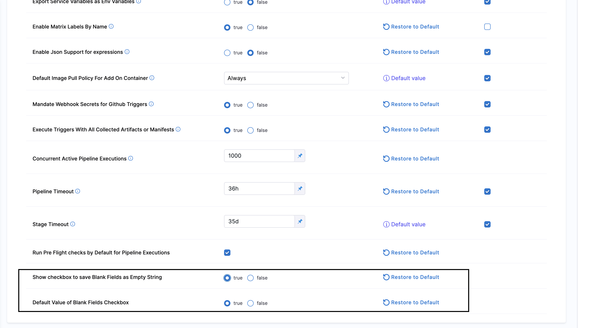

In a few cases, when you provide an empty value `""` as your input, it will be converted into `<+input>` in the background. This behavior specifically occurs in two scenarios:

1. When an Input Set is used to run a pipeline from the UI.
2. When an Input Set is used in a Trigger to start a Pipeline.

:::info
`<+input>` is interpreted as null by Harness.
::: 

Let's take an example where you are running a pipeline via an input set:-

In this example, we have not provided any value to the input:-

```yaml
inputSet:
  name: input
  tags: {}
  identifier: input
  orgIdentifier: default
  projectIdentifier: Samples
  pipeline:
    identifier: test_expression
    variables:
      - name: var_config
        type: String
        value: ""
```
When you run the pipeline, the Run Form processes the input values. If no value is provided, it shows `<+input>`, indicating that the pipeline is ready to accept values as they are given. The pipeline itself doesn't preprocess these values; it takes whatever is provided by the Run Form directly.


As a user, you might want more control over how empty values are handled, especially if you want the string to stay empty. Harness provides an option called **Save Blank Fields as Empty String** for this purpose.

With this option enabled, an empty string `""` remains unchanged throughout the pipeline execution. This keeps the YAML and visual view consistent with the final payload sent during execution.

For example, if you want **var_config** to stay an empty string, enabling this option will prevent it from being converted to `<+input>`.This ensures your input remains exactly as you specified, giving you precise control over your pipeline configurations.

## How to enable this feature?

:::info note
Currently this feature is behind feature flag `CDS_ENABLE_RAW_MODE`. Contact [Harness Support](mailto:support@harness.io) to enable the feature.
:::

You need to enable following settings at account level to use this feature:

1. **Show checkbox to Save Blank Fields as Empty String** - This setting, when enabled, will show the checkbox **Save Blank Fields as Empty String** both while creating the Input Set and during Pipeline runform.
2. **Default value of Blank Fields as Empty String** - When enabled, this setting will automatically select the checkbox **Save Blank Fields as Empty String** by default.



## Detailed Behavior Changes

### If Save Blank Fields as Empty String is not enabled (Current Behavior)

- **Creating Input Sets**:
   - **Initial Load**: On load `<+input>` is converted into `""`.
   - **Saving**: On Save, `""` is converted into`<+input>`.

- **Updating Input Sets**:
  - **Initial Load**: On Load, `<+input>` is converted into `""`.
  - **Saving**: On Save, `""` is converted into `<+input>`.

- **Run Pipeline form with Input Set**:
  - **Initial Load**: On Load, `<+input>` is converted into `""`.
  - **Execution**: On Run, `""` stays `<+input>`.

- **Run Pipeline without Input Set**:
  - **Initial Load**: On Load, `<+input>` is changed to `""`.
  - **Execution**: `""` stays `""`.

### If Save Blank Fields as Empty String is enabled

- **Creating Input Sets**:
   - **Initial Load**: On load `<+input>` is converted into `""`
   - **Saving**: On Save, `""` stays `""` and `<+input>` stays `<+input>`.

- **Updating Input Sets**:
  - **Initial Load**: On Load, `<+input>` stays `<+input>`, `""` stays `""`.
  - **Saving**: On Save, `<+input>` stays `<+input>`, `""` stays `""`.


- **Run Pipeline form with Input Set**:
  - **Initial Load**: On Load, `<+input>` stays `<+input>`, `""` stays `""`.
  - **Execution**: On Run, `<+input>` stays` <+input>`, `""` stays `""`.

- **Run Pipeline without Input Set**:
  - **Initial Load**: On Load, `<+input>` is changed to `""`.
  - **Execution**: `""` stays `""`.

