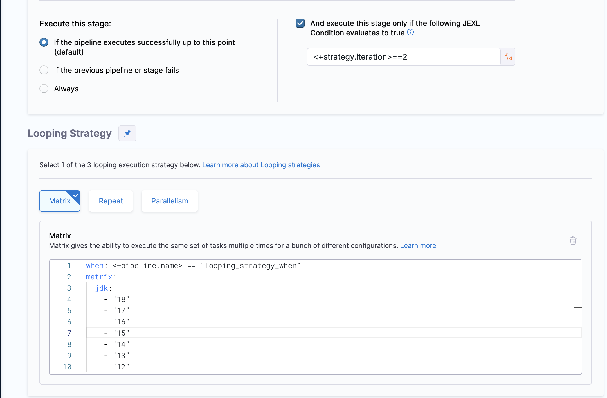
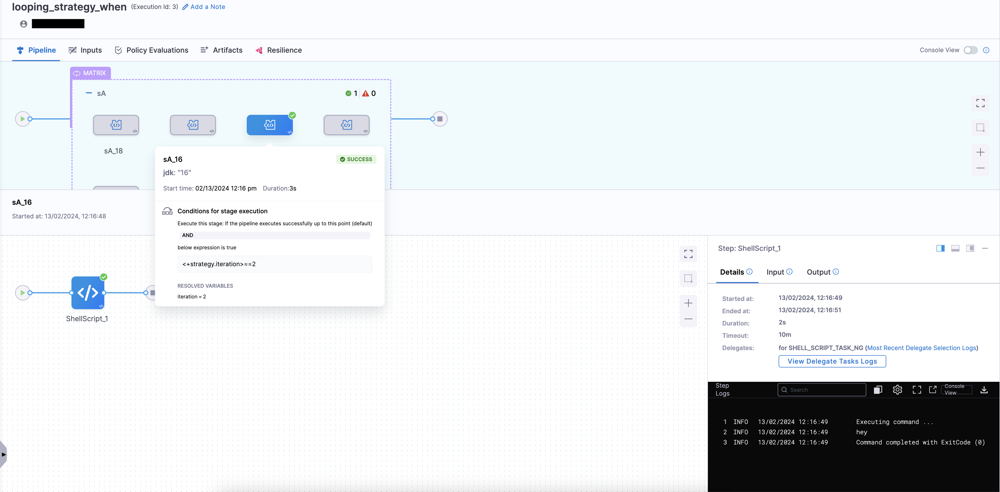
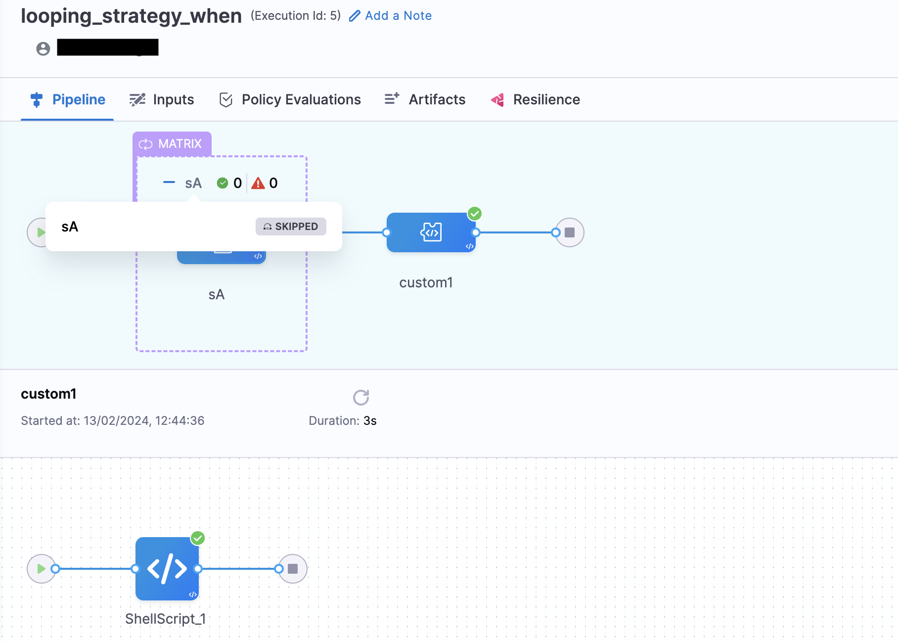

## Introduction
You can use conditional execution inside a [looping strategy](/docs/platform/pipelines/looping-strategies/looping-strategies-matrix-repeat-and-parallelism.md) by providing `when` keyword. 

Some scenarios where you might want to use the ``when`` condition in your pipeline include:

1. When you want to skip certain elements in the looping strategy.
2. When you prefer not to execute the looping strategy at all.
3. When you want to bypass matrix/repeat/parallelism if it's empty.

Let's cover a few examples and a scenario explaining the usage of ``when`` condition:

For example, you have matrix with 10 elements in your pipeline and you want to run a particular ith element after it satisfies a particular condition:
```yaml
pipeline:
  name: looping_strategy_when
  identifier: looping_strategy_when
  tags: {}
  projectIdentifier: fdsf
  orgIdentifier: default
  stages:
    - stage:
        name: sA
        identifier: sA
        description: ""
        type: Custom
        spec:
          execution:
            steps:
              - step:
                  type: ShellScript
                  name: ShellScript_1
                  identifier: ShellScript_1
                  spec:
                    shell: Bash
                    executionTarget: {}
                    source:
                      type: Inline
                      spec:
                        script: echo hey
                    environmentVariables: []
                    outputVariables: []
                  timeout: 10m
        tags: {}
        strategy:
          when: <+pipeline.name> == "looping_strategy_when"
          matrix:
            jdk:
              - "18"
              - "17"
              - "16"
              - "15"
              - "14"
              - "13"
              - "12"
              - "11"
              - "10"
              - "9"
        when:
          pipelineStatus: Success
          condition: <+strategy.iteration> == 2
  allowStageExecutions: true
```
Let's discuss how this YAML will get evaluated and what the expected output will be:
1. First, it will check whether ``when: <+pipeline.name> == "looping_strategy_when"`` is true. If it's true, then it will move forward to run the looping strategy, otherwise it will be skipped. 

2. Second, if you have a stage-level conditional execution as provided in the above example:
```yaml
 when:
        pipelineStatus: Success
        condition: <+strategy.iteration> == 2
```
Here, after the first ``when: <<+pipeline.name> == "looping_strategy_when"`` condition is evaluated, then it will only evaluate the stage-level condition.


To summarize, the above YAML will first check if the pipeline name matches ``looping_strategy_when``, and if it does, for example, if the status is ``Success``, it will run the second element of the matrix.


Let's consider an example where it will skip to run looping strategy:-
```yaml
pipeline:
  name: looping_strategy_when
  identifier: looping_strategy_when
  tags: {}
  projectIdentifier: fdsf
  orgIdentifier: default
  stages:
    - stage:
        name: sA
        identifier: sA
        description: ""
        type: Custom
        spec:
          execution:
            steps:
              - step:
                  type: ShellScript
                  name: ShellScript_1
                  identifier: ShellScript_1
                  spec:
                    shell: Bash
                    executionTarget: {}
                    source:
                      type: Inline
                      spec:
                        script: echo hey
                    environmentVariables: []
                    outputVariables: []
                  timeout: 10m
        tags: {}
        strategy:
          when: <+pipeline.name> == "feat1"
          matrix:
            jdk:
              - "18"
              - "17"
              - "16"
              - "15"
              - "14"
              - "13"
              - "12"
              - "11"
              - "10"
              - "9"
        when:
          pipelineStatus: Success
          condition: <+strategy.iteration> == 2
  allowStageExecutions: true
```
In this example, the pipeline name doesn't match as ``feat1``, therefore it will skip running the looping strategy (in this case ``matrix``), and move forward to run the rest of the pipeline.


