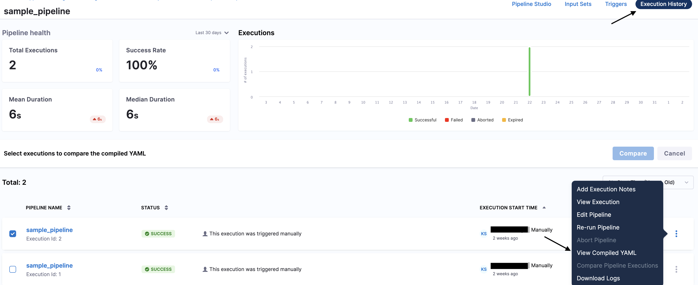

If you are an account administrator, you can enforce limits on the usage of pipelines in your account. Possible and default values, along with other aspects of each setting (such as whether or not you can edit the setting), depend on the plan to which you are subscribed.

This article provides a detailed description of the pipeline settings in various categories.

:::info

For certain settings, the values in the Free plan also apply to the trial period of the Team and Enterprise plans. In such cases, the Free plan and trial period share a column in the settings table.

:::

## Pipeline Execution Concurrency

### Concurrent Active Pipeline Executions

Number of concurrent pipeline executions per execution API request. The setting considers only those executions that are in progress (including those that are paused temporarily in steps such as the wait step or approval step), not those that have executed to completion.

Any executions that are triggered when the limit is reached are added to the execution queue. **These executions and their deployments are not failed by Harness.**

The following table describes how this setting applies to each plan.

<table>
  <thead>
    <tr>
      <th></th>
      <th>Free plan/Trial</th>
      <th>Team plan</th>
      <th>Enterprise plan</th>
    </tr>
  </thead>
  <tbody>
    <tr valign="top">
      <td>
        <strong>Default</strong>
      </td>
      <td>
        
2

      </td>
      <td>
        
200

      </td>
      <td>
        
500

      </td>
    </tr>
    <tr valign="top">
      <td>
        <strong>Maximum</strong>
      </td>
      <td>
        
NA

      </td>
      <td>
        
500

      </td>
      <td>
        
1000

      </td>
    </tr>
    <tr valign="top">
      <td>
        <strong>Editable</strong>  
      </td>
      <td>
        
No

      </td>
      <td>
        
Yes

      </td>
      <td>
        
Yes

      </td>
    </tr>
    <tr valign="top">
      <td>
        <strong>Scope</strong>
      </td>
      <td>
        
Account

      </td>
      <td>
        
Account

      </td>
      <td>    
        
Account

      </td>
    </tr>
  </tbody>
</table>

## Parallelism

### Parallelism Limit

Number of parallel steps or stages at a given level in a pipeline, regardless of whether you use a matrix, configure parallelism, or configure the steps or stages manually. For example, in the Free plan, you can add a maximum of 10 parallel stages at a level, and you can add a maximum of 10 parallel steps in each of those stages. 

This is a hard limit at the account scope; it is not made available to account administrators and users cannot configure this limit for their pipelines. Users who specify a value for their pipeline can save the pipeline but not execute it.

The following table shows the value of this setting on each plan.

<table>
  <thead>
    <tr>
      <th>Free plan/Trial</th>
      <th>Team plan</th>
      <th>Enterprise plan</th>
    </tr>
  </thead>
  <tbody>
    <tr valign="top">
      <td>
        
10

      </td>
      <td>
        
256

      </td>
            <td>
        
256

      </td>
    </tr>
  </tbody>
</table>

## Resolved YAML size limit 

Compiled YAML cannot exceed the Harness limit of **3MB**. 

Here are some important points to note:
- Compiled YAML refers to the final YAML file generated with all templates resolved.
- To see the compiled YAML of your pipeline, go to the ``Execution History`` of your pipeline, click on the three dots **(⋮)** for the specific pipeline, and choose ``View Compiled YAML`` as shown in the image below.

- Even if your pipeline YAML size is only a few kilobytes, using a template with a larger size will contribute to the overall size, calculated as Pipeline YAML size + Template size. Exceeding this limit may lead to an [error message](https://developer.harness.io/docs/troubleshooting/troubleshooting-nextgen/#the-incoming-yaml-document-exceeds-the-limit-3145728-code-points).

## Pipeline Execution Time Limits 

The maximum allowable time a stage or pipeline can run. These are the maximum allowable values, but smaller values can be set within the pipeline using the **Timeout** field.

If a timeout is configured within a pipeline or stage larger than these system limits, the limit is still enforced.

The following table lists the limits for each plan. You can only edit all of these items to be *less* within the Account.

<table>
  <thead>
    <tr>
      <th></th>
      <th>Free plan</th>
      <th>Trial plan</th>
      <th>Team plan</th>
      <th>Enterprise plan</th>
    </tr>
  </thead>
  <tbody>
    <tr valign="top">
      <td>
        <strong>Pipeline Timeout</strong>
      </td>
      <td>
        
2 hours

      </td>
      <td>
        
4 hours

      </td>
      <td>
        
30 days

      </td>
      <td>
        
35 days

      </td>
    </tr>
    <tr valign="top">
      <td>
        <strong>Stage Timeout</strong>
      </td>
      <td>
        
1 hour

      </td>
      <td>
        
1 hour

      </td>
      <td>
        
30 days

      </td>
      <td>
        
35 days

      </td>
    </tr>
    <tr valign="top">
      <td>
        <strong>Editable</strong>  
      </td>
      <td>
        
Yes

      </td>
      <td>
        
Yes

      </td>
      <td>
        
Yes

      </td>
      <td>
        
Yes

      </td>
    </tr>
    <tr valign="top">
      <td>
        <strong>Scope</strong>
      </td>
      <td>
        
Account/Organization/Project

      </td>
      <td>
        
Account/Organization/Project

      </td>
      <td>
        
Account/Organization/Project

      </td>
      <td>
        
Account/Organization/Project

      </td>
    </tr>
  </tbody>
</table>

