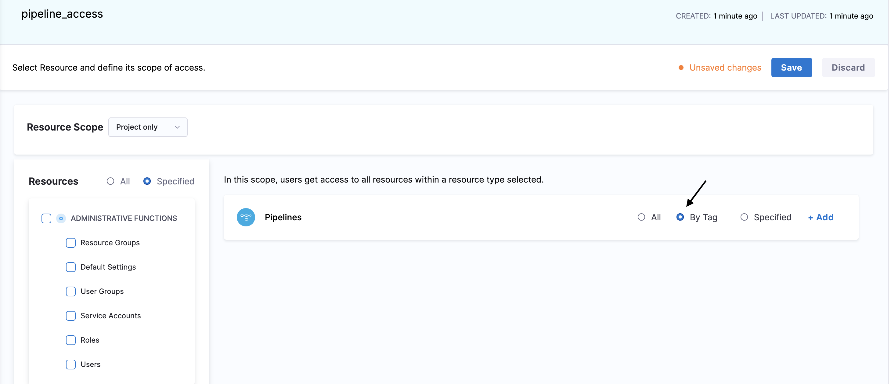
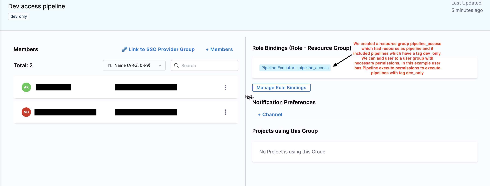

You can manage RBAC for your pipelines with help of tags.

Let's discuss this with an example:-

Suppose you manage three pipelines for different environment each i.e Dev, QA, Production and you want specific users in each environment's pipeline to have a particular access. For example, you want Developers to have Pipeline execute access to Dev, QA pipelines or any other relevant pipelines and Devops Admins to have pipeline execute and edit permission or admin permissions to Production related pipelines. You can have multiple pipelines and you don't want to add each pipelines in a resource group and and give permissions to users. 

Now, we have pipelines with tag **dev_only** that deploy to Dev related environment and you need to provide permission to Developers to these pipelines. Let's see how you can do this with help of tags:-

1. Tag your pipelines that deploy to the Dev environment with the tag **dev_only**.

Learn more about adding [tags](/docs/platform/references/tags-reference.md).

2. In the **Resource group**, after you have selected your Resources for which you want to provide user access (i.e., Pipelines, Services, Environments, etc.), you will see three options in the Pipeline section: **All**, **By Tag**, and **Specified**.

Learn more about creating [Resource Groups](./add-resource-groups.md) in Harness.

In our scenario, we want the user to have access to a few Dev pipelines. You have the option to select specified pipelines or use By Tag. If you have multiple pipelines, you don't want to search through the list to select those pipelines individually. This is where **By Tag** comes into use. Additionally, if you add new Dev Pipelines in Harness you you wouldn't want to manually include each new pipeline into the resource group you can just add the tag in your pipeline and automatically user will have access to newly added Dev pipelines.

By using the **By Tag** option, you can efficiently manage permissions for multiple pipelines by simply applying the relevant tag. 

3. Select **By Tag** and provide the tag of the pipelines you want users to have access to, in this case pipelines with tag **dev_only**.

Now, you can give users the required access by adding users to a user group and assigning permissions to the resource groups. For example, you can create a user group for developers that will have Pipeline Executor access to this Resource group. This will ensure that all users in this group have access to pipelines tagged with **dev_only**. Also if you want to remove a certain pipeline from the resource group all you need to do is remove the tag and it will automatically get removed from that particular Resource Group without a need to edit the Resource Group.

Learn more about creating [User groups](./add-user-groups.md) in Harness.

## Few important things to note

When working with tag-based Resource Groups, the tag used is the one found in the Harness Metadata for the pipeline.

It is important to note the following when pipelines are stored in Git:

1. Different versions of the pipeline stored in different branches may have different tags.
2. Updating the tag in the pipeline directly in Git does not update it in Harness.
3. When you save a different branch of the pipeline in the Harness UI, it updates the tags in the Harness system to match the tags from that specific branch.

This behavior can impact tag-based resource groups. Specifically, a pipeline may enter or exit a group based on the last saved branch from the UI.