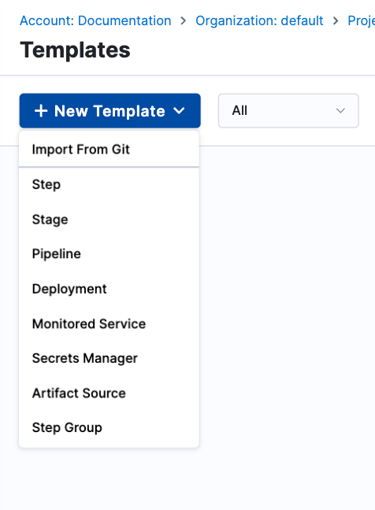
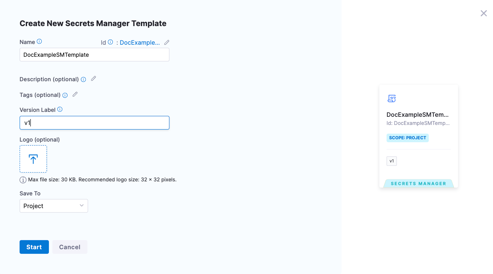

You can link CyberArk Conjur to Harness and use it to store any sensitive data you use in Harness, including secrets.

## Before you begin

You need an understanding of:

- [Harness' key concepts](/docs/platform/get-started/key-concepts.md).
- [Secrets Management](/docs/platform/secrets/secrets-management/harness-secret-manager-overview).
- [Storing authentication credentials](/docs/platform/secrets/secrets-management/store-authentication-credentials).

## CyberArk Conjur secret manager permission requirements

- Make sure you have **Create/Edit** permissions for secrets.
- Make sure you have **Create/Edit** permissions for connectors.

### Step 1: Create a Secret Manager Template

You can create a Secret Manager Template at the account, org, or project [scope](/docs/platform/role-based-access-control/rbac-in-harness/#permissions-hierarchy-scopes).

This topic shows you how to create a Secret Manager Template at the Project scope.

1. In your Harness Account, go to your Project.
2. Select **Project Settings**, then under **Project-level resources**, select **Templates**.

   

3. Select **New Template**, then select **Secret Manager**.

   

4. Enter a **Name** for your template.
5. (Optional) In **Description**, select the pencil icon and enter a description.
6. (Optional) In **Tags**, select the pencil icon and assign a tag.
7. Enter a **Version Label**.
8. (Optional) Select the upload icon and upload a **Logo**.
9. Under **Save To**, select **Project**, then select **Start**.
10. Select your **Script Type**, then select your script location.
11. Enter the following script in **Script**.

   ```bash
   CONJUR_APPLIANCE_URL='<+spec.environmentVariables.CONJUR_APPLIANCE_URL>'
   HOST_ID='<+spec.environmentVariables.HOST_ID>'
   API_KEY='<+secrets.getValue(<+spec.environmentVariables.API_KEY_SECRET_ID>)>'
   AUTHENTICATOR='<+spec.environmentVariables.AUTHENTICATOR>'
   ACCOUNT='<+spec.environmentVariables.ACCOUNT>'
   KIND='variable'

   IDENTIFIER='<+spec.environmentVariables.IDENTIFIER>'

   #
   # Authenticate first to get an access token
   # ref: https://docs.conjur.org/Latest/en/Content/Developer/Conjur_API_Authenticate.htm
   #

   FULL_AUTH_URL="$CONJUR_APPLIANCE_URL/$AUTHENTICATOR/$ACCOUNT/$HOST_ID/authenticate"
   ACCEPT_HEADER='Accept-Encoding: base64'
   ACCESS_TOKEN=$(curl --request POST --header "$ACCEPT_HEADER" --data "$API_KEY" "$FULL_AUTH_URL")

   #  Use the token to retrieve a secret
   RETRIEVAL_URL="$CONJUR_APPLIANCE_URL/secrets/$ACCOUNT/$KIND/$IDENTIFIER"
   AUTH_HEADER="Authorization: Token token=\"${ACCESS_TOKEN}\""
   ACCEPT_HEADER_JSON="Accept: application/json"

   secret="$(curl --request GET $RETRIEVAL_URL --header "$AUTH_HEADER" --header "$ACCEPT_HEADER_JSON" | head -n 1)"
   ```

12. Select **Configuration**, then Select **Add Input Variable**.
13. Set up the following input variables.

   - `CONJUR_APPLIANCE_URL`
      - **Type**: String
      - **Value**: `<+input>`
   - `HOST_ID`
      - **Type**: String
      - **Value**: `<+input>`
   - `API_KEY_SECRET_ID`
      - **Type**: String
      - **Value**: `conjur_api_key`
   - `AUTHENTICATOR`
      - **Type**: String
      - **Value**: `<+input>`
   - `ACCOUNT`
      - **Type**: String
      - **Value**: `<+input>`
   - `IDENTIFIER`
      - **Type**: String
      - **Value**: `<+input>`

14. Select **Save**.

   For detailed steps to create a Secret Manager Template, go to [Create a Secret Manager Template](../../templates/create-a-secret-manager-template.md).

#### Example YAML

```yaml
template:
  name: Conjur
  identifier: Conjur
  versionLabel: "1.0"
  type: SecretManager
  tags: {}
  icon:
  spec:
    shell: Bash
    delegateSelectors: []
    source:
      type: Inline
      spec:
        script: |-
          CONJUR_APPLIANCE_URL='<+spec.environmentVariables.CONJUR_APPLIANCE_URL>'
          HOST_ID='<+spec.environmentVariables.HOST_ID>'
          API_KEY='<+secrets.getValue(<+spec.environmentVariables.API_KEY_SECRET_ID>)>'
          AUTHENTICATOR='<+spec.environmentVariables.AUTHENTICATOR>'
          ACCOUNT='<+spec.environmentVariables.ACCOUNT>'
          KIND='variable'


          #
          # Authenticate first to get an access token
          # ref: https://docs.conjur.org/Latest/en/Content/Developer/Conjur_API_Authenticate.htm
          #
          FULL_AUTH_URL="$CONJUR_APPLIANCE_URL/$AUTHENTICATOR/$ACCOUNT/$HOST_ID/authenticate"
          ACCEPT_HEADER='Accept-Encoding: base64'
          ACCESS_TOKEN=$(curl --request POST --header "$ACCEPT_HEADER" --data "$API_KEY" "$FULL_AUTH_URL")

          #  Use the token to retrieve a secret
          RETRIEVAL_URL="$CONJUR_APPLIANCE_URL/secrets/$ACCOUNT/$KIND/$IDENTIFIER"
          AUTH_HEADER="Authorization: Token token=\"${ACCESS_TOKEN}\""
          ACCEPT_HEADER_JSON="Accept: application/json"

          # Set secret variable, which is expected to be set as the value of the secret.
          secret="$(curl --request GET $RETRIEVAL_URL --header "$AUTH_HEADER" --header "$ACCEPT_HEADER_JSON" | head -n 1)"

    environmentVariables:
      - name: CONJUR_APPLIANCE_URL
        type: String
        value: <+input>
      - name: HOST_ID
        type: String
        value: <+input>
      - name: API_KEY_SECRET_ID
        type: String
        value: <+input>
      - name: AUTHENTICATOR
        type: String
        value: <+input>
      - name: ACCOUNT
        type: String
        value: <+input>
      - name: IDENTIFIER
        type: String
        value: <+input>
    outputVariables: []
    onDelegate: true
```

### Step 2: Add a Custom Secret Manager

You can add a Custom Secret Manager at the account, org, and project scope.

To do this, go to Project, Organization, or Account settings.

This topic shows you how to add a Custom Secret Manager in the project scope.

1. In your Harness Account, go to your Project.
2. In Project Setup, select **Connectors** and then select **New Connector**.
3. In **Secret Managers**, select **Custom Secret Manager**. The Custom Secret Manager settings open.

   

4. Enter a **Name** for your Custom Secret Manager. Select **Continue**.
5. Select **Select Template**. The Template Library appears with all the [Secret Manager Templates](../../templates/create-a-secret-manager-template.md) listed.
6. Select the desired scope and select a your CyberArk Conjur Secret Manager template from the Template Library.

   

   You can also search for a specific Secret Manager Template by entering its name in **Search**. Once you select the Secret Manager Template, the details are displayed in the Template Studio.

7. Select **Use Template**.
8. Enter values for the required Input Variables. Harness allows you to use [Fixed Values and Runtime Inputs](../../variables-and-expressions/runtime-inputs).

	

9. Select **Fixed** for the `CONJUR_APPLIANCE_URL`, `HOST_ID`, `AUTHENTICATOR`, `API_KEY_SECRET_ID`, and `ACCOUNT`.

   - The `API_KEY_SECRET_ID` should be an identifier for a Harness Secret, to be used for authenticating with Conjur. Create the secret using any secret manager other than Conjur. Based on where you create the secret, this can be in the format of `account.secretid`, `org.secretid`, or just `secretid`.

   - The following values are used to authenticate with Conjur using this API URL format:

      `$CONJUR_APPLIANCE_URL/$AUTHENTICATOR/$ACCOUNT/$HOST_ID/authenticate`

   - The following values are used to fetch a secret from Conjur using this API URL format:

      `$CONJUR_APPLIANCE_URL/secrets/$ACCOUNT/$KIND/$IDENTIFIER`

   - Set the `IDENTIFIER` to not be **Fixed**, and provide an example secret identifier to be used for testing the connection.

      The `IDENTIFIER` should be in the following format:

      `<vault>/<lob-user>/<safe>/<account>/<property>`

10. Select **Continue**.
11. In **Delegates Setup**, enter [**Selectors**](../../delegates/manage-delegates/select-delegates-with-selectors.md#option-select-a-delegate-for-a-connector-using-tags) for specific **Delegates** that you want to allow to connect to this Connector. Select **Save and Continue**.
12. In **Connection Test**, select **Finish** after your connection is successful.

### Step 3: Use the Custom Secret Manager

Create an Encrypted Text using the Custom Secrets Manager you created earlier. Enter the name and values of all the Input Variables defined while creating the Shell Script Template.

For more information on creating Encrypted Text Secret, go to [Add Encrypted Text](/docs/platform/secrets/add-use-text-secrets).

If you want to create a secret on a Target Host Custom Secrets Manager, you must also select the Connection Attribute.

