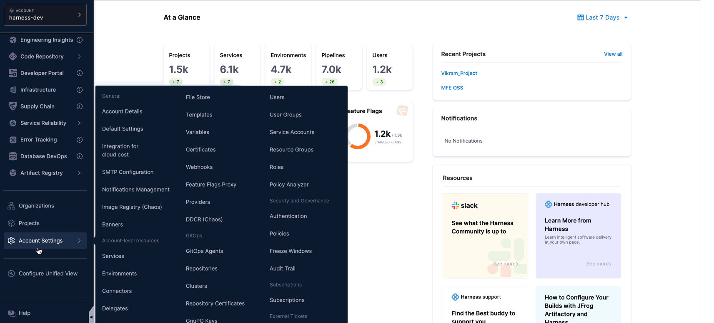
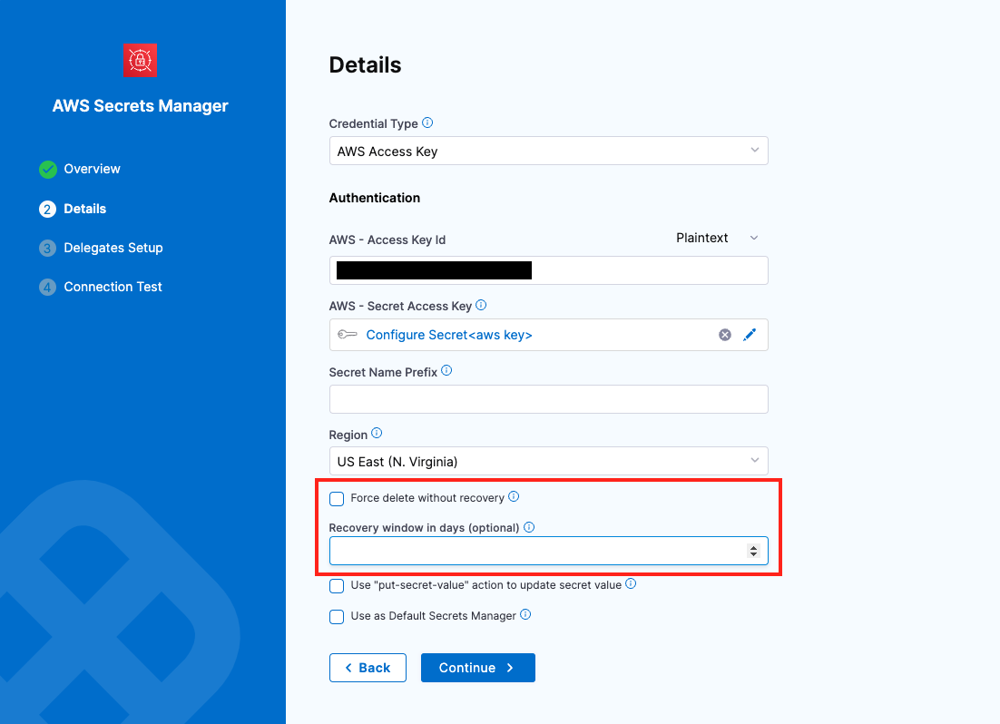
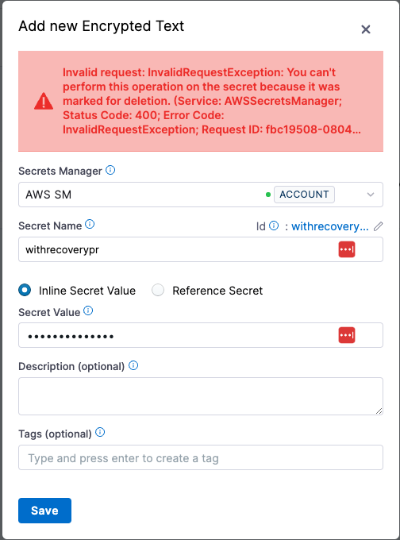
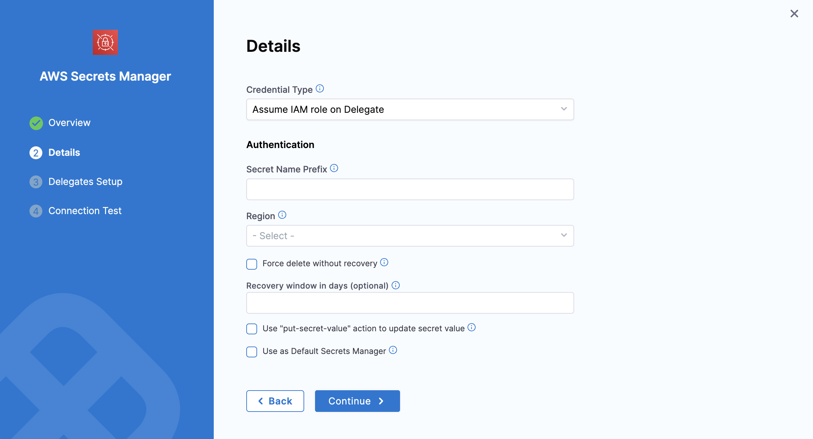
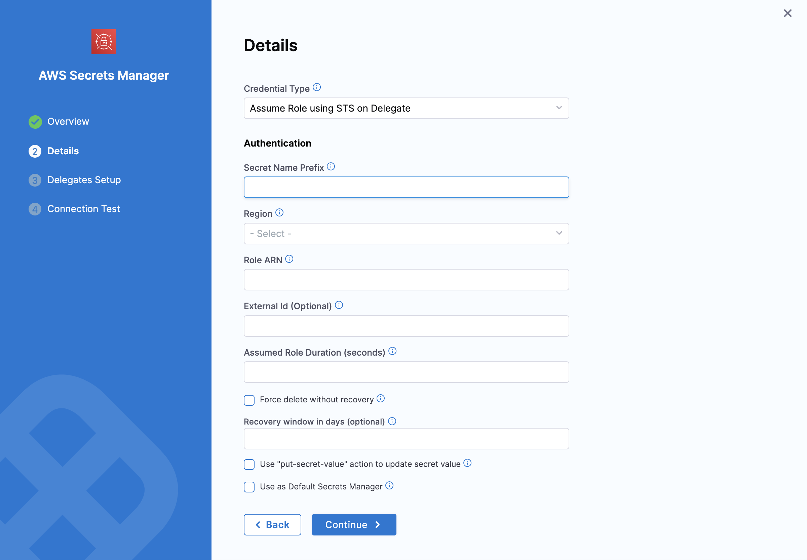
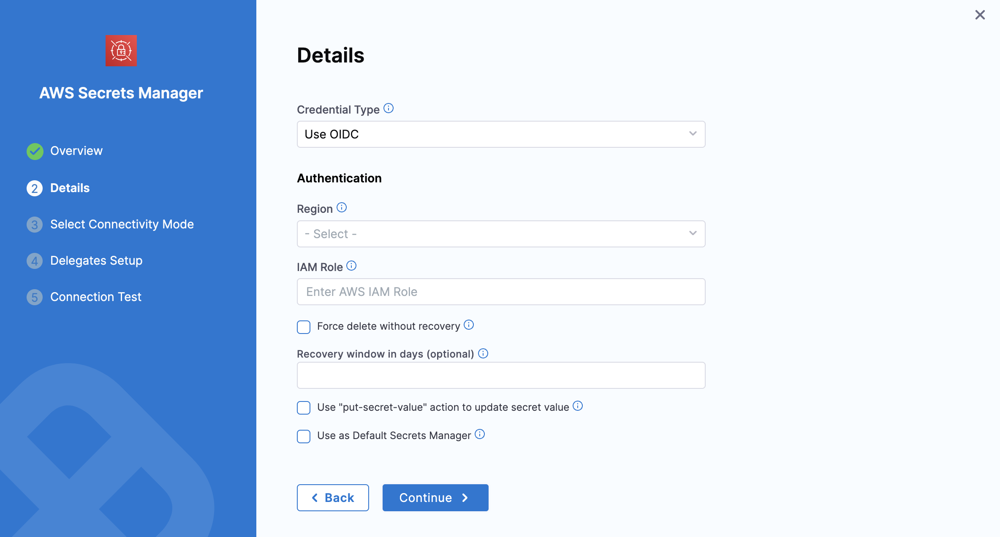

You can integrate AWS Secrets Manager to securely manage your Harness secrets.  

Unlike AWS KMS, AWS Secrets Manager stores both secrets and their encrypted keys. In contrast, AWS KMS requires Harness to store the secret in its own store while retrieving the encryption keys from KMS. For more details on using AWS KMS as a Secrets Manager, refer to [Add an AWS KMS Secrets Manager](/docs/platform/secrets/secrets-management/add-an-aws-kms-secrets-manager).  

This guide explains the steps to add an AWS Secrets Manager in Harness."

import Storeauth from '/docs/platform/shared/store-auth-credentials.md'

<Storeauth />

:::tip Things to Know
* If you're adding an AWS Secrets Manager on ROSA, set the environment variable `AWS_REGION` to the appropriate region, such as `AWS_REGION=us-east-1`.
:::

### Permissions: Test AWS Permissions

Harness uses the same minimum IAM policies for AWS secret manager access as the AWS CLI.

The AWS account you use for the AWS Secret Manager must have the following policies at a minimum:

```json
{
    "Version": "2012-10-17",
    "Statement": {
        "Effect": "Allow",
        "Action": [
            "secretsmanager:Describe*",
            "secretsmanager:Get*",
            "secretsmanager:List*"
        ],
        "Resource": "*"
    }
}
```

These policies let you list secrets which will allow you to add the secret manager and refer to secrets, but it will not let you read secrets values.

The following policy list enables Harness to perform all the secrets operations you might need:

```json
{
    "Version": "2012-10-17",
    "Statement": {
        "Effect": "Allow",
        "Action": [
          "secretsmanager:CreateSecret",
          "secretsmanager:DescribeSecret",
          "secretsmanager:DeleteSecret",
          "secretsmanager:GetRandomPassword",
          "secretsmanager:GetSecretValue",
          "secretsmanager:ListSecretVersionIds",
          "secretsmanager:ListSecrets",
          "secretsmanager:UpdateSecret",
          "secretsmanager:TagResource"
        ],
        "Resource": "*"
    }
}
```

Refer to the AWS documentation on [Using Identity-based Policies (IAM Policies) for Secret Manager](https://docs.aws.amazon.com/secretsmanager/latest/userguide/auth-and-access_identity-based-policies.html).

To test, use your AWS account and run the command [aws secretsmanager list-secrets](https://docs.aws.amazon.com/cli/latest/reference/secretsmanager/list-secrets.html#examples) on the Harness Delegate host or any other host.

### Step 1: Add a Secret Manager

This topic assumes you have a Harness Project set up. If not, refer to [Create Organizations and Projects](../../organizations-and-projects/create-an-organization.md).

You can add a connector from any module in your Project in Project SETUP, or in your Organization, or Account Resources.

1. Select one of the following settings: **Project**, **Organization**, or **Account**.
2. Navigate to **(Account/Organization/Project)-level Resources**.
3. Click on **Connectors**.
4. Click on **New Connectors**.
5. Scroll down and check for **Secret Manager**.
6. Select **AWS Secrets Manager**.

Below is an example for adding to the **Account**.



:::info note
For information on restrictions on names and maximum quotas, go to [Quotas for AWS Secrets Manager](https://docs.aws.amazon.com/secretsmanager/latest/userguide/reference_limits.html).
:::

### Step 2: Overview

1. Enter a **Name** for your secret manager.
2. You can either update the **ID** or keep it the same as your secret manager's name. For more information, visit [Entity Identifier Reference](../../references/entity-identifier-reference.md).
3. Provide a **Description** for your secret manager.
4. Enter **Tags** for your secret manager.
5. Select **Continue**.

### Step 3: Credential Details

When setting up your AWS Secrets Manager in Harness, you can choose one of the following **Credential Types** for authentication:

1. **AWS Access Key**  
2. **Assume IAM Role on Delegate**  
3. **Assume Role Using STS on Delegate**
4. **OIDC**

  #### General Settings for All Credential Types

  1. Use **"put-secret-value"** Action to update secret value:  
     
     - By default, Harness uses the `UpdateSecret` action to update secret values, which requires the `secretsmanager:UpdateSecret` permission for AWS Secrets Manager. Enable this option to use the `PutSecretValue` action instead, requiring the `secretsmanager:PutSecretValue` permission.
   
   
      :::note
        This item requires Harness Delegate version **24.11.84500**. For more details about the Harness Delegate feature, please refer to the **[release notes](https://developer.harness.io/release-notes/delegate#version-241184500)**.
      :::

  2. Use as **Default Secrets Manager**:  
      
      - Enable this option to set this Secrets Manager the default for all secret operations within your Harness account.

  3. **Force delete without recovery**:

      - Force Delete Without Recovery: Enabling this option ensures that when a secret in AWS Secrets Manager is deleted, it will be permanently removed without any recovery window. The secret is deleted immediately, and recovery is not possible.

      - Recovery Window in Days (Optional): When specified, a delete request is made to AWS with the provided recovery window. Although the secret is deleted in Harness, it can be recovered in AWS Secrets Manager within the specified window. The recovery window can range from 7 to 30 days, with 30 days being the default if not specified.

        
          
        :::warning Important Note
        <details>
          <summary>Force Delete without Recovery</summary>
            - If a user attempts to create the same secret (as an inline secret) again in Harness, an exception will be thrown.  
            - Additionally, **Force Delete Without Recovery** cannot be enabled when a recovery window value is provided.        
              
        </details>
        :::

    #### Credential Types 
  
      #### 1. AWS Access Key

        Use your AWS IAM user login credentials for authentication.

        

      #### Prerequisites

      - **Access Key ID** and **Secret Access Key**: Obtain these from the JSON Key Policy or the AWS **IAM** console under **Encryption Keys**.  
      - For detailed instructions, see [Finding the Key ID and ARN](https://docs.aws.amazon.com/kms/latest/developerguide/viewing-keys.html#find-cmk-id-arn) in the AWS documentation.

      #### Providing AWS Access Key ID

      You have two options for adding the **Access Key ID**:

      - **Plaintext**:
        - Enter the Access Key ID directly into the **AWS Access Key ID** field.

      - **Encrypted**: 
        - Click **Create or Select a Secret**.  
        - In the dialog, create or select a [Secret](/docs/platform/secrets/add-use-text-secrets) and enter the Access Key ID as the secret value.  
        - Save and use the created secret for this configuration.

      #### Providing AWS Secret Access Key

          - Click **Create or Select a Secret**.  
          - Create or select an existing [Secret](/docs/platform/secrets/add-use-text-secrets) with the Secret Access Key as its value.

      #### Additional Fields

          - **Secret Name Prefix**: Add a prefix to all secrets stored under this Secrets Manager. For example, using `devops` as the prefix results in secrets like `devops/mysecret`. This is not a folder name.  
          - **Region**: Select the appropriate AWS region for your Secrets Manager.

      #### 2. Assume IAM Role on Delegate

      With this option, Harness uses the IAM role assigned to the AWS host running the selected Delegate for authentication.

      

      #### Prerequisites

        - Ensure the Delegate host has the appropriate IAM role assigned.

      #### Additional Fields

        - Refer to the **Secret Name Prefix** and **Region** settings described under the AWS Access Key section above.

      #### 3. Assume Role Using STS on Delegate

        Harness uses AWS Security Token Service (STS) to assume a role. This option is commonly used for cross-account access or assuming roles within the same AWS account.

          

      #### Prerequisites

        - Configure an IAM role in the target AWS account.

      #### Required Fields

        - **Role ARN**: Enter the Amazon Resource Name (ARN) of the role you want to assume.  
        - **External ID**: If provided by the account administrator, enter the External ID for additional security. See [AWS External ID documentation](https://docs.aws.amazon.com/IAM/latest/UserGuide/id_roles_create_for-user_externalid.html) for more details.  
        - **Assume Role Duration**: Specify the session duration for the assumed role. For more information, refer to the [AssumeRole API documentation](https://docs.aws.amazon.com/STS/latest/APIReference/API_AssumeRole.html).

      #### Additional Fields

        - Refer to the **Secret Name Prefix** and **Region** settings described under the AWS Access Key section above.

      #### 4. OIDC - OpenID Connect

       Harness uses OpenID Connect (OIDC) to authenticate and authorize users. This option is commonly used for secure identity federation across different applications or cloud platforms, enabling seamless authentication and access management.

       

       - Configure an IAM role in the target AWS account. 

       - Once your configuration is complete, set the IAM role and region below to proceed with the setup, as shown in the image above.
  
### Step 4: Setup Delegates

  In **Setup Delegates,** enter [**Selectors**](../../delegates/manage-delegates/select-delegates-with-selectors.md#option-select-a-delegate-for-a-connector-using-tags) for specific **Delegates** that you want to allow to connect to this connector.

### Step 5: Test Connection

  Once the Test Connection succeeds, select **Finish**. You can now see the connector in **Connectors**.

### Reference JSON secrets

import Refj from '/docs/platform/shared/reference-via-json.md';

<Refj />
