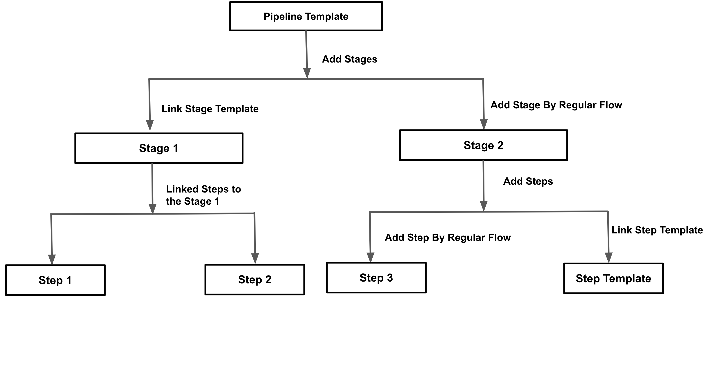
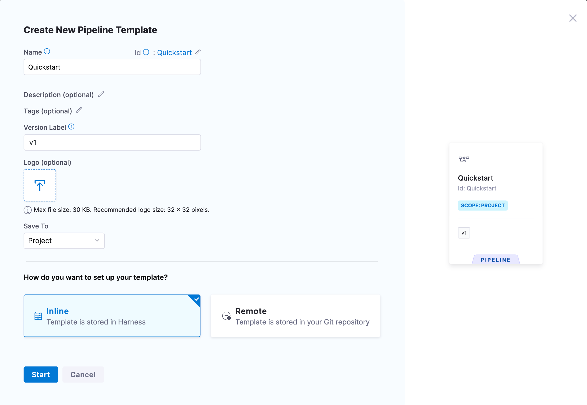
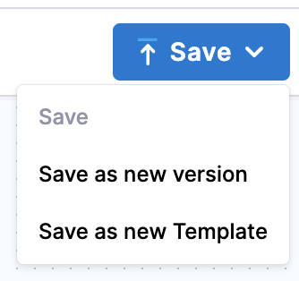

import Tabs from '@theme/Tabs';
import TabItem from '@theme/TabItem';

Harness [templates](./template.md) let you standardize builds for all your services and distribute them across teams. Templates are reusable builds with a common configuration that conforms to organizational standards, making maintenance easier and less prone to errors.

## Template benefits

A [pipeline](/docs/category/pipelines) template lets you distribute reusable pipelines across your team or among multiple teams. Instead of building pipelines from scratch, templates simplify the process by having parameters already built-in.

Benefits include:

- Share common logic without duplicating it on multiple pipelines. For example, if you have some tasks or operations that every pipeline must do, then make them a part of a template to use in your pipelines.
- Reduce the complexity and size of creating a single pipeline.
- Set a pattern that you and your team can follow throughout your pipelines.
- Save time and create generic templates that you can use across all scopes in your Harness account.
- Add or remove a change in one file rather than a lot of stages.

For example, you can automate your build and deploy services by adding a pipeline template. You can link the following templates to your pipeline template:

* Build stage: To push the artifact to the registry, run tests, and security scans.
* Staging deploy stage: To deploy to Dev, QA.
* Approval stage: To add approval stages for PROD.
* Prod deploy stage: To deploy to Production.

## Before you begin

* Failure strategy and notification settings can only be provided when you *create* a template, not when you use it in a pipeline.
* You need [permissions](../role-based-access-control/permissions-reference) to create/edit, delete, and access templates to create a pipeline template.
* You can add templates at any [scope](/docs/platform/role-based-access-control/rbac-in-harness#permissions-hierarchy-scopes) in Harness.

The following table shows what it means to add templates at different scopes or hierarchies:

| Scope | When to add templates |
| --- | --- |
| Account | To share step/stage/pipeline templates with users in the account, as well as users within the organizations and projects created within this account. |
| Organization | To share step/stage/pipeline templates with users in the organization as well as within the projects created within the org. |
| Project | To share step/stage/pipeline templates with users within the project. |

* You can either link an existing stage template or add a stage to your pipeline template.
* You can either link to a step template or add a step for any new step that you add to your pipeline stage.



## Create a pipeline template

Harness templates allow you to design reusable content, logic, and parameters, ensuring that the application is the major focus of your pipelines. Instead of creating pipelines from scratch each time, Harness lets you select from pre-built templates and link them to your pipelines. The process of developing pipelines thus becomes easier by reducing duplication and increasing reusability.

<details>
<summary>Tutorial: Create a CD pipeline template</summary>

This tutorial focuses on how to use templates with Harness CD pipelines. We will guide you through saving a sample deployment pipeline as a template, and then using it to get started with a new pipeline at project level.

1. Make sure you have followed the [get started with CD tutorial](/docs/continuous-delivery/get-started/cd-tutorials/manifest) and have the `guestbook` deployment pipeline up and running.
2. In the **Pipeline Studio** of the `guestbook` pipeline, select the dropdown menu next to **Save**, and select **Save as Template**.
3. Enter the **Name** `harness-deployment-template` and the **Version Label** `0.0.1`.
4. For this tutorial, select **Save To** `Project`.  There are three **Save To** options that declare the [scope](/docs/platform/role-based-access-control/rbac-in-harness#permissions-hierarchy-scopes) where the template is created.
4. Set up the template to be stored inline (in the Harness Platform) or in a remote Git repo.

<Tabs>
<TabItem value="Inline">

1. Select **Inline** and **Save** the Template.
2. Go to **Templates** under **Project Setup** in the left navigation.

</TabItem>
<TabItem value="Remote">

1. In **Git Connector**, select the `harness_gitconnector` you created during the get-started tutorial It will pre-fill the other settings.
2. Select **Save**.
3. Connect to your Github account and select **Commit to a New Branch**.
4. Select **Save**.
5. Harness will create the template and push it to Github.
6. When prompted to use use the template, select **No**.
7. Check your forked `harenesscd-example` apps repo and under **master-patch** branch you'll find the deployment-template under `.harness` directory.

</TabItem>
</Tabs>

To use the pipeline template to create a pipeline:

1. In **Default Project**, select **Pipelines**.
2. Select **New Pipeline**.
3. Enter the name `guestbook_template_pipeline`.
4. Select **Inline** to store the pipeline in Harness.
5. Now select **Start with Template**.
6. Select the `harness-deployment-template` you just created and select **Use Template**.
7. Select **Save** and then select **Run** to run the pipeline.

:::warning

The `harness-deployment-template` will only work under the `default_project` which already has all the pipeline resources created during get started pipeline.

:::

</details>

### Step 1: Add a template

You can create a pipeline template from your account, org, or project. This topic explains the steps to create a pipeline template from the project scope.

To add a template, do the following:

1. In your Harness, go to your project.
2. Select **Project Settings**, then, under **Project-level resources**, select **Templates**.
3. Select **+ New Template**, and then select **Pipeline**. The **Create New Pipeline Template** settings open.
4. In **Name**, enter a name for the template, for example `Quickstart`.
5. (Optional) Select the pencil icon to enter a **Description**.
6. (Optional) Select the pencil icon to add **Tags**.
7. In **Version Label**, enter the version of the stage, for example, `v1`. Versioning a template enables you to create a new template without modifying the existing one. For more information, go to [Versioning](template.md).

   

   You'll see the Git Repository Details option only if you're creating a template on a Git-enabled project. For more information, go to [Harness Git Experience overview](../git-experience/git-experience-overview.md).

8. In **Git Repository Details**, in **Repository Display Name**, select your Git repository and Branch.

9. (Optional) Select the **Logo** icon to upload a logo image file.
10. From the **Save To** list, select the scope where you want to save the template: Project, Organization, or Account. For this example, select Project.
11. Under **How do you want to set up your template?**, select **Inline**.

12. Once you've entered all the details, select **Continue**.

   

### Step 2: Add a stage

This example uses the Deploy stage. The Deploy stage type is a CD stage that enables you to deploy any service to your target environment.

Other options include:

   - **Build:** Use CI to build, test, and push artifacts to repositories.
   - **Approval:** Manual and Jira approval stages.
   - **Feature Flag:** Enable or disable functionality remotely without redeploying code.
   - **Custom Stage:** Set up a stage configurable to your needs.

To add a stage to the template, do the following:

1. Follow the steps above to add a template.
2. Select **Add Stage**. The **Select Stage Type** settings open.
3. Select **Deploy**. The **About Your Stage** settings open.
4. In **Stage Name**, enter a name for your stage.
5. Select the entity that this stage should deploy. Currently, for deploy, only service can be deployed and it is selected by default.
6. Select **Set Up Stage**.

   

### Step 3: Add service details

In **About the Service**, select the service that you want to deploy from the **Specify Service** list. You can also use [fixed values, runtime inputs, and expressions](../variables-and-expressions/runtime-inputs.md).

**Use Runtime Inputs instead of variable expressions:** when you update template settings in a stage or step template, use [runtime inputs](../variables-and-expressions/runtime-inputs.md) instead of variable expressions. When Harness tries to resolve variable expressions to specific stage-level settings using fully-qualified names, it can cause issues at runtime. Every pipeline where the stage or step template is inserted must use the same names for fully-qualified name references to operate. With runtime inputs, you can supply values for a setting at deployment runtime.In **Service Definition**, select the **Deployment Type**. **Deployment Type** defines how your service will be deployed.


### Step 4: Add infrastructure details

To add infrastructure details, do the following:

1. In **Infrastructure**, in **Specify Environment**, select the setting for your pipeline execution, for example, **Runtime input**. Harness pipelines allow you to use [fixed values, runtime inputs, and expressions](../variables-and-expressions/runtime-inputs.md). Environments represent your deployment targets logically (QA, Prod, etc). You can add the same environment to as many stages as you need.

   

2. In **Infrastructure Definition**, select the method for Harness to reach your Kubernetes cluster. Infrastructure definitions represent the physical infrastructure of the environment. They are the actual clusters, hosts, etc. For example, the target infrastructure definition for a Kubernetes deployment. By separating environments and infrastructure definitions, you can use the same environment in multiple stages while changing the target infrastructure settings with each stage.

3. In **Cluster Details**, enter **Connector** and **Namespace** details. Harness pipelines allow you to use [fixed values, runtime inputs, and expressions](../variables-and-expressions/runtime-inputs.md) also.

4. In **Connector**, select a connector from the list. To create a new connector, go to [Kubernetes cluster connector settings reference](../connectors/cloud-providers/ref-cloud-providers/kubernetes-cluster-connector-settings-reference.md) and [Add a Kubernetes cluster connector](/docs/platform/connectors/cloud-providers/add-a-kubernetes-cluster-connector).

5. In **Namespace**, enter the namespace. For example, `default`.

   

6. Select **Next**. The **Execution Strategies** settings open.

   

### Step 5: Define execution strategies

To define execution strategies, do the following:

1. In **Execution Strategies**, select the deployment strategy for your pipeline template. We've used **Rolling** in this topic. For more information on different execution strategies, go to [Deployment concepts and strategies](/docs/continuous-delivery/manage-deployments/deployment-concepts/).

2. Select **Use Strategy**.

3. Select **Save**. The pipeline template is published successfully.

   

   If you're using a Git-enabled project, you must provide **Save Template to Git** settings.

   

4. In **Harness Folder**, enter the name of the folder in your repo where you want to sync. The **Harness Folder** is the default folder in the repository where you are syncing your project.

5. In **File Path**, enter a name for the YAML file. For example, `Example.yaml`. Harness will generate one automatically from the Pipeline name, but you can add your own.

6. In **Commit message**, enter a message for the commit that adds this connector.

7. Select **Save**, and then select **Save** again. You can save the pipeline in two ways:

   * As new version
   * As a new template

   

8. Select **Save as new Template**.

   **Save as new Template** settings open.

   

9. Select **Continue**. The template is published successfully.

## Advanced Options

After defining a pipeline template, you can configure a set of **Advanced Options** in **Template Studio**. These settings control how downstream pipelines behave and execute, but are managed centrally at the template level. Metadata fields (name, identifier, tags, description, etc.) no longer appear in this editor.

Below is a breakdown of each Advanced Option exposed in the Template Studio:

**1. Pipeline Timeout Settings**

**Timeout (optional)** : Enter a timeout for the entire Pipeline. You can change this setting at any time.

**Description:**  Sets a global timeout for the entire pipeline run. If the run exceeds this duration, it’s automatically aborted and marked as failed.

**2. Stage Execution Settings**

**Allow selective stage(s) executions?**  
> • Yes / No

**Description:** Controls whether users can pick and choose which stages to run:


**3. Re-run Settings**

> **Is Input Data uneditable when rerunning?**  
> • Yes / No 

**Description:**  Determines whether inputs provided in a previous run are locked down on retry.

**4. Delegate Selector**

> **Delegate Selector (optional)**  
> Define Delegate Selector  

**Description:**  Restricts which Harness delegates can execute this pipeline:
- List one or more delegate tags  
- If left empty, any delegate is eligible

**Example YAML**

```yaml
spec:
  timeout: 10m
  allowStageExecutions: true
  fixedInputsOnRerun: true
  delegateSelectors:
    - your-delegate
```

:::info
When you instantiate pipelines from this template in Pipeline Studio, these four settings appear under the **Advanced** tab as **read-only** (to faithfully reflect your template). Any instance-specific options—such as **Public access** or **Dynamic execution settings**—are shown below in the same tab as editable metadata fields. Don’t overlook those! 
:::

## Use templates

After creating a template, [use it to create a pipeline](use-a-template.md).

You can also:

* [Create a step template](run-step-template-quickstart.md)
* [Create an HTTP step template](harness-template-library.md)
* [Create a stage template](add-a-stage-template.md)
