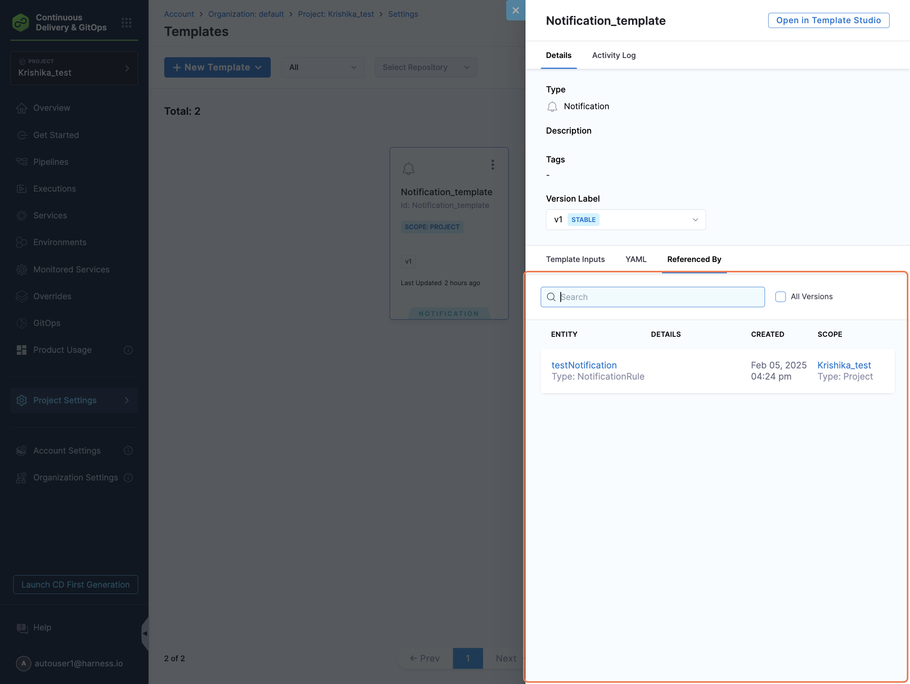
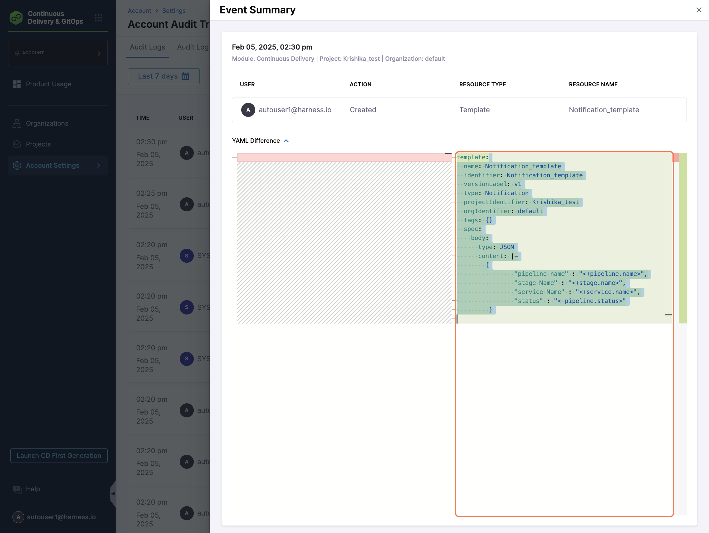

import Tabs from '@theme/Tabs';
import TabItem from '@theme/TabItem';

:::info note
Currently this feature is behind Feature Flag: `PIPE_CUSTOM_NOTIFICATION_TEMPLATES`
However, since this is supported for centralised notification, we need `PL_CENTRAL_NOTIFICATIONS` and `PIPE_CENTRALISED_NOTIFICATION` to be enabled first. Please contact [Harness support](mailto:support@harness.io) to enable this feature.
:::

Users can create custom notification templates, allowing them to customize notification content and reuse templates within **Centralized Pipeline Notifications**. Templates support Pipeline Expressions and RBAC controls, ensuring flexibility and security.

We are going to discuss setting up a notification for Pipeline Events using Custom Notification Templates, at a certain scope.

You can set up custom notification template for Pipeline notification at following [scope](https://developer.harness.io/docs/platform/role-based-access-control/rbac-in-harness/#permissions-hierarchy-scopes): **Account**, **Organization** and **Project Level**. 

## Setting Up Notifications Template

<Tabs>
<TabItem value="Interactive guide">

In this example, we are going to discuss setting up custom notification template for Pipeline at Project Level:-

<iframe 
  src="https://app.tango.us/app/embed/fc86f283-ef3a-4199-88a1-8de92b845754"
  style={{ minHeight: '960px', maxWidth: '800px', width: '100%' }}
  sandbox="allow-scripts allow-top-navigation-by-user-activation allow-popups allow-same-origin"
  security="restricted"
  title="Creating a Notification Template in Harness"
  width="100%" 
  height="100%" 
  referrerpolicy="strict-origin-when-cross-origin"
  frameborder="0" 
  webkitallowfullscreen="webkitallowfullscreen"
  mozallowfullscreen="mozallowfullscreen"
  allowfullscreen="allowfullscreen"
/>

</TabItem>

<TabItem value="Step-by-step">
In this example, we are going to discuss setting up custom notification template for Pipeline at Project Level:

1. In your Harness, go to your project.
2. Select **Project Settings**, then, under **Project-level resources**, select **Templates**.
3. Select **+ New Template**, and then select **Notifications**. The **Create New Notifications Template** settings open.
4. In **Name**, enter a name for the template.
5. (Optional) Select the pencil icon to enter a **Description**.
6. (Optional) Select the pencil icon to add **Tags**.
7. In **Version Label**, enter the version of the template, for example, `v1`. Versioning a template enables you to create a new template without modifying the existing one. For more information, go to [Versioning](template.md).
8. In Text Type you can choose text type as **HTML**, **JSON**, **YAML** or **String** for content body.


9. When you select text type as per your need you will be asked to provide the body of notification template.


10. Click on **Save**.

Now, let's add this custom notification template to a notification rule at Project Level:

:::info note
A template created at the Account level can be used for notification rules at Account, Org, or Project levels. Similarly, Org-level templates can be used at Org and Project levels.
:::

1. In Harness, go to **Project Settings**.
2. Under **General**, select **Notifications Management**. 
3. Under **Overview**, provide **Notification Name** and **Continue** to select Resource type.
4. Under **Resources**, Select Resource Type as **Pipeline**. 
5. Under **Condition** , select **+ Add Condition** to define pipeline events based on which you want to be notified.

Under events you can select the following **pipeline events**:-

1. Pipeline Start
2. Pipeline Success
3. Pipeline Failed
4. Stage Start
5. Stage Success
5. Stage Failed

:::info note
Stage start/success/failed events will apply to all stages within a pipeline. There is no option to configure notifications for specific stages. If you want stage-specific notifications, you can configure them via Pipeline-level notifications, but note that this does not support custom notification templates.
:::

Under **Create Condition** provide, Condition Name and **Select Pipeline Events**. Click on **Continue** to set channel where you want to send the notification.

6. Under **Notification Templates**, select your Notification template and select **Use Template** and click on **Continue**.

7. Under **Set Channels**, **Select Channels** where you want notification to be sent.

Under **Select Channel** you can chose the already created channel at that scope or you can create a [**New Channel**](/docs/platform/notifications/notification-settings.md).


8. Select **Submit** to save your notification configuration.


You can also view **Referenced By** in your Custom Notification Template to see notification rule it is attached to.



You can also check audit trail events for Custom Notification Template created. 




</TabItem>
</Tabs>

---

## Attaching a Custom Notification Template to Pipeline Notifications

Harness supports [adding notification rules to pipelines](/docs/platform/notifications/notification-settings/#add-a-notification-rule). With this enhancement, you can now **attach a Custom Notification Template** to a pipeline notification rule to override the default message format and send custom webhook-based notifications.

Custom templates give you control over the structure and content of the notification payload, support dynamic expressions, and allow reuse across multiple pipelines.

### How to attach a template

When configuring a **pipeline-level notification rule**, follow the existing flow until you reach the **Notification Templates** step:

1. Under the **Notification Templates** tab:
   - Select your custom notification template.
   - If the template includes **runtime variables**, you’ll be prompted to provide values for those inputs.

   

:::info
Custom notification templates are supported **only for webhook notification methods**. Templates cannot be used with Email, Slack, Teams, or PagerDuty.
:::

Once applied, the custom template overrides the default webhook payload sent during pipeline execution.

### Variables in the Notification Template

Notification templates support **runtime inputs**, which must be provided when configuring a notification rule—whether at the **Centralized Notification Service (CNS)** level or the **pipeline** level.

If a runtime variable is declared in the template, you will be prompted to **enter values** for it when selecting that template during notification rule configuration.

Use the following expression format to reference these variables in your template body: `<+notification.variables.testVar>`

You can also access the event type that triggered the notification using: `<+notification.eventType>`

### Reconciliation of Notification Rules

If you update a notification template by adding more input variables **after it has already been used** in a notification rule (either in **Centralized Notifications** or at the **pipeline** level), here’s how the reconciliation process works:

- When you go to run the pipeline, a **warning message** will appear on the Run dialog:
  **Entities referenced in this pipeline have been updated. Please reconcile and save the pipeline to run the latest version.**

  You can still proceed to run the pipeline, but any newly added variables will default to an **empty string** unless resolved.

- Clicking **Reconcile** and saving the pipeline or the notification rule will update the YAML with the new variables, but it will **not resolve** the runtime values. These values will still default to empty strings during execution.

- To **fully reconcile** and provide values for the new inputs:
  1. Edit the notification rule (either in CNS or pipeline Notify tab).
  2. Keep all current settings as-is until you reach the **Templates** tab.
  3. Reselect the **same notification template**.
  4. A pop-up will appear prompting you to **enter values** for the new runtime variables.

This ensures your notification rule is up to date with the latest version of the template and that all required inputs are correctly resolved.

## YAML Structure

Below is an example of the YAML structure for a **Custom Notification Template** where the `type` of the content body is set to **YAML**

```yaml
template:
  name: sample_notification_template
  identifier: sample_notification_template
  versionLabel: v1
  type: Notification
  projectIdentifier: samples
  orgIdentifier: default
  tags: {}
  spec:
    body:
      content: |-
        {
            "pipeline name": "<+pipeline.name>",
            "description": "<+pipeline.description>",
            "eventType": "<+notification.eventType>",
            "runtime_var_1": "<+notification.variables.var1>"
        }
      type: YAML
    variables:
      - name: var1
        value: <+input>
        type: string
```

## Sample JSON Response

Below is an example of the JSON response received when this notification is triggered:


## CD Events Schema

To align with the [CDEvents](https://cdevents.dev/) standard, Harness has contributed several notification templates to the public CD Events schema repository based on our supported events.

You can explore these templates here:  
[CD Events Schema on GitHub](https://github.com/harness/harness-schema/tree/main/cdevents)

The public repository includes a brief explanation of the schema, structure, and supported event types. If you think anything is missing or requires further clarification, feel free to raise a GitHub issue or contact us.