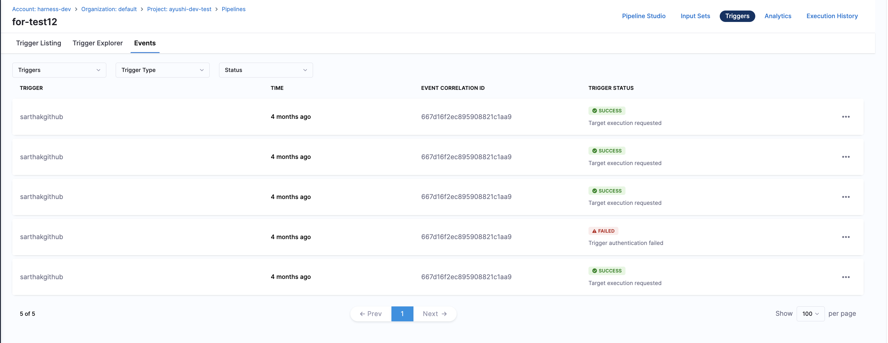
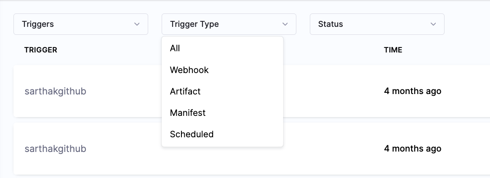

This topic provides an overview of triggers in Harness. Harness uses triggers as a core component to automate and streamline deployment workflows. Triggers help you automate the execution of your pipelines based on some event like a new artifact/manifest, or run on a schedule or an external webhook. Triggers offer a versatile and dynamic approach to initiating processes based on specific events, changes, or conditions in pipelines.

## Types of triggers

There are four trigger types in Harness:

- **Webhook:** Trigger Harness pipelines in response to Git events that match specific payload conditions you set up in a Harness trigger. For more information, go to [Trigger pipelines using Git events](/docs/platform/triggers/triggering-pipelines).

    - Trigger Harness pipelines in response to specific Slack events that you set up in a Harness trigger. For more information, go to [Trigger pipelines using Slack events](/docs/platform/triggers/trigger-pipelines-using-slack-events).

    - Trigger Harness pipelines in response to events from third-party artifact repositories that match specific payload conditions you set up in a Harness trigger. For more information, go to [Trigger pipelines using Generic events](/docs/platform/triggers/trigger-pipelines-using-generic-events).

- **Artifact:** Trigger Harness pipelines in response to a new artifact version being added to a registry. For more information, go to [Trigger pipelines on a new artifact](/docs/platform/triggers/trigger-on-a-new-artifact).
- **Manifest:** Trigger Harness pipelines in response to a new Helm chart version being added to an HTTP Helm repo. For more information, go to [Trigger pipelines on new Helm chart](/docs/platform/triggers/trigger-pipelines-on-new-helm-chart).
- **Scheduled:** Schedule Harness pipeline executions using Cron-based triggers. For more information, go to [Schedule pipelines using triggers](/docs/platform/triggers/schedule-pipelines-using-cron-triggers).

### Webhook triggers

You can trigger pipelines in response to Git events that match specific payload conditions you set up in a Harness trigger. For example, when a pull request or push event occurs on a Git repo and your trigger settings match the payload conditions, a CI or CD pipeline can run.

:::info important
RBAC doesn't apply to Webhook triggers as the events occur on the repository side.

:::

Triggers enable event-driven CI/CD and support the practice of every commit building and/or deploying to a target environment.

Harness supports the following SCM providers:

- GitHub
- GitLab
- Harness code
- Bitbucket
- Azure Repos
- Custom

### Artifact triggers

:::info note

Currently, this feature is behind the feature flag `CD_TRIGGERS_REFACTOR`. Contact [Harness Support](mailto:support@harness.io) to enable the feature.

:::

You can set up Harness pipelines to be triggered automatically when a new version of an artifact is added to a registry. For instance, if a new Docker image is uploaded to your Docker Hub account, it can trigger a CD pipeline that automatically deploys the image.

#### Supported artifact providers for artifact triggers

You can use the following artifact providers to triggers pipelines:

- ACR (Azure Container Registry)
- Amazon Machine Image (AMI)
- Amazon S3
- Artifactory Registry
- Azure Artifacts
- Bamboo
- Custom Artifact
- Docker Registry
- ECR (Amazon Elastic Container Registry)
- GCR (Google Container Registry)
    
    :::warning
    **Google Container Registry Deprecation Notice 📢**

    Google Container Registry (GCR) is deprecated and scheduled to shut down on **March 18, 2025**. It is recommended to migrate to Google Artifact Registry (GAR). For migration guidance, refer to [Google's official transition documentation](https://cloud.google.com/artifact-registry/docs/transition/transition-from-gcr).

    For more information on GCR, see the [Harness GCR Documentation](/docs/continuous-delivery/x-platform-cd-features/services/artifact-sources/#google-container-registry-gcr).
    :::

- Github Package Registry
- Google Artifact Registry
- Google Cloud Storage
- Jenkins
- Nexus3 Registry

### Manifest triggers

Helm chart triggers simply listen to the repo where one or more of the Helm charts in your pipeline are hosted. You can set conditions on the triggers, such as matching one or more chart versions. This trigger type is a simple way to automate deployments for new Helm charts.

### Scheduled triggers

With scheduled triggers, you can automate pipeline executions by setting up Cron-based triggers. This allows you to schedule the pipelines to run at specific times and intervals, making your workflow more efficient and reliable.

## Add a trigger to a pipeline

To add a trigger to a pipeline, do the following:

1. Open your Harness pipeline in Pipeline Studio.
2. Select **Triggers**.
2. Select **+ New Trigger** or **Add New Trigger**. The **Triggers** pane opens.
3. Select the Webhook, Artifact, Manifest, or Scheduled trigger.
4. Complete the required fields for your trigger type. For steps on setting up different types of triggers, go to the [Triggers documentation](/docs/category/triggers).

## View Trigger Events

:::info note
Currently this feature is behind the Feature Flag `PIPE_TRIGGER_EVENTS_PAGE_UI`. Contact [Harness Support](mailto:support@harness.io) to enable this FF.
:::

Users can view trigger events for all triggers created within a Pipeline in the **Events** tab.

The Events tab provides information on **Event Correlation ID**, **Trigger Status**, **Time**, and **Trigger Name**.

By clicking the three dots next to each trigger, you can view additional details, including the **Payload** and **Trigger Details**.

You can filter triggers based on **Trigger Name, Trigger Type and Status**:- 

- Trigger type will include :- **All, Webhook, Artifact, Manifest and Scheduled**

- Trigger Status will include :- **Success, Failed, Skipped**

