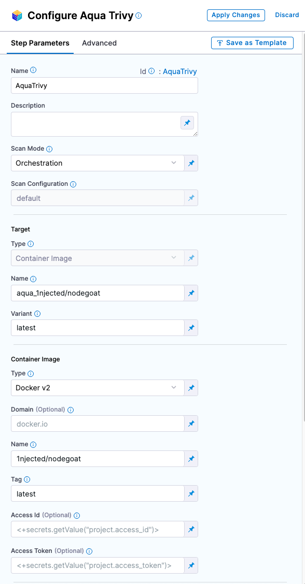

You can scan your container images using [Aqua Trivy](https://github.com/aquasecurity/trivy), a comprehensive and versatile open-source scanner. 

:::note
STO supports container scans only with Aqua Trivy.
:::

## Before you begin

### Docker-in-Docker requirements


```mdx-code-block
import StoDinDRequirements from '/docs/security-testing-orchestration/sto-techref-category/shared/dind-bg-step.md';
```

<StoDinDRequirements />


### Root access requirements 

```mdx-code-block
import StoRootRequirements from '/docs/security-testing-orchestration/sto-techref-category/shared/root-access-requirements.md';
```

<StoRootRequirements />


## Aqua Trivy step configuration

The recommended workflow is add an AquaTrivy step to a Security Tests or CI Build stage and then configure it as described below. You can also configure Aqua Trivy scans programmatically by copying, pasting, and editing the [YAML definition](#yaml-configuration). 

```mdx-code-block
import StoScannerStepNotes from './shared/step_palette/_sto-palette-notes.md';
```

<StoScannerStepNotes />

<details>
    <summary>Scanner Template</summary>

 

</details>


### Scan settings


<a name="scan-mode"></a>

#### Scan Mode

```mdx-code-block
import StoSettingScanMode from './shared/step_palette/_sto-ref-ui-scan-mode.md';
import StoSettingScanModeOrch from './shared/step_palette/_sto-ref-ui-scan-mode-00-orchestrated.md';
import StoSettingScanModeIngest from './shared/step_palette/_sto-ref-ui-scan-mode-02-ingestonly.md';
```

<StoSettingScanMode />
<StoSettingScanModeOrch />
<StoSettingScanModeIngest />

<a name="scan-config"></a>

#### Scan Configuration

```mdx-code-block
import StoSettingProductConfigName from './shared/step_palette/_sto-ref-ui-product-config-name.md';
```

<StoSettingProductConfigName />


### Target Settings

<a name="target-type"></a>

#### Type

```mdx-code-block
import StoSettingScanTypeCont     from './shared/step_palette/_sto-ref-ui-scan-type-01-container.md';
```

<a name="scan-type"></a>
<StoSettingScanTypeCont />


#### Name 

```mdx-code-block
import StoSettingProductID from './shared/step_palette/_sto-ref-ui-prod-id.md';
```

<StoSettingProductID />


#### Variant

```mdx-code-block
import StoSettingTargetVariant from './shared/step_palette/_sto-ref-ui-target-variant.md';
```

<StoSettingTargetVariant  />


### Ingestion settings


<a name="ingestion-file"></a>

#### Ingestion File

```mdx-code-block
import StoSettingIngestionFile from './shared/step_palette/_sto-ref-ui-ingestion-file.md';
```

<StoSettingIngestionFile  />


### Log Level, CLI flags, and Fail on Severity

<a name="log-level"></a>

#### Log Level

```mdx-code-block
import StoSettingLogLevel from './shared/step_palette/_sto-ref-ui-log-level.md';
```

<StoSettingLogLevel />

<a name="cli-flags"></a>

#### Additional CLI flags

```mdx-code-block
import StoSettingCliFlags from './shared/step_palette/_sto-ref-ui-cli-flags.md';
```

<StoSettingCliFlags />

<a name="fail-on-severity"></a>


#### Fail on Severity

```mdx-code-block
import StoSettingFailOnSeverity from './shared/step_palette/_sto-ref-ui-fail-on-severity.md';
```
<StoSettingFailOnSeverity />

### Settings

You can add a `tool_args` setting to run the trivy image scanner with specific command-line arguments. For example, you can customize the security issues to detect using the scanners argument. To scan vulnerabilities only, specify `tool_args` = `--scanners ("vuln")`. 


### Additional Configuration

In the **Additional Configuration** settings, you can use the following options:

* [Privileged](/docs/continuous-integration/use-ci/manage-dependencies/background-step-settings#privileged)
* [Image Pull Policy](/docs/continuous-integration/use-ci/manage-dependencies/background-step-settings#image-pull-policy)
* [Run as User](/docs/continuous-integration/use-ci/manage-dependencies/background-step-settings#run-as-user)
* [Set Container Resources](/docs/continuous-integration/use-ci/manage-dependencies/background-step-settings#set-container-resources)


### Advanced settings

In the **Advanced** settings, you can use the following options:

* [Conditional Execution](/docs/platform/pipelines/w_pipeline-steps-reference/step-skip-condition-settings/)
* [Failure Strategy](/docs/platform/pipelines/w_pipeline-steps-reference/step-failure-strategy-settings/)
* [Looping Strategy](/docs/platform/pipelines/looping-strategies-matrix-repeat-and-parallelism/)
* [Policy Enforcement](/docs/platform/hovernance/Policy-as-code/harness-governance-overview)


## Security step settings (_legacy_)

You can set up a Security step with [Aqua Trivy](https://aquasecurity.github.io/trivy) to detect vulnerabilities and misconfigurations in your container images.

#### Important Notes

* STO supports container scans only with Aqua Trivy.

#### Scan types

STO supports the following `policy_type` settings for Aqua-Trivy:

* `orchestratedScan`  — A Security step in the pipeline runs the scan and ingests the results. This is the easiest to set up and supports scans with default or predefined settings.
* `ingestionOnly` — Run the scan in a Run step, or outside the pipeline, and then ingest the results. This is useful for advanced workflows that address specific security needs. See [Ingest scan results into an STO pipeline](../use-sto/orchestrate-and-ingest/ingest-scan-results-into-an-sto-pipeline.md).

#### Target and variant

```mdx-code-block
import StoLegacyTargetAndVariant  from './shared/legacy/_sto-ref-legacy-target-and-variant.md';
```

<StoLegacyTargetAndVariant />

#### Aqua Trivy scan settings

* `product_name` = `aqua-trivy`
* `scan_type` = `containerImage`, `ingestionOnly`
* `product_config_name` — Specify one of the following:
	+ `aqua-trivy` — Run the Trivy image scanner with default settings.
	+ `aqua-trivy-debug` — Run the Trivy image scanner in Debug mode.
* `container_domain` — The image registry domain, for example `docker.io`
* `container_project` — The image owner and project, for example `harness/delegate`
* `container_tag` — The tag of the image to scan, for example `latest`
* `container_type` — Set to `local_image`, `docker_v2`, `jfrog_artifactory`, or `aws_ecr`  
* `fail_on_severity` - See [Fail on Severity](#fail-on-severity).

#### Container scan settings

The following settings are also required, depending on the container type:
+ if `container_type` = `docker_v2`
	- `container_access_id`: Username
	- `container_access_token`: Password/Token
+ if `container_type` = `aws_ecr`
	- `container_access_id`: Username
	- `container_access_token`: Password/Token
	- `container_region`: Image registry AWS region
+ if `container_type` = `jfrog_artifactory`
	- `container_access_id`: Username
	- `container_access_token`: Password/Token

#### Ingestion file 

```mdx-code-block
import StoLegacyIngest from './shared/legacy/_sto-ref-legacy-ingest.md';
```

<StoLegacyIngest />


## YAML pipeline example

```mdx-code-block
import StoSettingYAMLexample from './shared/step_palette/_sto-ref-yaml-example.md';
```

<StoSettingYAMLexample />
