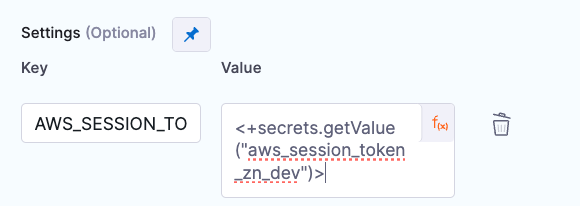

You can scan your configurations using [AWS Security Hub](https://docs.aws.amazon.com/securityhub/latest/userguide/what-is-securityhub.html), which provides a comprehensive view of your security state in AWS and helps you check your environment against security industry standards and best practices. 

## Important notes for running AWS Security Hub scans in STO

### Root access requirements 

import StoRootRequirements from '/docs/security-testing-orchestration/sto-techref-category/shared/root-access-requirements-no-dind.md';

<StoRootRequirements />

### For more information

import StoMoreInfo from '/docs/security-testing-orchestration/sto-techref-category/shared/_more-information.md';

<StoMoreInfo />

## AWS Security Hub step configuration

### Scan

#### Scan Mode

import StoSettingScanModeData from './shared/step_palette/scan/mode/_extraction.md';
import StoSettingScanModeIngest from './shared/step_palette/scan/mode/_ingestion.md';

<StoSettingScanModeData />
<StoSettingScanModeIngest />

#### Scan Configuration

import StoSettingProductConfigName from './shared/step_palette/scan/_config-name.md';

<StoSettingProductConfigName />

### Target

#### Type

import StoSettingScanTypeConfig  from './shared/step_palette/target/type/_config.md';

<StoSettingScanTypeConfig />

#### Name 

import StoSettingTargetName from './shared/step_palette/target/_name.md';

<StoSettingTargetName />

#### Variant

import StoSettingTargetVariant from './shared/step_palette/target/_variant.md';

<StoSettingTargetVariant  />

### Ingestion File 

import StoSettingIngestionFile from './shared/step_palette/ingest/_file.md';

<StoSettingIngestionFile  />

### Authentication

You should create [Harness text secrets](/docs/platform/secrets/add-use-text-secrets) with your encrypted access ID and token and access them using the format `<+secrets.getValue("project.my-secret")>`. 

#### Access ID 

The access ID for your AWS account.

#### Access Token

The access token for your AWS account.

#### Access Region

Your AWS region. 

### Log Level

import StoSettingLogLevel from './shared/step_palette/all/_log-level.md';

<StoSettingLogLevel />

### Additional CLI flags

import StoSettingCliFlags from './shared/step_palette/all/_cli-flags.md';

<StoSettingCliFlags />

### Fail on Severity

import StoSettingFailOnSeverity from './shared/step_palette/all/_fail-on-severity.md';

<StoSettingFailOnSeverity />

### Settings

You can use this to add environment variables to your scan environment. To enable session-based authentication with AWS, for example, you can pass `AWS_SESSION_TOKEN` with a [Harness text secret](/docs/platform/secrets/add-use-text-secrets) of your token.

<!-- STO-7187 remove legacy configs for scanners with step palettes

## Security step settings for AWS Security Hub scans in STO (legacy)

You can set up an AWS Security Hub scan using a Security step: create a CI Build or Security Tests stage, add a Security step, and then add the `setting:value` pairs as specified below.

* `product_name` : `aws-security-hub`
* [`scan_type`](/docs/security-testing-orchestration/sto-techref-category/security-step-settings-reference#scanner-categories) : `configuration`
* [`policy_type`](/docs/security-testing-orchestration/sto-techref-category/security-step-settings-reference#data-ingestion-methods) : `dataLoad` or `ingestionOnly`
* `product_config_name` : `default`
* `fail_on_severity` - See [Fail on Severity](#fail-on-severity).

#### Target and variant

import StoLegacyTargetAndVariant  from './shared/legacy/_sto-ref-legacy-target-and-variant.md';

<StoLegacyTargetAndVariant />

#### Configuration settings

import StoLegacyConfig from './shared/legacy/_sto-ref-legacy-config.md';

<StoLegacyConfig  />

#### Ingestion file

import StoLegacyIngest from './shared/legacy/_sto-ref-legacy-ingest.md';

<StoLegacyIngest />

-->