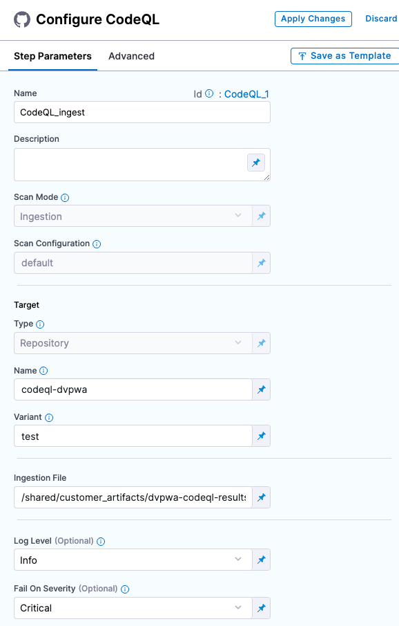

<!-- hiding this topic until the integration is ready to GA -->

You can scan your code repositories using [CodeQL](https://codeql.github.com/), an analysis engine used by developers to automate security checks, and by security researchers to perform variant analysis. 

The following steps outline the basic workflow:

1. Run a CodeQL scan, either externally or as part of a Run step, and publish the results to SARIF.

2. Add the SARIF data to your pipeline. If you ran the scan outside the pipeline, do the following:

   1. In the stage where you ingest the results, go to **Overview** > **Shared Paths** and create a folder under `/shared` such as `/shared/customer_artifacts`.

   2. Use a Run step to add your scan results to the shared folder.

2. Use a [CodeQL](#codeql-step-configuration) step to ingest the results. 

   :::note
   Currently, the CodeQL scanner template is behind the feature flag `STO_STEP_PALETTE_CODEQL`. Contact [Harness Support](mailto:support@harness.io) to enable this feature.

   Alternately, you can use a [Custom ingest step](./custom-ingest-reference.md) to ingest your data instead.
   :::

   
This topic includes an [end-to-end YAML pipeline](#yaml-pipeline-example) that illustrates this workflow. 

## Before you begin

<!-- 
### Docker-in-Docker requirements

```mdx-code-block
import StoDinDRequirements from '/docs/security-testing-orchestration/sto-techref-category/shared/dind-bg-step.md';
```

<StoDinDRequirements />

-->

### Root access requirements

```mdx-code-block
import StoRootRequirements from '/docs/security-testing-orchestration/sto-techref-category/shared/root-access-requirements.md';
```

<StoRootRequirements />


## CodeQL step configuration

The recommended workflow is to add a CodeQL step to a Security Tests or CI Build stage and then configure it as described below. You can also configure CodeQL scans programmatically by copying, pasting, and editing the [YAML definition](#yaml-configuration). 

```mdx-code-block
import StoScannerStepNotes from './shared/step_palette/_sto-palette-notes.md';
```

<StoScannerStepNotes />

<details>
    <summary>CodeQL Step Palette</summary>

 

</details>


### Scan Mode

```mdx-code-block
import StoSettingScanModeIngest from './shared/step_palette/_sto-ref-ui-scan-mode-02-ingestonly.md';
```

<StoSettingScanModeIngest />


### Scan Configuration

```mdx-code-block
import StoSettingProductConfigName from './shared/step_palette/_sto-ref-ui-product-config-name.md';
```

<StoSettingProductConfigName />


### Target


#### Type

```mdx-code-block
import StoSettingScanTypeRepo from './shared/step_palette/_sto-ref-ui-scan-type-00-repo.md';
```


<StoSettingScanTypeRepo />

#### Name 

```mdx-code-block
import StoSettingProductID from './shared/step_palette/_sto-ref-ui-prod-id.md';
```

<StoSettingProductID />

#### Variant

```mdx-code-block
import StoSettingTargetVariant from './shared/step_palette/_sto-ref-ui-target-variant.md';
```

<StoSettingTargetVariant  />


### Ingestion file

```mdx-code-block
import StoSettingIngestionFile from './shared/step_palette/_sto-ref-ui-ingestion-file.md';
```

<StoSettingIngestionFile  />


### Log Level, CLI flags, and Fail on Severity

<a name="log-level"></a>

#### Log Level

```mdx-code-block
import StoSettingLogLevel from './shared/step_palette/_sto-ref-ui-log-level.md';
```

<StoSettingLogLevel />

<a name="cli-flags"></a>

#### Additional CLI flags

```mdx-code-block
import StoSettingCliFlags from './shared/step_palette/_sto-ref-ui-cli-flags.md';
```

<StoSettingCliFlags />

<a name="fail-on-severity"></a>


#### Fail on Severity

```mdx-code-block
import StoSettingFailOnSeverity from './shared/step_palette/_sto-ref-ui-fail-on-severity.md';
```
<StoSettingFailOnSeverity />

### Settings

You can add a `tool_args` setting to run the [CodeQL scanner binary](https://pypi.org/project/CodeQL/1.0.1/) with specific command-line arguments. For example, you can skip certain tests using  `-skip` followed by a list of test IDs: `tool_args` = `-skip testID_1, testID_3, testID_5`


### Additional Configuration

In the **Additional Configuration** settings, you can use the following options:

* [Privileged](/docs/continuous-integration/use-ci/manage-dependencies/background-step-settings#privileged)
* [Image Pull Policy](/docs/continuous-integration/use-ci/manage-dependencies/background-step-settings#image-pull-policy)
* [Run as User](/docs/continuous-integration/use-ci/manage-dependencies/background-step-settings#run-as-user)
* [Set Container Resources](/docs/continuous-integration/use-ci/manage-dependencies/background-step-settings#set-container-resources)


### Advanced settings

In the **Advanced** settings, you can use the following options:

* [Conditional Execution](/docs/platform/pipelines/w_pipeline-steps-reference/step-skip-condition-settings/)
* [Failure Strategy](/docs/platform/pipelines/w_pipeline-steps-reference/step-failure-strategy-settings/)
* [Looping Strategy](/docs/platform/pipelines/looping-strategies-matrix-repeat-and-parallelism/)
* [Policy Enforcement](/docs/platform/Governance/Policy-as-code/harness-governance-overview)


<!-- yaml pipeline example ----------------------------------------------------------------------------- -->


## YAML pipeline example

The following pipeline example illustrates this workflow.

```yaml

pipeline:
  projectIdentifier: STO
  orgIdentifier: default
  tags: {}
  properties:
    ci:
      codebase:
        connectorRef: wwdvpwa
        repoName: dvpwa
        build: <+input>
  stages:
    - stage:
        name: codeql
        identifier: codeql
        type: CI
        spec:
          cloneCodebase: true
          execution:
            steps:
              - step:
                  type: Run
                  name: codeql_analyze
                  identifier: codeql_analyze
                  spec:
                    connectorRef: account.harnessImage
                    image: ubuntu:20.04
                    shell: Sh
                    command: |-
                      #!/bin/bash


                      # Change the working directory to the app directory.
                      mkdir /app
                      cd /app

                      # Update and upgrade the apt packages.
                      apt update -y -q
                      apt upgrade -y -q 

                      # Install the wget and tar packages and python3.
                      export DEBIAN_FRONTEND="noninteractive"
                      apt install -y -q wget tar python3.9-venv python3.9 build-essential

                      # Download the CodeQL bundle.
                      wget -q https://github.com/github/codeql-action/releases/latest/download/codeql-bundle-linux64.tar.gz

                      # Extract the CodeQL bundle.
                      tar -xvzf ./codeql-bundle-linux64.tar.gz -C /app/

                      # Set the PATH environment variable to include the CodeQL directory.
                      export PATH="${PATH}:/app/codeql"

                      # Resolve the CodeQL packs
                      codeql resolve qlpacks

                      # Move back to the code folder before scanning
                      cd /harness

                      # Create a CodeQL database.
                      codeql database create python_database --language=python

                      # Run the CodeQL analyzer.
                      codeql database analyze python_database --format=sarif-latest --output=/shared/customer_artifacts/dvpwa-codeql-results.sarif
                    imagePullPolicy: Always
                    resources:
                      limits:
                        memory: 2G
                        cpu: 2000m
              - step:
                  type: CodeQL
                  name: CodeQL_ingest
                  identifier: CodeQL_1
                  spec:
                    mode: ingestion
                    config: default
                    target:
                      name: codeql-dvpwa
                      type: repository
                      variant: test
                    advanced:
                      log:
                        level: info
                      fail_on_severity: critical
                    ingestion:
                      file: /shared/customer_artifacts/dvpwa-codeql-results.sarif
          sharedPaths:
            - /shared/customer_artifacts/
          infrastructure:
            type: KubernetesDirect
            spec:
              connectorRef: hyharnesslegate
              namespace: harness-delegate-ng
              automountServiceAccountToken: true
              nodeSelector: {}
              os: Linux
  identifier: CodeQLv3
  name: CodeQL-v3


```

<StoSettingYAMLexample />

<!-- END yaml pipeline example ----------------------------------------------------------------------------- -->

