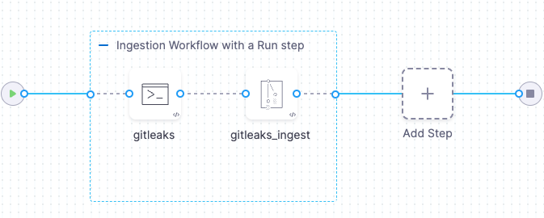

You can scan your code repositories using [Gitleaks](https://github.com/PyCQA/GitLeaks), an open-source tool designed to find common security issues in Python code. 


<!-- START step-palette-config ----------------------------------------------------------------------------- -->

## GitLeaks step configuration

The recommended workflow is to add a GitLeaks step to a Security Tests or CI Build stage and then configure it as described below.  

<!--
```mdx-code-block
import StoScannerStepNotes from './shared/step_palette/_sto-palette-notes.md';
```

<StoScannerStepNotes />
-->

### Scan Mode

```mdx-code-block
import StoSettingScanMode from './shared/step_palette/_sto-ref-ui-scan-mode.md';
import StoSettingScanModeIngest from './shared/step_palette/_sto-ref-ui-scan-mode-02-ingestonly.md';
```

<StoSettingScanMode />
<StoSettingScanModeIngest />

<!-- ============================================================================= -->
<a name="scan-config"></a>

### Scan Configuration

```mdx-code-block
import StoSettingProductConfigName from './shared/step_palette/_sto-ref-ui-product-config-name.md';
```

<StoSettingProductConfigName />


### Target


<!-- ============================================================================= -->
<a name="target-type"></a>

#### Type

```mdx-code-block
import StoSettingScanTypeRepo from './shared/step_palette/_sto-ref-ui-scan-type-00-repo.md';
```


<StoSettingScanTypeRepo />


<!-- ============================================================================= -->
<a name="target-name"></a>

#### Name 

```mdx-code-block
import StoSettingProductID from './shared/step_palette/_sto-ref-ui-prod-id.md';
```

<StoSettingProductID />

<!-- ============================================================================= -->
<a name="target-variant"></a>

#### Variant

```mdx-code-block
import StoSettingTargetVariant from './shared/step_palette/_sto-ref-ui-target-variant.md';
```

<StoSettingTargetVariant  />

<!-- ============================================================================= -->
<a name="target-workspace"></a>

#### Workspace (_repository_)

```mdx-code-block
import StoSettingTargetWorkspace from './shared/step_palette/_sto-ref-ui-target-workspace.md';
```

<StoSettingTargetWorkspace  />


### Ingestion File

```mdx-code-block
import StoSettingIngestionFile from './shared/step_palette/_sto-ref-ui-ingestion-file.md';
```

<StoSettingIngestionFile  />


### Log Level, CLI flags, and Fail on Severity

<a name="log-level"></a>


#### Log Level

```mdx-code-block
import StoSettingLogLevel from './shared/step_palette/_sto-ref-ui-log-level.md';
```

<StoSettingLogLevel />

<a name="cli-flags"></a>

#### Additional CLI flags

```mdx-code-block
import StoSettingCliFlags from './shared/step_palette/_sto-ref-ui-cli-flags.md';
```

<StoSettingCliFlags />

<a name="fail-on-severity"></a>


#### Fail on Severity

```mdx-code-block
import StoSettingFailOnSeverity from './shared/step_palette/_sto-ref-ui-fail-on-severity.md';
```
<StoSettingFailOnSeverity />

### Settings

You can add a `tool_args` setting to run the [Gitleaks scanner binary](https://github.com/gitleaks/gitleaks) with specific command-line arguments. For example, you can redact secrets from the scanner output using `-redact`: `tool_args : --redact` 


### Additional Configuration

In the **Additional Configuration** settings, you can use the following options:

* [Privileged](/docs/continuous-integration/use-ci/manage-dependencies/background-step-settings#privileged)
* [Image Pull Policy](/docs/continuous-integration/use-ci/manage-dependencies/background-step-settings#image-pull-policy)
* [Run as User](/docs/continuous-integration/use-ci/manage-dependencies/background-step-settings#run-as-user)
* [Set Container Resources](/docs/continuous-integration/use-ci/manage-dependencies/background-step-settings#set-container-resources)


### Advanced settings

In the **Advanced** settings, you can use the following options:

* [Conditional Execution](/docs/platform/pipelines/w_pipeline-steps-reference/step-skip-condition-settings/)
* [Failure Strategy](/docs/platform/pipelines/w_pipeline-steps-reference/step-failure-strategy-settings/)
* [Looping Strategy](/docs/platform/pipelines/looping-strategies-matrix-repeat-and-parallelism/)
* [Policy Enforcement](/docs/platform/Governance/Policy-as-code/harness-governance-overview)

<!-- END step-palette-config ----------------------------------------------------------------------------- -->
## Gitleaks step configuration example

Here's an example of a configured Gitleaks step.

```yaml
- step:
    type: Gitleaks
    name: gitleaks
    identifier: gitleaks
    spec:
      mode: ingestion
      config: default
      target:
        name: nodegoat
        type: repository
        variant: dev
      advanced:
        log:
          level: debug
      ingestion:
        file: /path/of/file.sarif
    description: gitleaks step
```

## Gitleaks ingestion pipeline example

The following pipeline shows and end-to-end ingestion workflow. The pipeline consist of a Build stage with two steps:

1. A Run step that copies a Gitleaks data file `/sarif_simple.sarif` from the local codebase into `/shared/customer_artifacts/`.

2. A Gitleaks step that auto-detects the data file type (SARIF) and then ingests and normalizes the data from `/shared/customer_artifacts/sarif_simple.sarif`. 



```yaml
pipeline:
  projectIdentifier: STO
  orgIdentifier: default
  tags: {}
  stages:
    - stage:
        name: gitleaks-build-stage
        identifier: gitleaksbuildstage
        type: CI
        spec:
          cloneCodebase: true
          execution:
            steps:
              - step:
                  type: Run
                  name: Run_1
                  identifier: Run_1
                  spec:
                    connectorRef: MYDOCKERCONNECTOR
                    image: alpine:latest
                    shell: Sh
                    command: |-
                      # ls /harness
                      # ls /harness/testdata/expected/report
                      cp /harness/testdata/expected/report/sarif_simple.sarif /shared/customer_artifacts/
                      # ls /shared/customer_artifacts/
                      # cat /shared/customer_artifacts/sarif_simple.sarif
              - step:
                  type: Gitleaks
                  name: gitleaks_ingest
                  identifier: gitleaks_ingest
                  spec:
                    mode: ingestion
                    config: default
                    target:
                      name: mycoderepo
                      type: repository
                      variant: dev
                    advanced:
                      log:
                        level: info
                    ingestion:
                      file: /shared/customer_artifacts/sarif_simple.sarif
          platform:
            os: Linux
            arch: Amd64
          runtime:
            type: Cloud
            spec: {}
          sharedPaths:
            - /shared/customer_artifacts
          caching:
            enabled: false
            paths: []
  identifier: gitleaks_ingestion_test
  name: gitleaks ingestion test
  properties:
    ci:
      codebase:
        connectorRef: MYGITHUBCONNECTOR
        repoName: mycoderepo
        build: <+input>


```
