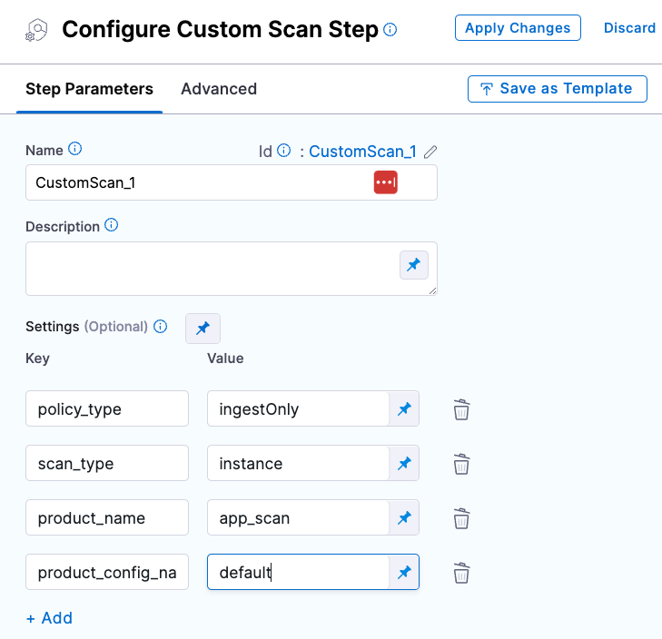

This section describes how to set up each of the external scanners supported by Harness STO.

For more information about STO support, go to [What's supported in STO](/docs/security-testing-orchestration/whats-supported).

## Scanner categories supported by STO

import StoSupportedCategories from './shared/_sto-supported-categories.md';

<StoSupportedCategories />

<!-- 
### Data ingestion methods supported by STO

import StoSupportedMethods from './shared/_sto-supported-methods.md';

<StoSupportedMethods />

The scanner, targets, and scan approach combinations are covered in the next section.

-->

## Scanners supported by STO

import StoSupportedScanners from './shared/_sto-supported-scanners.md';

<StoSupportedScanners />

##  Operating systems and architectures supported by STO

import StoInfraSupport from '/docs/security-testing-orchestration/sto-techref-category/shared/_supported-infrastructures.md';

<StoInfraSupport />

## Ingestion formats supported by STO

import StoSupportedFormats from './shared/_sto-supported-ingestion-formats.md';

<StoSupportedFormats />

## DinD for scanning a Docker image with STO

STO supports two primary ways of scanning a container image; scanning the docker image contained within a Docker-in-Docker background step (requiring privileged mode) or scanning an OCI/Docker archive, which **doesn't need the Docker-in-Docker background step** (this is the recommended approach).

### Scanning an OCI/Docker archive with STO

Scanning an OCI/Docker archive is easier and preferred approach, as it simplifies configuration by removing the need for a Docker-in-Docker background step and reducing security overhead (since privileged mode is not required). STO will automatically scan the OCI/Docker archive without any need for additional DinD configurations.

If you want to force the scanner step **not to use** any Docker-in-Docker(DinD) background step, set the following variable in the Settings section of your step configuration (optional):

- `docker_mode`: `without-docker-in-docker`

This setting is optional and only needed if you want force the STO to use a specific approach.

### Using a Docker-in-Docker Background Step

You can use Docker-in-Docker background step for the following cases:
- Your scanner requires Docker access to perform operations inside a container.
- You're using a **Custom Scan** step or **DataLoad/OrchestratedScan** scan modes that depend on Docker functionality.

#### Configuring Docker-in-Docker (DinD) for your pipeline

import StoDinDRequirements from '/docs/security-testing-orchestration/sto-techref-category/shared/dind-bg-step-setup.md';

<StoDinDRequirements />

For Orchestrated and Extraction scans, you might want to increase the resource limits for your Docker-in-Docker background step. This can speed up your scan times, especially for large scans. For more information, go to [Optimize STO pipelines](/docs/security-testing-orchestration/use-sto/set-up-sto-pipelines/optimize-sto-pipelines).

If you want to force the scanner step to use Docker-in-Docker (DinD) background step, set the following variable in the **Settings** section of your step configuration (optional):

- `docker_mode`: `docker-in-docker`

This setting is optional and only needed if you want force the STO to use a specific approach.

## Root access requirements for STO

import StoRootRequirements from '/docs/security-testing-orchestration/sto-techref-category/shared/root-access-requirements.md';

<StoRootRequirements />

<!-- 
### Scanner binaries used in STO container images

import StoSupportedBinaries from './shared/_sto-supported-binaries.md';

<StoSupportedBinaries />

-->

## Security steps and scanner templates in STO

The Step library includes a [**Custom Scan**](/docs/security-testing-orchestration/custom-scanning/custom-scan-reference) step for setting up scanners: open the step and configure the scan as a set of key/value pairs under **Settings**. 

Some scanners also have their own steps with simplified UIs that simplify the setup process.

Step Library with scanner-specific steps and <b>Custom Scan</b> step

<b>Custom Scan</b> step configuration

Scanner-specific step configuration

