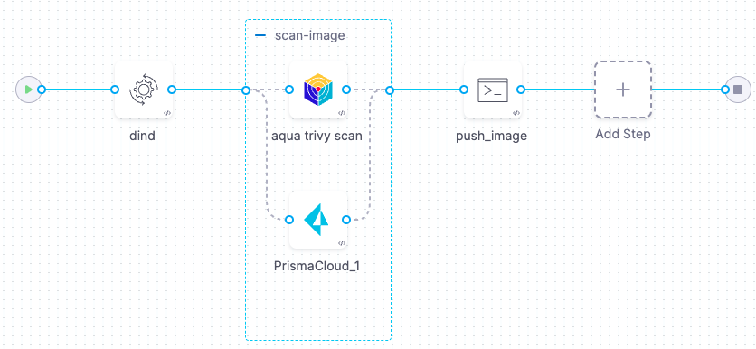

If your STO scans are running slowly, try the following: 

- Make sure that the **Log Level** setting in your scanner is not set to **Debug**. Debug mode can slow down scans considerably.

- Increase the [**memory and CPU resources**](/docs/continuous-integration/use-ci/manage-dependencies/background-step-settings/#set-container-resources) reserved for your scan step. 

   If your scans are running slowly, the scan-step container might be under-resourced.  Some scanners require a lot of memory For example, SonarQube and Veracode generally require 2GB+ of memory to scan a medium-sized codebase. Increasing the CPU capacity should also speed up your scans. 

   The optimal CPU and memory resources to reserve are highly dependent on the specific scanner and the size and complexity of your target. You might find specific guidance in the external scanner documentation. 
   
   You can also try an iterative approach: run a scan with 1GB memory and 800m CPU, compare the new vs. previous scan times, run the scan again with new values, and repeat until your scan times are acceptable.

   To increase the resource capacity of a step, expand **Additional Configuration** and set the **Limit Memory** and a **Limit CPU** options. 

   

- If your scanner requires a Docker-in-Docker background step, you might need to increase the resources for this step as well.

   The DinD step needs enough memory to store all of the images to be scanned in the current stage. Thus if all your scanned images have a total size of 2GB, the DinD step requires _at least_ 2GB of memory.

   Increasing the CPU will enable the DinD to pull images from the registry faster, which will also speed up your scans. 

- If you're scanning the same target with multiple scanners, try running the scan steps in parallel rather than sequentially.

   In this example, the stage scans an image target using Aqua Trivy and Prisma Cloud. The two steps run in parallel within a [step group](/docs/continuous-integration/use-ci/optimize-and-more/group-ci-steps-using-step-group), which speeds up the total scan time. 

     

    :::note

    The stage must have enough memory and CPU to run all parallel steps at the same time. If the stage lacks resources, running the steps in parallel could [cause your pipeline executions to fail](/docs/continuous-integration/use-ci/optimize-and-more/group-ci-steps-using-step-groups#organizing-steps-and-step-groups). 

    :::
    

### Running STO in Self-Managed Platform

<!-- https://harness.atlassian.net/browse/STO-6171 -->

You might find that STO scans run slower than expected when you're running STO in Harness Self-Managed Platform. This issue has been observed when the Harness delegate and Harness server are running in the same cluster with a load balancer that has `preserve client IP` enabled. In this case, consider disabling to speed up your scans. 
