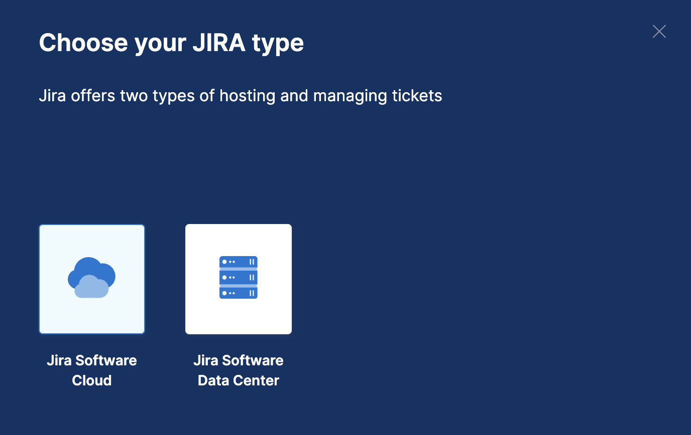
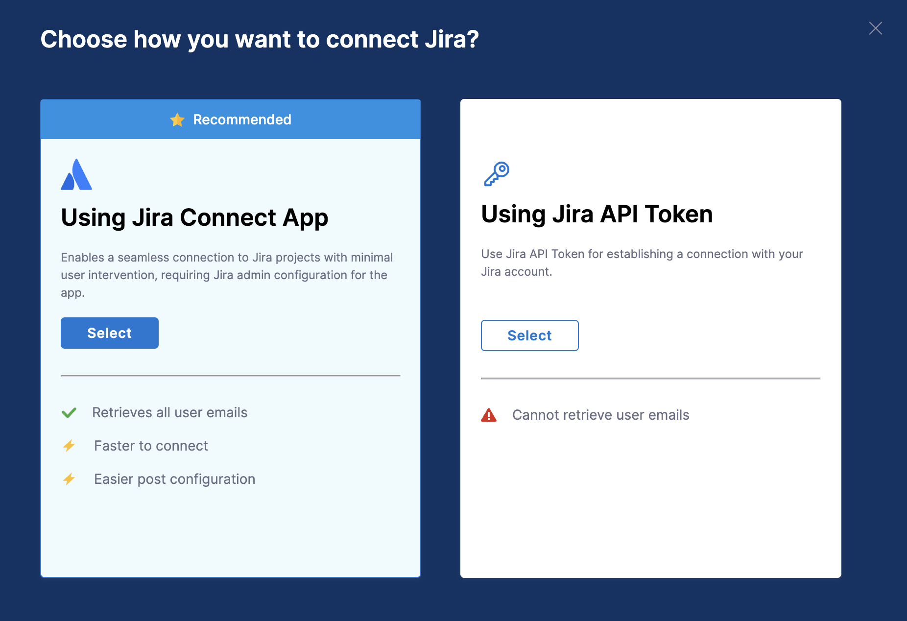
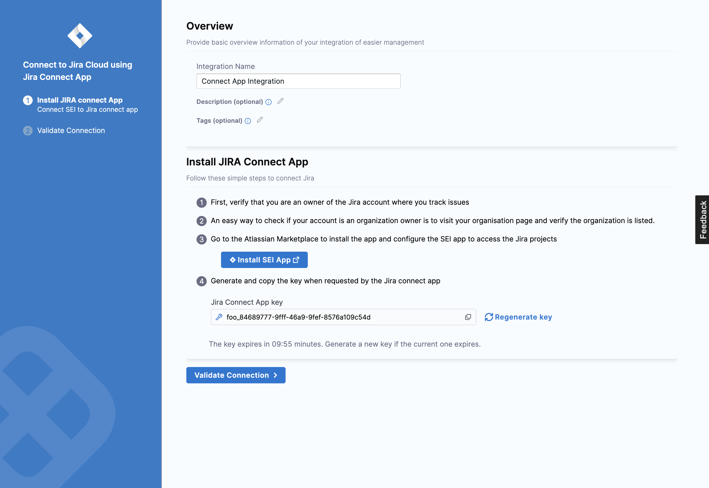
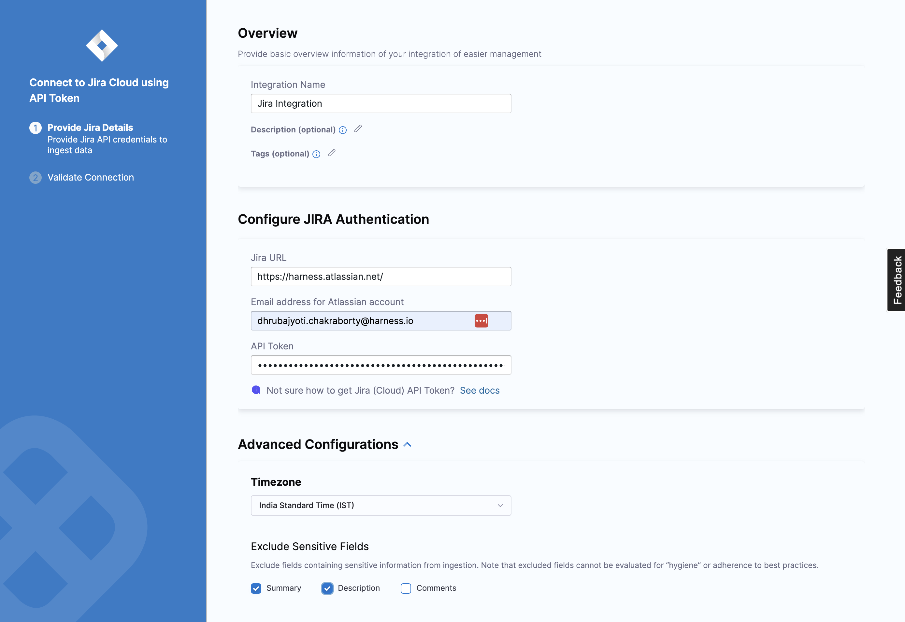

Jira is a proprietary issue-tracking product that allows bug tracking and agile project management.

:::info **ABOUT THIS INTEGRATION**

The new experience for the Jira integration is currently in BETA and is behind the Feature Flag `<SEI_EASY_ONBOARDING_JIRA>`. Please contact Harness Support to enable this feature.
:::

To integrate SEI with Jira, you must choose your Jira type:

* Jira Cloud
* Jira Data Center



## Connect with Jira Cloud

For the Jira type as Cloud, you can choose how you want to connect Jira i.e.

* Jira Connect App
* Jira API Token



### Configure the integration using the Jira Connect App

The Jira Connect App facilitates a seamless connection to Jira projects with minimal user intervention, requiring Jira admin configuration for the app.
<br/> <br/>Using the Jira Connect App allows you to retrieve all user emails from Jira, making it faster and easier to connect and manage the integration.


The following permissions are required to configure the **Jira Connect App** integration:

* **View email addresses of users:** This permission allows the integration to access and view the email addresses of users within the Atlassian account.
* **Read data from the application:** This permission allows the integration to read data from the Atlassian account, such as data from Jira tickets, Jira projects etc.


To set up the integration using the **Jira Connect App**:

1. Select **Integrations** under **Settings**.
2. Select **Available Integrations**, locate the **Jira integration**, and select **Install**.
3. Select **Jira Software Cloud** as the ~~i~~ntegration type.
4. Select the **Jira Connect App** tile to set up the connection with Jira.
5. In the Jira Connect App settings page add the basic overview information:
   * **Integration Name:** Name for your integration.
   * **Description (optional):** Add a description for the integration.
   * **Tags (optional):** Add tags for the integration if required.



6. Install the Jira Connect App. To do this, follow these simple steps:
   * Verify that you are an owner of the Jira account where you track issues. An easy way to check is to visit your organization page and verify that the organization is listed.
   * Go to the **Atlassian Marketplace** to install the app and configure the [SEI app](https://marketplace.atlassian.com/apps/1231375/harness-software-engineering-insights-sei?tab=overview\&hosting=cloud) to access the Jira projects.
   * **Install** the App.
   * Generate and copy the **Jira Connect App key**, then paste it when requested by the Jira Connect app.

:::info
Note that the key expires after 10 minutes, so generate a new key if the current one expires.
:::

7. Click on **Validate Connection** to validate the connection, and once successful, you'll have the integration set up under the **Your Integrations** tab.

### Configure the integration using the Jira API Token

Before you configure the SEI Jira integration, you must generate an Atlassian API token.

#### Authenticate with Jira

Before you configure the SEI Jira integration, you must generate an Atlassian API token.

:::tip Use a service account

The user creating the token must have read access to all projects that you want SEI to track, and the user must be able to search issues within the SEI-relevant projects.

Due to the scope of visibility required, consider using a managed service account, rather than a personal user account, to create the token.

:::

1. Create an Atlassian API token. For instructions, go to the Atlassian documentation on [Managing API tokens for your Atlassian account](https://support.atlassian.com/atlassian-account/docs/manage-api-tokens-for-your-atlassian-account/).
2. Make sure to copy the token somewhere that you can retrieve it when you configure the integration.


#### Configure the integration

To set up the integration using the Jira API Key:

1. Select **Integrations** under **Settings**.
2. Select **Available Integrations**, locate the **Jira integration**, and select **Install**.
3. Select Jira Software Cloud as the integration type.
4. Select the Using Jira API Token tile to set up the connection with Jira.
5. Configure the integration settings and authentication:&#x20;
   * Integration Name: Name for your integration.
   * Description (optional): Add a description for the integration.
   * Tags (optional): Add tags for the integration if required.
   * Add the **URL** of your **Jira** integration instance, for example, `"https://organization.atlassian.net"`. Make sure it's a valid URL.
   * Enter your Email address for the Atlassian account
   * Provide the **API Key** that you previously generated for your Atlassian account.


7. Configure the advanced integration settings if required:
   * Select your preferred **Time Zone** from the available options.
   * Choose the fields you wish to exclude from ingestion.
     
     You might exclude fields containing sensitive information such as **Summary**, **Description**, and **Comments**. Excluded fields will not be evaluated for hygiene or adherence to best practices.



:::info
Please note that after adding an integration, it **may take up to 24 hours for the data to reflect on SEI.** This means that any widgets you configure on Insights using this integration **may not display data until the synchronization is completed.**
:::

## Connect with Jira Software Data Center

To connect with the **Jira Software Data Center**, you can use the **Ingestion Satellite** to integrate with on-premises Jira instances. The configuration process for the integration is similar to setting up the integration in the cloud but instead uses the satellite to communicate with the Atlassian server.

To set up the integration for the Jira Data Center:

1. Select **Integrations** under **Settings**.
2. Select **Available Integrations**, locate the **Jira integration**, and select **Install**.
3. Select **Jira Software Data Center** as the ~~i~~ntegration type.
4. Define the integration settings:
   * **Integration Name:** Name for your integration.
   * **Description (optional):** Add a description for the integration.
   * **Tags (optional):** Add tags for the integration if required.
5. Configure the integration settings and authentication:
   * Enter the URL of your Jira On-prem instance, for example, `<https://JIRA.ORGANIZATION-DOMAIN>`. Ensure it's a valid URL.
   * Select the authentication method. You can choose between **Using Jira Personal Access Token** (recommended) or **Jira Username** and **Password**.
   * If using a personal access token, enter the token.
   * If using a username and password, enter the username and associated password.


6. Configure advanced integration settings as needed:
   * Select your preferred time zone from the available options.
   * Choose which fields you want to exclude from ingestion. 
     
     You may want to exclude fields containing sensitive information like summary, description, and comments. Excluded fields won't be evaluated for hygiene or best practices compliance.
7. Once you've configured the integration, click on **Download YAML File** to download the satellite.yml file.


Once you have downloaded the `satellite.yml` file update it following the instructions [here](/docs/software-engineering-insights/sei-ingestion-satellite/run-the-satellite-container).

Here’s a sample `satellite.yml` file which uses username and password for authentication.

```yaml
satellite:
  tenant: <ACCOUNT_NAME>
  api_key: <SEI_API_KEY>
  url: "https://app.harness.io/gratis/sei/api" # Note that this URL is relative to the environment you are using.
integrations:
  - id: '<INTEGRATION_ID>'
    url: '<ATLASSIAN_ORGANIZATION_URL>'
    username: <ATLASSIAN_USERNAME>
    application: jira
    api_key: <ATLASSIAN_PASSWORD>
    metadata:
      timezone: '<TIMEZONE>'
      sensitive_fields:
        - description
        - userDetails
jira:
  allow_unsafe_ssl: true
```

Here’s a sample `satellite.yml` file which uses a Personal Access Token and password for authentication.

```yaml
satellite:
  tenant: <ACCOUNT_NAME>
  api_key: <SEI_API_KEY>
  url: "https://app.harness.io/gratis/sei/api" # Note that this URL is relative to the environment you are using.
integrations:
  - id: '<INTEGRATION_ID>'
    url: '<ATLASSIAN_ORGANIZATION_URL>'
    application: jira
    api_key: <ATLASSIAN_API_KEY>
    metadata:
      timezone: <ATLASSIAN_ACCOUNT_TIMEZONE>
      sensitive_fields:
        - summary
        - description
jira:
  allow_unsafe_ssl: true
```

:::info
The timezone field within the metadata should be in the Atlassian standard version.

To find the correct timezone, go to `https://<ORGANIZATION_ATLASSIAN_URL>/rest/api/2/myself`
:::

### Troubleshooting

If you encounter any authentication issues, consider the following options:

* While using a username and password for authentication, edit the generated `satellite.yml` file and use your Jira password as a value for `api_key` in the YAML and keep the `user_name` as is.

Test with the following curl command:

```bash
curl -u "USERNAME:PASSWORD" -X GET "https://host:port/context/rest/api/search?jql=key-<JIRA_KEY>"
```

* While using the generated managed token (Bearer token) for authentication leave the `user_name` blank and use the managed token that you are generating for `api_key`.

Test with the following curl command:

```bash
curl -H "Authorization: Bearer MANAGED_TOKEN" -X GET "https://host:port/context/rest/api/search?jql=key=<JIRA_KEY>
```

<details>
<summary> ADFS-based authentication for JIRA using Satellite</summary>

ADFS (Active Directory Federation Services) is a Microsoft service that provides single sign-on authentication to users across multiple applications or systems. When integrating with Jira using ADFS-based authentication via Satellite, specific fields need to be configured in the `satellite.yml` file.

Update the `satellite.yml` file:

Remove:

```yaml
username:
api_key:
```

Replace with:

```yaml
authentication: adfs
adfs_url: <ADFS_SERVER_ENDPOINT>
adfs_client_id: <CLIENT_IDENTIFIER> / <APPLICATION_ID>
adfs_resource: <RESOURCE_IDENTIFIER>
adfs_username: <ADFS_USERNAME>
adfs_password: <ADFS_PASSWORD>
```

Replace `<ADFS_PASSWORD>` with the actual password for the specified ADFS username. Ensure the rest of the file remains unchanged.

| Field | Description |
| - | - |
| `authentication` | This field specifies the authentication method to be used, in this case, ADFS. |
| `adfs_url` | The URL of the ADFS server endpoint where authentication requests will be sent. |
| `adfs_client_id` | The client identifier or application ID assigned to your application in the ADFS configuration. It uniquely identifies your application to the ADFS server. |
| `adfs_resource` | The identifier of the resource for which the access token is being requested. In the context of Jira integration, it specifies the URI of the Jira OAuth API on the ADFS server. |
| `adfs_username` | The username used for authentication. This could be a service account or a specific user account authorized to access Jira via ADFS. |
| `adfs_password` | The password associated with the specified ADFS username. It is important to keep this information secure. |

</details>

If you encounter any issues during the integration process, go to the Satellite integration [Troubleshooting and FAQs](/docs/software-engineering-insights/sei-ingestion-satellite/satellite-troubleshooting-and-faqs).

## Add the Salesforce mapping

If you also have an [SEI Salesforce integration](/docs/software-engineering-insights/sei-integrations/other-integrations/sei-integration-salesforce), you can link Salesforce tickets to Jira issues by using a custom Jira field.

1. In your Harness project, go to the SEI module, and select **Account**.
2. Select **Integrations** under **Data Settings**.
3. Find your **Jira** integration and edit it.
4. Under **Salesforce Field Mapping**, select the Jira field that contains your Salesforce case IDs.

## Add custom hygiene misses

The [Issue Hygiene Report widget](/docs/software-engineering-insights/sei-metrics-and-reports/hygiene-metrics#issue-hygiene-reports) uses data from Jira to calculate hygiene scores. These scores represent _hygiene misses_ in a designated time frame. A hygiene miss means that a ticket in your issue management system was missing an important field, failed to change status in a timely manner, or was assigned to an inactive user.

What constitutes a miss depends on your _hygiene categories_. There are several built-in [hygiene categories](/docs/software-engineering-insights/sei-metrics-and-reports/hygiene-metrics.md#issue-hygiene-categories), and you can add custom hygiene categories by configuring **Custom Hygiene Misses** in your issue management integration.

To add custom hygiene categories:

1. In your Harness project, go to the SEI module, and select **Account**.
2. Select **Integrations** under **Data Settings**.
3. Find your **Jira** integration and edit it.
4. Select **Add Custom Hygiene Miss Criteria** and configure the new hygiene category:

   - **Name:** Enter a name for the category. This name appears on the Issue Hygiene Report widget along with the category's score.
   - **Field:** Select the Jira field that provides data for this category.
   - **Operator:** Specify the operator, such as **Missing** or **Greater Than**, that determines if there was a hygiene miss for this category.

   The **Operator** represents an undesired state for the specified **Field**. For example, if your _desired state_ is for the specified **Field** to be populated, then your _undesired state_ is that the field is empty. Therefore, you would set the **Operator** to **Missing**.

5. To get scores for custom hygiene categories, you must modify the category **Weights** in your Issue Hygiene Report widgets. Custom categories don't have an initial weight, so you must modify all instances of this widget to include your custom categories in the hygiene score calculations. For instructions, go to [Configure the Issue Hygiene Report](/docs/software-engineering-insights/sei-metrics-and-reports/hygiene-metrics#configure-the-issue-hygiene-report).
