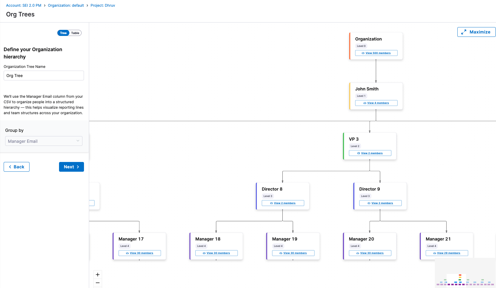

## Overview

The Org Tree in SEI 2.0 mirrors your organization’s internal reporting structure, serving as the backbone for grouping developers and analyzing performance in the context of real-world teams and reporting lines.

By replicating your org hierarchy within SEI, the Org Tree enables team-based insights for engineering leaders, allowing them to assess productivity, efficiency, and delivery performance across various levels of the organization — from individual contributors to entire departments.

### Prerequisites

Before setting up your Org Tree, ensure the following:

* You have uploaded your developer records via a CSV driven export from your HRIS system. The CSV is available with the required structure:
  * Each row represents a developer.
  * Must include at least Name, Email & Manager Email, and optionally Title, Role, Department etc
* You have created the relevant [Efficiency](/docs/software-engineering-insights/harness-sei/setup-sei/setup-profiles/efficiency-profile) and [Productivity Profiles](/docs/software-engineering-insights/harness-sei/setup-sei/setup-profiles/productivity-profile).
* You have connected your integrations for:
  * Issue Management (e.g., Jira, Azure Boards)
  * Source Code Management (e.g., GitHub, GitLab)
  * CI/CD (e.g., Harness etc) (if applicable)

### How Org Trees work in SEI 2.0

The Org Tree in SEI 2.0 is automatically constructed using your organization's developer records (typically managed as a CSV driven export from your HRIS system like Workday or BambooHR)

To build the Org Tree, SEI reads two key fields from the uploaded developer records:

* **Developer Identifier:** Usually the developer’s email address
* **Reporting Field:** A reference to their manager (e.g., Manager Email)

Using this data, SEI automatically builds your organizational hierarchy:

* Each manager is represented as a node.
* Their direct reports are placed underneath them.
* This hierarchy continues recursively up to the root of the organization.

The result is a complete manager-reportee tree that mirrors your real-world structure.

#### What this enables

The Org Tree powers many key capabilities in SEI:

* Groups developers into actual teams without manual setup
* Assigns metrics, insights, and goals at every team or manager level
* Supports reporting by team, department, manager, or business unit

#### Ways to view your Org Tree

You can explore your Org Tree in two formats:

* **Tree View:** Interactively navigate relationships and reporting lines
* **Table View:** See summaries of total teams, team size, and any missing or unmapped data

:::note Coming Soon
In future releases, SEI will support multi-level groupings based on custom attributes like Department, Function, and Team.
This enhancement will allow you to model complex org structures beyond the manager-reportee relationship, enabling cross-sectional analysis across business units, geographies, and lines of business.
:::

## Set up an Org Tree

1. In your Harness Account, go the SEI project and click on Org Tree tab.  
2. Click the **+ Create Org Tree** button.  
3. Enter a name for your Org Tree.  

3. Review the **Developer Records** preview to confirm that the data matches your expectations.
4. Click **Next**. A visual representation of your organization’s hierarchy will appear, based on the **Manager & Reportee** field. Click any individual node to view their direct reports.  

5. To switch to a detailed summary, click the **Table** tab. Here, you can see stats like total teams, root teams, total developers, and any missing or unmatched records.  
6. Click **Next** to proceed to profile selection.  
7.  Select the relevant profiles that will power your insights:  
   * Under **Efficiency Profiles**, choose the profile that you had configured previously for measuring software delivery performance metrics such as DORA.
   * Under **Productivity Profiles**, choose the profile that you had configured previously for measuring developer activity and output.
   * Under **Business Alignment Profiles**, choose the BA profile that you had configured for measuring Business Alignment metrics.

8.  Click **Next**.  
9.  Configure default integrations for all teams in this Org Tree. These can be customized later at the team level:  
    * Under **Issue Management**, select the default IM type integration that apply to all teams in your organization.  
    * Under **Source Code Management**, select the default SCM integration.
    * Under **Continuous Delivery**, select the default CD integration. 

10. Click **Save Org Tree** to complete setup. You will see a confirmation message:  
   **Org tree created successfully.**

## What happens next?

Once saved, your Org Tree will be available for use across SEI 2.0. Engineering Managers can begin analyzing metrics per team, manager, or function based on the tree structure.

Each team inherits the assigned profiles and integrations unless overridden at the team level. The tree becomes a foundational layer to:

* Power dashboards and insights per team
* Group developers for performance visibility
* Drive organizational benchmarking

## FAQs

### Can I create multiple Org Trees?

Yes (coming soon). While SEI 2.0 currently allows multiple Org Trees to exist, each tree uses the same reporting structure logic based on manager-reportee relationships. In future updates, you’ll be able to use multiple Org Trees to support different business units or experiment with alternative grouping strategies.

### Can I update the Org Tree later?

Yes. Org Tree updates are tied to your regular developer records upload. When you upload a new CSV (exported from your HRIS system), SEI will automatically detect changes and restructure the Org Tree accordingly.

For newly added teams or existing teams with new developers, you’ll need to update the team settings to view insights correctly.

## Next steps

* [Set up Teams](/docs/software-engineering-insights/harness-sei/setup-sei/setup-teams)
* [Manage developers](/docs/software-engineering-insights/harness-sei/setup-sei/setup-teams)