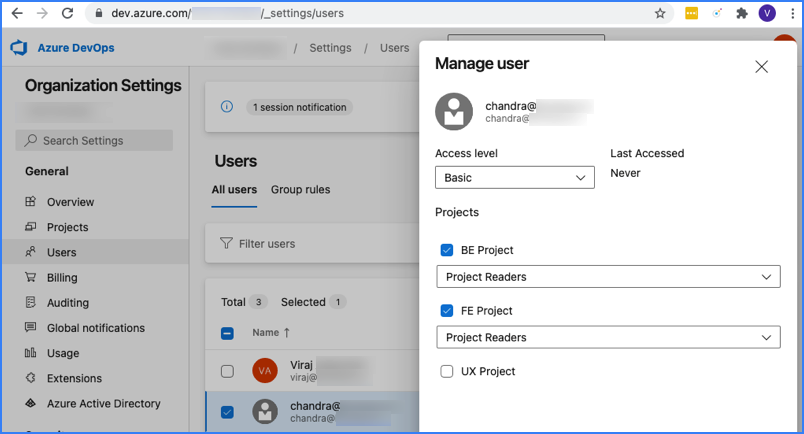
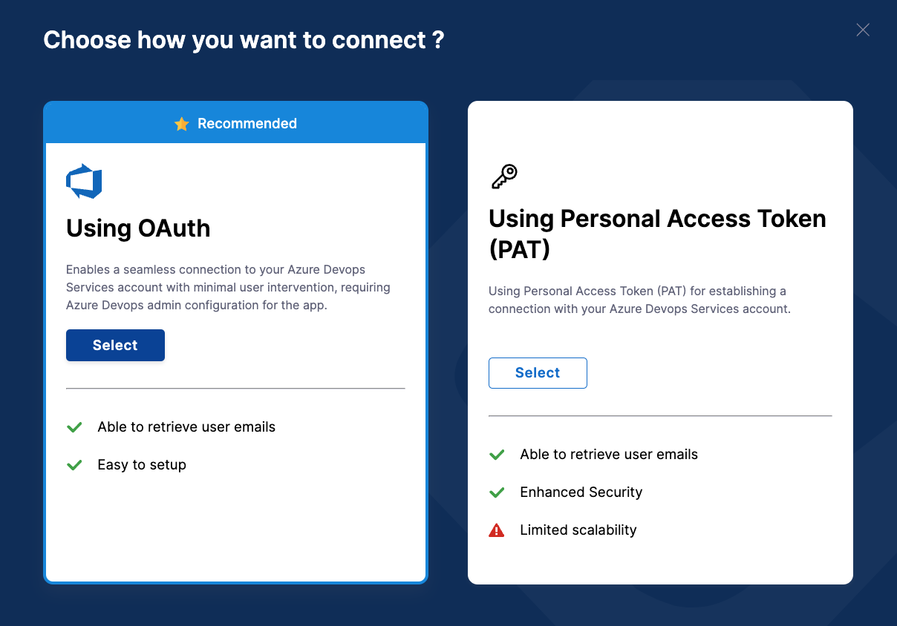
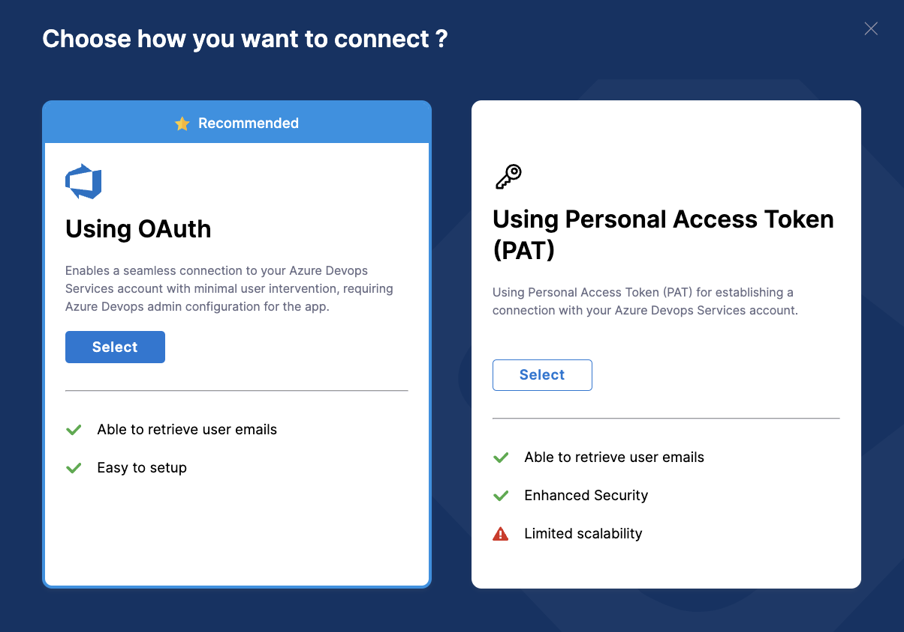
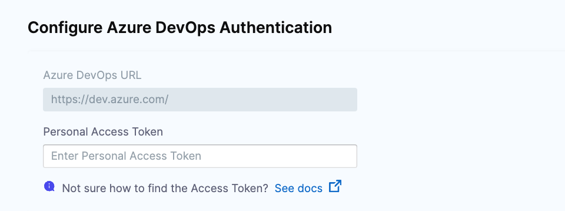

import Tabs from '@theme/Tabs';
import TabItem from '@theme/TabItem';

Azure DevOps (ADO) is a Microsoft product that provides version control, reporting, requirements management, project management, automated builds, testing and release management capabilities. It covers the entire application lifecycle, and enables DevOps capabilities.

Use the SEI Azure DevOps Services integration to integrate SEI with ADO Services. SEI ingests pipelines, Git repos, Team Foundation Version Control (TFVC), and Azure Boards data from ADO Services.

Azure DevOps Services is a cloud offering. To integrate with the on-premises offering, Azure DevOps Server, you must use an [Ingestion Satellite](/docs/software-engineering-insights/propelo-sei/setup-sei/sei-ingestion-satellite/satellite-overview).

### Requirements

The following permissions and settings are required to use the **SEI AzureDevOps Services integration**:

<Tabs>
   <TabItem value = "OAuth" label = "OAuth" default>

* You have registered for Azure DevOps Services and created organizations and projects in ADO.
* All SEI-relevant ADO projects use **Git** for version control.
* You have enabled **Third-party application access via OAuth** in your [ADO organization policies](https://learn.microsoft.com/en-us/azure/devops/organizations/accounts/change-application-access-policies?view=azure-devops).
* Your Azure DevOps account has one of the following access levels: **Basic**, **Basic + Test Plans**, or **Visual Studio Professional/Enterprise**. For more information, go to the Microsoft documentation on [Azure DevOps Access Levels](https://docs.microsoft.com/en-us/azure/devops/organizations/security/access-levels?view=azure-devops#supported-access-levels).
* You have **Reader** permission (or higher) for all SEI-relevant Azure DevOps projects. For more information, go to the Microsoft documentation on [Azure DevOps Permissions](https://docs.microsoft.com/en-us/azure/devops/organizations/security/permissions-access?view=azure-devops).

<figure>

<figcaption>Permissions for an Azure DevOps user who can access two projects and can't access a third project.</figcaption>
</figure>

</TabItem>

<TabItem value = "PAT" label = "Personal Access Token">

Before you configure the **SEI AzureDevOps integration**, you must generate a **Personal Access Token.**

1. Sign in to your **Azure DevOps organisation** with **Microsoft account** using the following url: `https://dev.azure.com/{yourorganisation}`
2. Navigate to your **User Settings**:
   1. Click on your profile picture in the top right corner.
   2. Select **Security** from the dropdown menu.
   3. Under **Personal Access Tokens**, click on the **+ New Token** button.
3. In the Organization dropdown, select **All accessible organizations**.

:::info
Due to a limitation in Azure DevOps, the PAT token must be configured with the All accessible organizations scope to ensure Harness can retrieve the user data
:::

4. Configure the **Scopes** by choosing the required level of access for the token as given below.

</TabItem>
</Tabs>

:::info
If you have enabled an allow list in your Azure DevOps account, certain Harness IP addresses must be added to it in order to allow communication between the Harness Platform and Azure DevOps. If the necessary IPs are not whitelisted, the integration may fail to authenticate or sync data properly.

To ensure your integration can work correctly, please refer to the list of [Harness Platform IPs](/docs/platform/references/allowlist-harness-domains-and-ips) that may need to be whitelisted in your firewall.
:::

### Add the integration

<Tabs>
   <TabItem value = "OAuth" label = "OAuth" default>

1. In your **Harness Project**, select the **SEI Module**, and go to your **Account**.
2. Select **Integrations** under **Data Settings**.
3. Select **Available Integration**, locate the **Azure DevOps Services** integration, and select **Install**.

4. Select **Using OAuth** as the type of authentication to configure the integration. You'll be redirected to the Azure Devops platform, sign in with your Azure DevOps credentials to authenticate via OAuth.

5. Enter a **Name** for the integration.
6. The **Description** and **Tags** are optional.
7. Specify the **Azure DevOps Organizations** to associate with the integration. If left unspecified, all accessible organizations will be associated.

</TabItem>
   <TabItem value = "PAT" label = "Personal Access Token">

1. Select **Integrations** under **Data Settings**.
2. Select **Available Integration**, locate the **Azure DevOps Services integration**, and select **Install**.

3. Choose the authentication type as **Using Personal Access Token (PAT)** and click on **Next** in the instructions page.

4. Configure and **Save** the integration.
   * Enter a **Name** for the integration.
   * The **Description** and **Tags** are optional.
   * Add the **Personal Access Token** you previously generated in Azure DevOps.

   * Select the specific Azure DevOps services you want to integrate:
     * Azure Boards
     * Azure Pipelines
     * Azure Repos

   * Click on **Validate Connection** to validate the connection, and once successful, you'll have the integration set up under the **Your Integrations** tab.

:::info
Note: Different integrations will be automatically created for all the Azure DevOps services. For example:

* Azure integration - Boards for Azure Boards
* Azure integration - Pipelines for Azure DevOps Pipelines
* Azure integration - Repos for Azure DevOps Repos

:::

</TabItem>
</Tabs>

### Limitations

1. The Azure DevOps integration currently ingests and retains data for the last 90 days.
2. The SCM Rework metric, including the Rework widget, is not stable at this time for Azure DevOps integration.
3. Data for the following widgets (duration metrics) is not available:
   * CICD Job Duration Report
   * CICD Job Duration Single Stat
   * CICD Job Duration Trend Report
   * CICD Pipeline Jobs Duration Report
   * CICD Pipeline Jobs Duration Trend Report
4. The integration does not accurately reflect the pipeline stage status across the widgets.

:::note

After adding the integration, it may take up to 24 hours for data to fully sync to SEI. During this time, any widgets you set up in Insights may not display data until the sync is complete.

:::

### See also

* [Reauthenticate](/docs/software-engineering-insights/propelo-sei/setup-sei/configure-integrations/reauthenticate-integration)
* [Ingested data from Azure Repos](/docs/software-engineering-insights/propelo-sei/setup-sei/configure-integrations/azure-devops/sei-azure-repos-datasheet)
* [Ingested data from Azure Pipelines](/docs/software-engineering-insights/propelo-sei/setup-sei/configure-integrations/azure-devops/sei-azure-pipelines-datasheet)
* [Ingested data from Azure Boards](/docs/software-engineering-insights/propelo-sei/setup-sei/configure-integrations/azure-devops/sei-azure-boards-datasheet)
