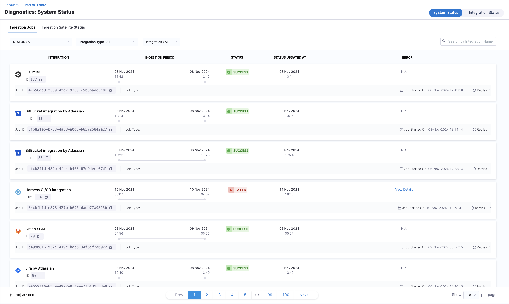
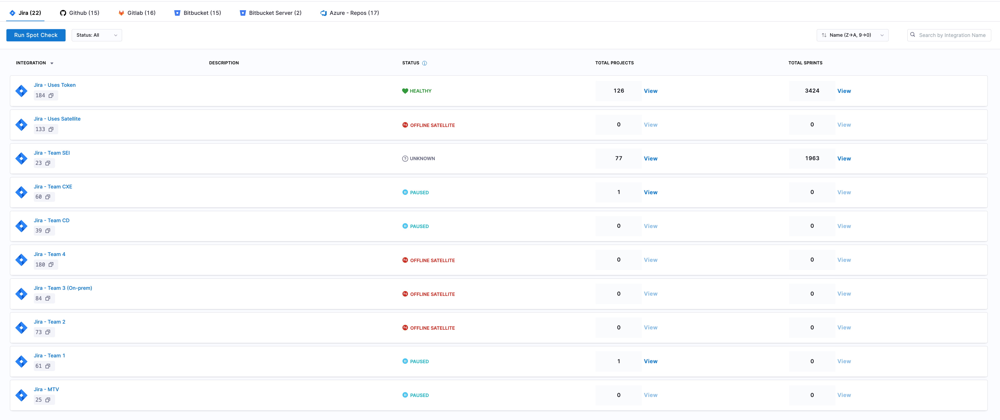
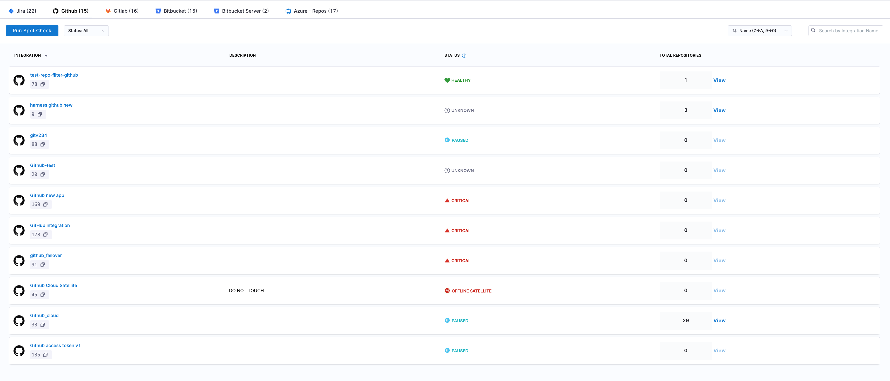

import Tabs from '@theme/Tabs';
import TabItem from '@theme/TabItem';

Diagnostics helps you validate data accuracy, monitor data ingestion, and troubleshoot integration related issues in the application. It provides visibility into data ingestion status, progress, and alerts to ensure the SEI system is healthy and  has the latest data updated.

## Primary scenarios

Use SEI Diagnostics if you need to:

* Compare data between Jira or supported SCM tools and SEI and verify the accuracy and completeness of ingested data
* Track real-time status of all integrations and view the summary of data ingested from each source.
* Identify and resolve integration misconfigurations
* Investigate missing tickets, commits, or pull request data in SEI reports
* Monitor status and progress of data ingestion jobs
* Receive alerts for anomalies or issues in the ingestion process

:::info Supported Integrations:

* Issue Management: Jira by Atlassian
* Source Control Management (SCM): All SCM integrations supported by SEI
:::

## System Status

The System Status overview provides a centralized view of your SEI system's health, specifically focusing on the ingestion jobs and satellite connectivity. Here's a breakdown of what each section covers:

### Injestion Jobs

Ingestion jobs retrieve data from integrated platforms. For each job, the following details are available:

* **Integration ID:** Identify the specific integration source, helpful for multi-platform environments.
* **Ingestion Period:** Tracks the duration of each job to assess efficiency and detect any unusually long processes.
* **Status:** Shows if the job was successful or failed, with a timestamp for the last update.
* **Error Logs:** In case of a failure, the logs provide insights into the cause and any associated errors for troubleshooting.

Below are examples of errors you might find in the error logs, along with causes and potential fixes:

#### 401/403 Unauthorized Access

* **Cause:** The token provided was invalid, resulting in failure to access project data or certain API endpoints.
* **Solution:** Confirm the token validity and if the token has expired, update the integration configuration by reauthenticating with the third-party platform. Ensure the integration is configured with correct credentials.
* If the error persists, reach out to support with these details for further investigation.

Note that if you're using the Azure DevOps integration, 203 also reflects issue with the access token being expired.

#### Stream Exception

This error happens when data fetching from paginated endpoints fails midstream. It can result from:

* Authorization issues (e.g., expired or invalid tokens).
* Misconfigurations in settings (e.g., exceeding data limits).

**Solution**

* **Verify API Token:** Go to your SEI integration settings and confirm that the API token is valid and hasn’t expired. Generate a new token if needed and [reauthenticate](/docs/software-engineering-insights/sei-integrations/reauthenticate-integration), especially if the integration has been recently reconfigured.
* **Check Permissions:** Ensure the user or service account associated with the integration has the necessary permissions to access the data.
* **Review integration settings:** If you’re pulling large volumes of data from GitHub / Jira, try reconfiguring the integration using multiple access tokens in the integration’s configuration (e.g., 4-5 PATs for a data size of 20k+ repositories in GitHub) to manage data limits better.
* If the error persists, reach out to [support](/docs/software-engineering-insights/sei-support) with the details for further investigation.

#### IOException

An IOException occurs when network connectivity issues prevent data retrieval, even after multiple retries. This can be due to:

* Network outages or intermittent connectivity.
* Endpoint downtime

**Solution**

* **Test Connectivity:** Check if you can access the API endpoints directly from your network (e.g., using a curl command). This will help determine if the endpoint is down or if there are network issues preventing access.
* **Verify Network Settings:** Confirm that any firewall or proxy settings are allowing traffic to the endpoint. If you're using a cloud-based integration with allowlist settings in the third-party account or if you're utilizing an ingestion satellite, confirm that [Harness IP addresses are allowlisted](/docs/platform/references/allowlist-harness-domains-and-ips) to avoid access restrictions.
* If the error persists, reach out to [support](/docs/software-engineering-insights/sei-support) with the details for further investigation.

#### 429 Rate Limiting

This error occurs when the integration is sending too many requests to the API within a given time frame. This is typically caused by a large set of data being ingested using one integration exceeding the API rate limit.

**Solution**

If you're using a PAT (Personal Access Token) or API Key for authentication, try [reauthenticating](/docs/software-engineering-insights/sei-integrations/reauthenticate-integration) the integration with multiple access tokens for different service accounts. This can help distribute the request load and reduce the likelihood of hitting rate limits. If the error persists, reach out to [support](/docs/software-engineering-insights/sei-support) with the details for further investigation.

### Ingestion Satellite Status

Monitor the health of ingestion satellites for on-prem integration setups. 

## Integration Status

The Integration Status page is a central dashboard designed to help you monitor, manage, and troubleshoot all your integrations effectively. 
This page provides a real-time health check on data ingestion status, allowing you to identify potential data discrepancies across different integrations quickly.

### Overview

Each integration displays essential information:

* Integration Name, ID, and Description: Unique identifiers for easy identification across multiple integration instances.
* Current Status: Real-time health indicator, showing the latest ingestion state.

### Status labels and recommended actions

Each integration is labeled with a specific status based on recent ingestion results. Below are the statuses, their meanings, and recommended actions:

| Status | Description | What It Means For You | Recommended Action |
|--------|-------------|----------------------|-------------------|
| HEALTHY | All ingestion jobs successful in the past week | Your integration is working optimally | Continue regular monitoring |
| CRITICAL | No successful ingestion jobs in the past week | Data is not being updated, immediate attention required | Check credentials and connectivity  |
| NEEDS ATTENTION | Some failed ingestion jobs in the past week | Partial data loss may be occurring | Review [error logs](#injestion-jobs) and recent changes |
| OFFLINE SATELLITE | No recent ingestion jobs and no active satellite | Integration agent is not communicating | Verify satellite configuration and network status |
| PAUSED | Integration ingestion manually paused | No new data is being collected (intentional) | Contact [Harness Support](/docs/software-engineering-insights/sei-support) to resume when ready to continue data ingestion |
| UNKNOWN | No recent ingestion jobs or unspecified issues | System cannot determine integration health | Check integration requirements and configuration |

### Troubleshooting by Integration Type

Each integration provides unique data points based on its setup and usage. For example, the Jira integration section includes separate details on Projects and Sprints ingested into the system.
Similarly for Source Code Management (SCM) tools provides a summary of repository ingestion across all integrations. It includes the total count of repositories successfully ingested, along with specific data for each integration.

<Tabs>
<TabItem value="Jira" default>

The integration status page for Jira display the total count of projects and sprints data that are ingested as part of all the integrations.

For each ingested project, the following details are available:

* Total Issues Count: Number of issues ingested for the project.
* Newest Issue Creation Date and Time: Date and time of the most recently created issue.
* All Issues View: Lists all ingested issues, making it easy to verify data accuracy. 

* Each issue includes:
  * Story Points Allocated: Total story points assigned to each issue.
  * Issue Type: Categorizes issues (e.g., Bug, Task, Story).
  * Assignee: Person responsible for the issue.
  * Issue Created At: Date and time the issue was originally created.
  * Last Issue Update: Timestamp of the last update to the issue.

To locate specific issues, you can use the Filter and Search by Ticket ID feature. If you need to identify projects with missing data, enable Show Only Projects with 0 Issues to display projects with no issues ingested.

For each ingested sprint, the following metrics are displayed:

Sprint Name
Start Date and End Date: Planned timeline for the sprint.
Committed Story Points: Total story points planned for completion.
Delivered Story Points: Actual story points delivered by the sprint’s end.
Total Issues Count: Number of issues ingested for the sprint.
Latest Issue Created Date: Most recent creation date among issues in the sprint.

In addition, each sprint shows all associated issues, with the following details for each:

Story Points Allocated: Story points assigned to each issue.
Issue Type: Type of issue (e.g., Bug, Task, Story).
Status: Current status of the issue.
Assignee: Team member assigned to the issue.
Issue Created At: Date the issue was created.
Last Issue Update: Date of the latest update to the issue.

</TabItem>

<TabItem value="Source Code Managers">

The integration status page for SCM integrations provides a overview for tracking and validating the data of repositories ingested through your integrations. It displays the total count of repositories and allows you to access detailed information to monitor repository activity and troubleshoot data discrepancy issues.

The status page shows the total count of repositories ingested as part of the integration. For each SCM integration, select View to see key information.

* Repository Name: Name of each repository.
* Total Commits: Total number of commits made in each repository.
* Total Pull Requests: Total count of PRs submitted in the repository.
* Newest PR Created Time (UTC): Date and time of the latest PR creation.

Click View PRs to see data on each pull request, including:

* All PRs: List of all pull requests for the repository.
* Current State: The current status of each PR (e.g., open, closed, merged).
* Creator: The user who created the PR.
* Assignee: The user assigned to review or merge the PR.
* Labels: Any labels applied to the PR.
* Created At: The date and time the PR was created.
* Last Updated: The most recent date and time the PR was updated.

Clicking on a PR title opens a detailed PR Details page, displaying:

* Cycle Time: The total time from PR creation to merge or closure.
* Files Changed: A list of all files modified in the PR.
* Lines Changed: The total lines of code added or removed.
* Comment Density: The frequency of comments within the PR.
* PR History: A timeline of significant PR events (e.g., status changes).
* Associated Commits: All commits linked to the PR.
* CI Pipelines: Any continuous integration pipelines related to the PR.
* Time Spent in Status: A breakdown of time spent in each PR stage, along with other specific PR details.

</TabItem>
</Tabs>

## Run Spot Check

Perform targeted validation of data for a specific timeframe or data subset.

## Troubleshooting

### Missing data in the system

If you encounter a 