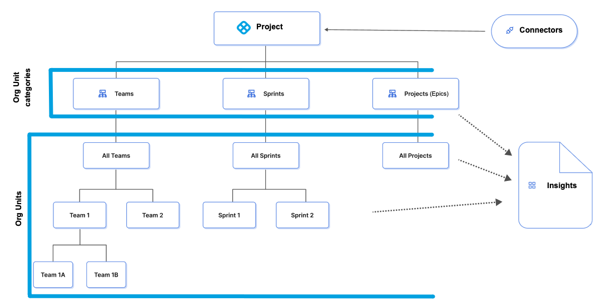

Pivot Point hierarchies in SEI keep data organized. At the top of the hierarchy is a [Harness project](/docs/category/organizations-and-projects). Under each project are Org Unit categories and one or more levels of Org Units (also known as Organizational Units or OUs).

* **Harness project:** The umbrella for the SEI Org Unit hierarchy. Org Unit categories and Org Units exist under their associated project; they don't span across projects. While multiple projects can have Org Unit categories and Org Units with the same name, these are distinct groups under their designated project.
* **Org Unit categories:** Broad classifications that serve as containers for Org Units but are not, themselves, Org Units. For example, **Teams** is an Org Unit category; whereas **Engineering Team** and **Docs Teams** are Org Units under the **Teams** category.
* **Org Units:** Groupings or narrow classifications that are subdivisions of Org Unit categories. Each Org Unit category also has one root group that is the **All** Org Unit. For example, the root Org Unit for the **Teams** category is **All Teams**.

<figure>

<figcaption>Figure 1: A diagram of the relationship between projects, Org Unit categories, and Org Units. Connectors (integrations) feed data from your SDLC tools into the project and the corresponding Org Unit categories and Org Units. Data is ultimately displayed on Insights, which are associated with particular Org Units.</figcaption>
</figure>

Projects, Org Unit categories, and Org Units provide a broad way of organizing, filtering, and scoping data so you can examine data for different teams, lines of business, development initiatives, sprints, or other scopes. From there, you can configure [Metrics and Insights](/docs/category/metrics-and-insights) to further refine and examine different facets of your teams' data.

## Projects

[Projects](/docs/category/organizations-and-projects), in addition to the roles they serve elsewhere in the Harness Platform, provide an umbrella for you to organize the Org Unit hierarchy and access Insights associated with specific Org Units.

Org Unit categories and Org Units exist under their associated project; they don't span across projects. While multiple projects can have Org Unit categories and Org Units with the same name, these are distinct groups under their designated project.

[Insights](../sei-metrics-and-insights/sei-insights.md) are associated with a specific project and one or more specific Org Unit categories and Org Units under that project. It is not possible to create Insights that aggregate data from multiple projects.

On your [Insights](../sei-metrics-and-insights/sei-insights.md), widgets derive data from [integrations](/docs/category/connectors-and-integrations) that are inherited from the Org Unit associated with the Insights. Org Units inherit integrations from the [connectors](/docs/category/connectors-and-integrations) defined in the associated project.

While you can create projects from within the SEI module, projects are part of the Harness Platform and can be associated with multiple modules. For information about configuring Harness projects, go to the Harness Platform documentation on [Organizations and Projects](/docs/category/organizations-and-projects).

## Org Unit categories

Org Unit categories are broad classifications that serve as containers for Org Units but are not, themselves, Org Units. For example, **Teams** is an Org Unit category; whereas **Engineering Team** and **Docs Team** are Org Units under the **Teams** category.

Each project has three default Org Unit categories: Teams, Projects, and Sprints. You can modify the default categories and create custom categories.

:::info Harness projects and Org Unit projects

The **Projects** Org Unit category is not the same as your Harness projects. This category is meant to represent sub-projects under the umbrella of the Harness Project. For example, if your Harness projects align with apps that you develop, then your sub-projects could be epics, components, or Jira projects.

:::

For information about configuring Org Unit categories, go to [Manage Org Unit categories](./manage-org-unit-cat.md).

## Org Units

Under each Org Unit category are one or more levels of Org Units. Org Units are groupings or focused classifications that are subdivisions of Org Unit categories. Inheritance flows down the Org Unit levels. For example, all Org Unit categories and Org Units automatically inherit connectors from the associated Harness project.

By default, each Org Unit category has one root, or **All**, Org Unit node. For example, the Teams category automatically has an **All Teams** Org Unit. Under the root node, you can create any number of Org Units and Org Unit levels.

For example, in the Teams category, assume that you have an Org Unit for your Engineering teams, and you then create a child Org Unit for the Front End team under the Engineering teams Org Unit. The Front End team Org Unit inherits all Insights associated with the parent Org Unit (the Engineer teams Org Unit). The resulting hierarchy might look like this:

* Project
  * Teams (Org Unit category)
    * All Teams (Root Org Unit)
      * Engineering teams (Parent Org Unit)
        * Front End team (Child Org Unit)
        * Other Engineering teams...
      * Other teams...

For information about configuring Org Units, go to [Manage Org Units](./manage-org-units.md).

## Contributors

Contributors are developers and other team members that complete actions and activities that contribute to your SEI metrics and insights. Contributors are represented by contributor records in SEI. SEI contributor records associate related user accounts across your SDLC tools and can be used to populate contributor-based Org Units.

For information about managing contributors, go to [Manage contributors](./manage-contributors.md).
