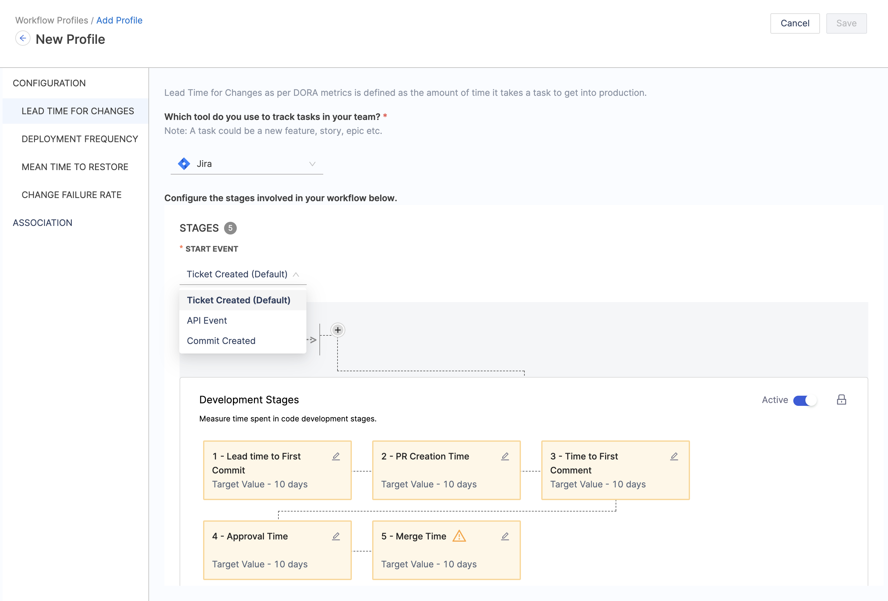
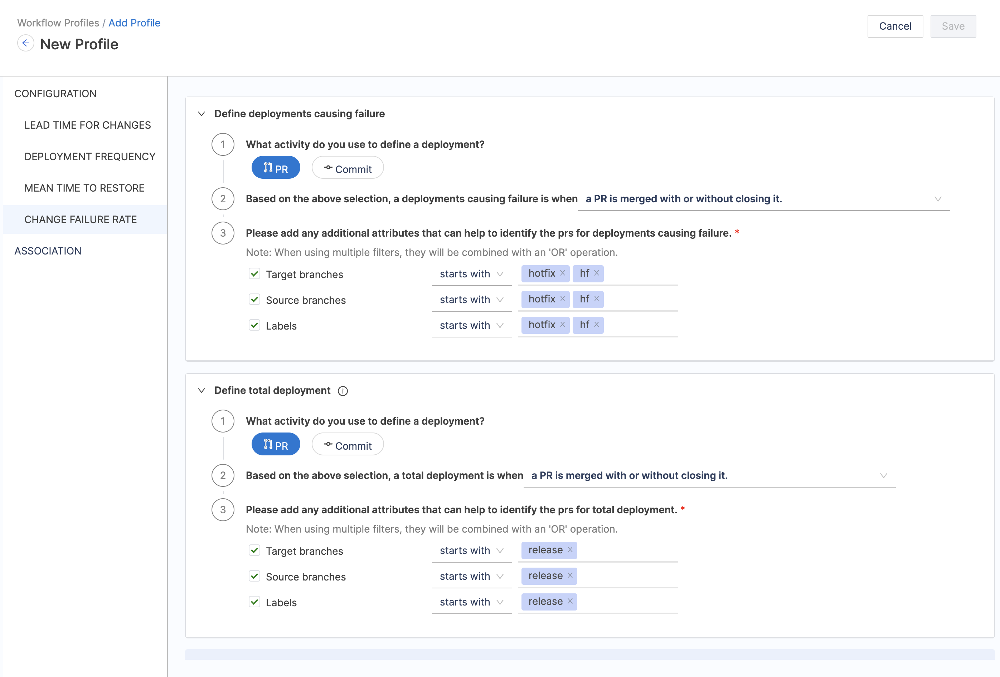
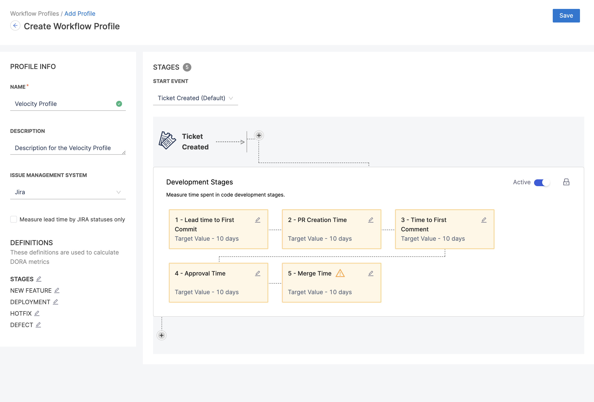
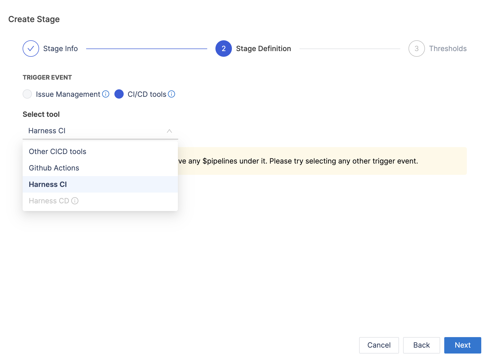

Workflow profile is an entity in SEI where users define the stages, events, and measurement criteria to assess the entire development process lifecycle. You can use these profiles to derive insights on time taken to ship changes or the time taken for bug fixes to reach production etc.

You can configure the profile depending on the factors you want to include in your calculations. For example, you can:

* Define the **Start of Change** to start calculating lead time, which can be ticket creation in an issue management system, commits to source code, pull requests, or deployments to dev, staging, or prod environments.
* Track time spent in various issue statuses, if your profile includes monitoring for an issue management system, such as Jira.
* Track time spent in source code lifecycle stages, such as commit to merge and activities related to pull requests.
* Track lead time and DORA metrics for your engineering teams through your CI/CD tools.


## Workflow Profile Settings

**Workflow profile settings include:**

When creating a new workflow profile, you will need to choose the profile type. The available profile types include DORA profile & Velocity lead time profile.

* **DORA Profile:** Supports the four key DORA metrics - Lead time for changes, Deployment frequency, Mean time to restore, and Change failure rate. 
* **Velocity Lead Time Profile:** Supports all the pre-defined workflow profile-based widgets.


## DORA Profile

DORA metrics are vital for evaluating and enhancing engineering team performance. The available DORA metrics are Lead Time for Changes, Deployment Frequency, Mean Time to Restore, and Change Failure Rate.

### Lead Time for Changes

Lead Time for Changes measures the time it takes for a task to progress from development to production. To configure:

* Choose the tool used for tracking tasks (e.g., new features, stories, epics) in your team.
* Configure the stages involved in your workflow based on the requirements.
* Note that for lead time metrics you can define stages based on either of the following events:
  * Ticket Created: This event ensures that lead time tracking starts in issue management.
  * Commit Created: This event ensures that lead time tracking starts when the first commit is committed.
  * API Event: This This event triggers the lead time calculation based on a custom API event.


  
To learn more about how lead time metrics are calculated, Go to [Lead Time for Changes calculation](/docs/software-engineering-insights/sei-metrics-and-reports/dora-metrics#lead-time-for-changes-calculation).

### Deployment Frequency

Deployment Frequency measures how frequently a team successfully deploys code to production. To configure:

* Specify the tool used for measuring deployments in your team.
* Select any existing integrations you wish to use for calculating deployment frequency.
* Defind the settings for how you want to calculate deployment frequency. The additional filters being used to define the deployments will be applicable to all the integrations that you selected.


### Mean Time to Restore

Mean Time to Restore represents the duration it takes a team to recover from a production failure. To configure:

* Choose the tool used for tracking tasks similar to the Lead Time for Changes metric.
* Configure the stages involved in your workflow based on the requirements.

### Change Failure Rate

Change Failure Rate is computed by dividing the total number of deployments causing failure by the overall number of deployments. To configure:

* Specify the tool used for measuring deployments in your team.
* Choose any existing integrations you want to utilize for calculating the change failure rate.
* Select how to configure your integration between SCM (Source Code Management) and CI/CD.
* Add attributes and filters to identify and define deployments causing failure and total deployments.



Total deployments represent all deployments that have occurred within a specified time range, regardless of whether they resulted in success or failure.

<details>
<summary>Integration configured with SCM</summary>

When the integration is configured with SCM, specify whether deployments causing failure and total deployments are defined based on Pull Requests (PR) or Commits. Describe what defines a deployment causing failure based on the following filters:

* PR merged without closing.
* PR closed without merging.
* A merged PR is closed.

Add any extra attributes that help identify PRs for deployments causing failure. Multiple filters are combined using an 'OR' operation.
</details>

<details>
<summary>Integration configured with CI/CD</summary>

When the integration is configured with CI/CD, define additional attributes to identify deployments causing failure and total deployments. When using multiple filters, they will be combined with an 'AND' operation.

Define job run parameters in key-value pairs. When using multiple job run parameters, they will be combined with an 'OR' operation. Similarly describe what defines a deployment causing failure based on the jobs completed or jobs started events in the selected time range.

</details>

:::info
Note: The additional filters being used to define the deployments will be applicable to all the integrations that you have selected.
:::

## Lead Time Profile

Lead time is based on time spent in stages defined in a Velocity Lead Time type Workflow profile.

For example, the default configuration for a [PR-based Workflow profile](#create-a-profile-to-track-lead-time-in-scm) has four stages:

* PR creation time.
* Time to Comment.
* Approval time.
* Merge time.

Similarly, the default configuration for a [Ticket-based Workflow profile](#configuration-examples) has five stages:

* Lead time to First Commit.
* PR Creation time.
* Time to Comment.
* Approval time.
* Merge time.

When calculating lead time, the time spent in each stage depends on the stages that a PR or issue actually goes through. For example, if your Workflow profile includes a *time to comment* stage, but there are no comments on the PR or ticket, then the *time to comment* is zero.


You can configure grading thresholds (good, acceptable, and slow) for each stage. These thresholds determine grades that appear on your lead time widgets. Grades are reported for each stage as well as a cumulative grade for all stages combined.

You can modify Workflow profile stages and grades according to your team's SDLC process. If your Workflow profile includes stages across issue management, SCM, and CI/CD, make sure the same event is not tracked in multiple tools, such as *Deploy to Production* in Jira and a *CI/CD Deploy* stage.

## Configure Workflow profiles

To add or edit Workflow profiles:

1. In your Harness project, go to the SEI module.
2. Select **Account**.
3. Select **Workflow** under **Profiles**.
4. To create a profile, select **+New Workflow Profile**. To edit a profile, select the profile's name in the profiles list.

:::tip

You can create profiles by copying existing profiles. Make sure to edit copies accordingly and that your Lead Time widgets reference the correct profile.

:::

### Configure the DORA Profile

DORA Profile is a type of Workflow Profile that allows you to define the thresholds for measuring the DORA metrics for your engineering team. Follow the steps below to configure the DORA profile:

1. In the **Workflow** tab under **Profiles** select **+New Workflow Profile**
2. Select **DORA profile** as the type for the Workflow profile.
3. Enter a **Name** for the profile.
4. Add a profile description. (Optional)
5. **Lead Time for Changes:** Define the settings for calculating the DORA Lead Time for Changes report. 
   * Select the Issue Management tool that you want to use to track tasks in your team.
   * Configure the stages involved in the workflow based on the selected event. To learn more, go to [Development Stages in Lead Time for Changes](/docs/software-engineering-insights/sei-metrics-and-reports/dora-metrics#development-stages).
6. **Deployment Frequency:** Modify this settings to define how you want to calculate Deployment Frequency for your engineering team.
   * Choose the tool that you want to use to measure deployments in your team.
   * Select the existing integrations that you would like to use to calculate the Deployment Frequency.
   * Configure the additional filters to define the criteria for deployments to be considered in the calculation.
7. **Mean Time to Restore:** Define the settings for measuring the time it takes a team to recover from a failure in production. The configuration is similar to the settings for Lead Time.
8. **Change Failure Rate:** Define the configuration for measuring the Change Failure Rate for your team.
   * Ensure to select the checkbox incase you want to calculate the Change Failure Rate using only deployments that causes failure.
   * Choose the tool that you want to use to measure deployments in your team.
   * Select the existing integrations that you would like to use for the calculation.
   * Configure the additional filters to define the criteria for total deployment and deployments causing failure to be considered in the calculation.
9. **Association:** Modify the Collection and Project associated with this profile.
10. Once you have finished configuring the profile setting click on **Save** to save the profile.

:::tip
Note that for calculating DORA metrics, each profile can be associated with only one Collection in a one-to-one mapping
:::

### Configure the Lead Time Profile

To create a Velocity Lead Time profile, you need to follow these key steps:

1. In the **Workflow** tab under **Profiles** select **+New Workflow Profile**
2. Select **Velocity lead time profile** as the type for the Workflow profile.
3. Enter a **Name** for the profile.
4. Add a profile description. (Optional)
5. Select either **JIRA** or **Azure** as your issue management system. 
6. Configure the Workflow Profile Definition. Here you can define the setting for **Stages**, **New Features**, **Deployment**, **Hotfix** and **Defects**.
7. Configure the stages involved in the workflow based on the selected event. To learn more, go to [Development Stages in Lead Time calculation](/docs/software-engineering-insights/sei-metrics-and-reports/velocity-metrics-reports/lead-time-reports#development-stages).
8. For **NEW FEATURE**, **DEPLOYMENT**, **HOTFIX**, **DEFECT** the configuration is done based on the below parameters:
   * **Pull Requests to Branches:** Specify values that the branches for pull requests should start with or contain.
   * **Pull Requests from Branches:** Define values that the source branches for pull requests should start with or contain.
   * **Direct Merges to Branches:** Set criteria for branches that should be considered for direct merges, based on starting or containing specified values.
   * **Tags on Commits of Merged PRs:** Specify values that tags on commits of merged pull requests should start with or contain.
   * **Labels on Pull Requests:** Define values for labels on pull requests that should start with or contain specific values.



:::tip
Separate multiple values with a comma.
:::

### Stages

Depending on your chosen start event, the stage configuration can vary:

You can change the start event that initiates the first stage, and you can add, edit, and remove stages. When editing stages you can customize the fields, define ideal and acceptable time ranges, grades, and more. This refines how you track KPIs.

* For **Ticket Created** Start Event by default the Development stages are enabled which includes Lead time to first commit, PR creation time, Time to Comment, Approval time, and Merge time (requires destination branch confirmation). For Approval Time you have the option to choose between choosing the First Approval or the Final Approval depending on your workflow's needs.
  
  PR review stages cannot be rearranged. Default values for stages are customizable to meet specific requirements. We can add new custom stages at the beginning of the workflow or after the completion of the Development stages.

* For **Commit Created** Start Event Workflow starts with `Commit Created` followed by PR Creation Time, Time to Comment, Approval Time, and Merge Time stages. Default values are customizable based on specific requirements. Custom stages can only be added after completing the default stages.

* For **API Event** Start Event Development stages are the same as for `Ticket Created` and the PR review stages cannot be rearranged. The default values are customizable and custom stages can be added at the beginning or after the development stages.

### Add a custom stage

To add custom stages, follow these steps:

1. Click on the plus button within the workflow.
2. Add a stage name and description.
3. Define the Stage Definition by selecting the trigger event (options include Issue Management, Other CI/CD tools, Harness CI) and set event parameters.
4. Set acceptable time limits and target times (e.g., IDEAL TIME, ACCEPTABLE TIME) for the custom stage and save it.



### Add the Jira Release stage

When configuring a workflow profile in Jira, you have the option to add a release stage to measure Lead Time. This allows you to schedule how features are rolled out to customers or organize completed work for your project.

By default, the Jira release stage is disabled, so you'll need to enable it to use it. Once enabled, the starting event for the workflow is automatically set to `Ticket Created` and cannot be modified as it will result in incorrect configuration.Similarly, the issue management system is automatically set to Jira by default.

If you want to customize the starting event and Issue Management fields, you'll have to disable the release stage first. Once disabled, you'll be able to customize your starting event and Issue Management configuration for your profile.

### Measure Lead Time by Jira Statuses

You can choose to measure lead time exclusively by JIRA statuses. This feature is especially useful for teams using JIRA as their primary issue management tool. It is a mandatory configuration for the JIRA releases report.

Since lead time is being measured by JIRA statuses only, the start event will be `Ticket Created` by default. Additionally, you have the option to add stages to your workflow, each with its name and description, and define the threshold by setting acceptable time limits for each stage.


To ensure accurate lead time measurement, at least one stage, apart from the release stage, is mandatory when measuring lead time by JIRA statuses. This ensures that the lead time metric captures the entire workflow process with all the steps involved in bringing an issue to its final state.

Intermediate stages allow for a more detailed analysis of the time spent at each phase of the workflow, enabling teams to identify potential bottlenecks and areas for optimization. When measuring lead time by JIRA statuses, stages can only be added before the release stage.

* For newly created profiles the release stage is disabled by default in the configuration. However, selecting the checkbox to measure Lead Time only using Jira Statuses enables the Release Stage settings.
* In this case, the selection for the `Issue Management System` and `Start Event` is disabled. Since JIRA is selected as the issue management platform, `Ticket Created` is the only start event supported
* If you want to switch to Azure as the issue management system, you’ll have to disable the release stage from the profile configuration.
* You cannot choose a start event other than `Ticket Created` when the release stage is configured as it will lead to incorrect settings.

For existing profiles already in use, the release stage remains disabled by default.


In cases where a single ticket is associated with multiple versions, the user can choose between two methods for the calculation:

* **Considering the Earliest Released Version:** This option measures lead time to the first released version linked to the ticket. This approach prioritizes the initial delivery of value to stakeholders, emphasizing the initial completion of the issue and its subsequent release.
* **Considering the Latest Released Version:** This option measures lead time to the most recently released version associated with the ticket. This approach focuses on the final iteration of the issue, capturing the cumulative development effort and ensuring that the lead time reflects the issue's final state as it reaches users.

## Configuration examples​

The following examples describe Workflow profile configurations to track Lead Time.

<details>
<summary>Track Lead Time in SCM​</summary>

Use this profile configuration to track Lead Time across the PR lifecycle and gain insight into your SCM tools, such as GitHub, Bitbucket, GitLab, and so on.

1. Select Workflow under Profiles.
2. Select Add Profile.
3. Under Profile Info, enter a Name and optional Description.
4. Under Lead Time for Changes, select Stages, and set the Start Event to Commit Created.
5. Review the pre populated Stages that represent the PR lifecycle, from PR creation to merge. You can edit, add, and remove stages as needed. You can edit the data or fields that drive each stage, set time range goals, and more.

If you want to include CI/CD builds and deployments in your lead time calculation, edit your Workflow profile, and add stages to track your CI/CD build and deploy jobs.

</details>

<details>
<summary>Track Lead Time in Issue Management and SCM​</summary>

1. Select Workflow under Profiles.
2. Select Add Profile.
3. Under Profile Info, enter a Name and optional Description, and then select the Issue Management System to associate with this profile.
4. Under Lead Time for Changes, select Stages, and set the Start Event to Ticket Created.
5. Review the pre populated Development Stages and edit them, if necessary. These stages represent the progression of code in your SCM tool, from first commit to PR merge.
6. To track progress in your issue management tool, select the + icon to add stages before and after the Development Stages. This allows you to track progress in both your issue management and SCM tools, from issue creation through code deployment.

</details>

<details>
<summary>Include CI/CD in Lead Time​</summary>

If you want to include CI/CD builds and deployments in your lead time calculation, follow the steps to Track Lead Time in SCM or Track Lead Time in issue management and SCM, and then add stages to track your CI/CD build and deploy jobs.

</details>

<details>
<summary>Use a webhook to trigger Lead Time tracking​</summary>

Use this profile configuration to use an API event to initiate Lead Time tracking.

1. Select Workflow under Profiles.
2. Select Add Profile.
3. Under Profile Info, enter a Name and optional Description.
4. Under Lead Time for Changes, select Stages, and set the Start Event to API Event.
5. Use the following REST API request to push custom API events to SEI:

```bash
curl --location --request POST 'https://app.harness.io/gratis/sei/api/v1/generic-events' \ 
--header 'accept: application/json' \
--header 'Content-Type: application/json' \
--header 'Authorization: Apikey <SEI_API_KEY>' \
--header 'Cookie: JSESSIONID=23F...BA12' \
--data-raw '{
    "component": "jira",
    "key": "PROP-1460",
    "event_type": "incident_1",
    "event_time": 1664925769
}'
```

Note that the API endpoint mentioned in the REQUEST is relative to the environment you are using. You will need to replace it with the actual URL that are specific to your environment.

In addition to an API Key and session ID, you must supply relevant values for the `data-raw` object according to the following definitions:

* `component`: The correlation component for the event, such as `jira`, `scm`, `ado`, and so on.
* key: The correlating identifier. For the issue management system, this is the issue ID. For SCM, this is the commit SHA.
* `event_type`: Free form text field identifying the type of event.
* `event_time`: A timestamp, in seconds, identifying when the event occurred.

</details>