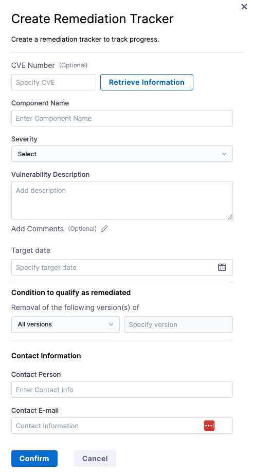
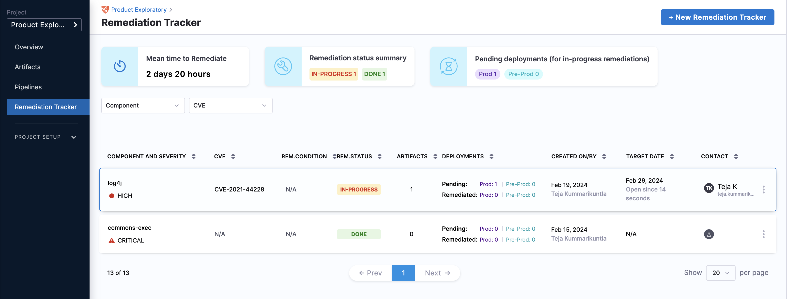
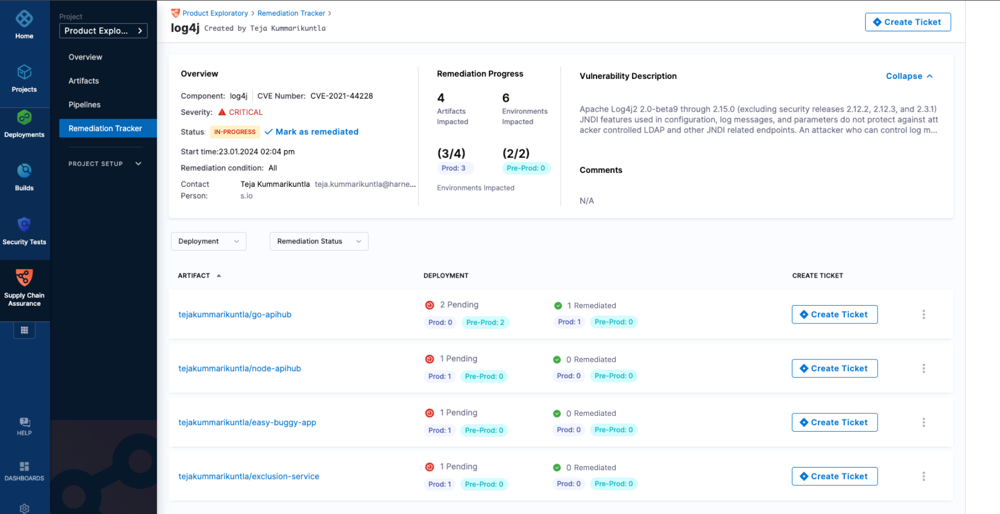
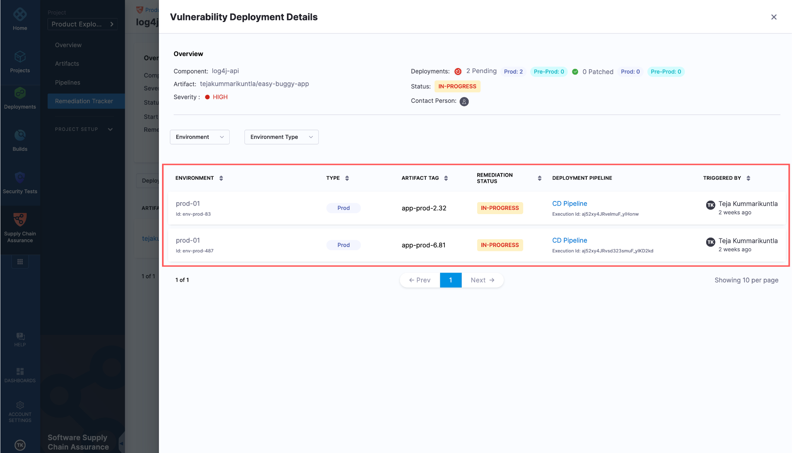
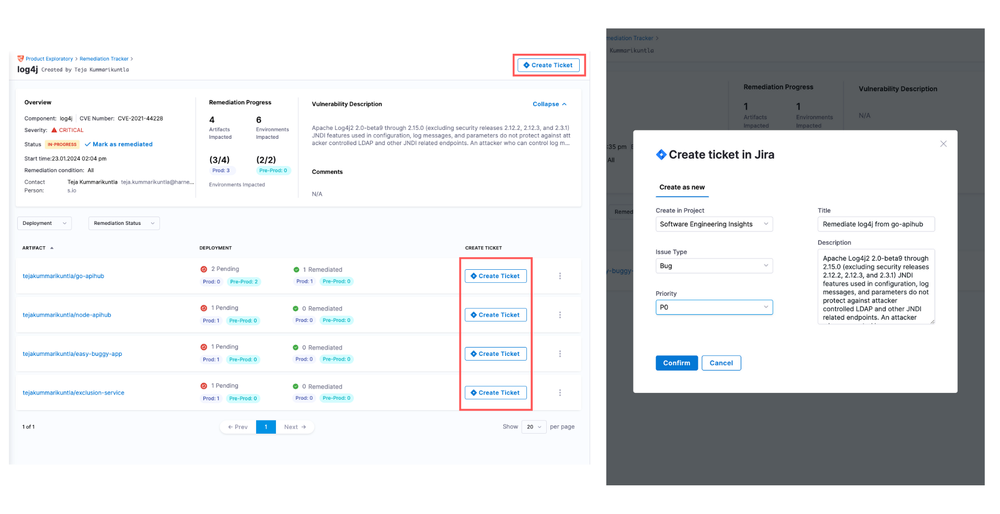

The instructions provided in this document will guide you through the process of creating a remediation tracker in the SSCA Module. Please follow these steps to set up your tracker.

## Prerequisites

Before creating a remediation tracker, it is crucial to ensure that your deployment pipelines incorporate and successfully complete the [SBOM Orchestration step](../sbom/generate-sbom#generate-sbom-in-harness). Additionally, all artifacts must be listed in the [Artifacts view](../artifact-view) page in the SSCA module, as the tracker can only screen through those deployed artifacts available in this view.

## Setting up the remediation tracker

Creating the remediation tracker can be done in a few clicks:

1. Navigate to the Supply Chain Assurance module within the project
2. Select 'Remediation Tracker' from the available options.
3. Click '+ New Remediation Tracker'.

4. Fill in the required details.

* **CVE Number**: A CVE (Common Vulnerabilities and Exposures) number serves as a unique identifier assigned to a specific security vulnerability. Managed by MITRE, CVE numbers facilitate standardized tracking and referencing of vulnerabilities, you can explore [MITRE](https://cve.mitre.org/) or the [National Vulnerability Database (NVD)](https://nvd.nist.gov/) to learn more. 

    The 'Retrieve Information' button aids in fetching vulnerability data from the NVD database and automatically populates the Severity and Description fields. These fields are also editable for further customization. 

* **Component Name***: The name of the vulnerable component. This serves as the key identifier to enumerate all the artifacts utilizing the component.
* **Severity***: The level of impact the vulnerability can have on your system. It can be set to
    * Critical
    * High
    * Medium
    * Low
    * Info
*  **Vulnerability Description**: A concise description of the identified vulnerability
* **Add comments**: Additional information or remarks allowing for broader contextual knowledge and understanding.
* **Target Date**: The intended date for the completion of the remediation process. Breaching this date does not impact any details within the tracker.
* **Condition to qualify as remediated**: A set of conditions that must be met to consider an artifact as successfully remediated.
    * **Removal of the following version(s) of**: Specify the version of the component whose removal is considered as remediation of the artifact. The versions can be defined with the options.
        * All versions
        * Less than
        * Less than or equal to
        * Exact version
* **Contact Person**: The individual responsible for overseeing the remediation efforts
* **Contact Email**: The email address to reach out to the designated contact person

Here’s a detailed view of populating all the fields with sample data.

Click on 'Confirm' to create the tracker, which will then be added to a remediation tracker list.

Each tracker in the list will present the provided details succinctly for quick and easy reference. Additionally, the status of the tracker will automatically be set to 'In-Progress' as it identifies the relevant artifacts.

## Viewing the affected artifacts

By clicking on the tracker, you can access a list of all artifacts that utilize the specified component and do not meet the remediation conditions. The following is an example of how the artifacts listing page appears for the sample 'log4j' remediation tracker.

## Viewing the affected deployment environments

When all the artifacts are listed, you can click on any artifact to see a detailed list of its deployments and environments. This view also includes the specific pipeline used for deployment and displays the tag of the artifact utilized in each deployment. Here’s how it appears:

## 

## Excluding artifacts from the remediation

While the tracker lists all artifacts and includes them in the remediation process by default, it also offers the flexibility to exclude any artifact. To do this, click on the ellipses (…) in the list and select 'Exclude Artifact from Remediation.' This action will permanently remove the artifact from the process.

:::info

It's important to note that once an artifact is excluded, it cannot be re-added to the tracker. Additionally, there is no limit to the number of artifacts you can exclude from the process.

:::

## Creating tickets from the tracker

In the tracker, you can easily create Jira tickets for individual artifacts. Simply click the 'Create Ticket' button located to the right of the artifact list item. This will open options to configure the ticket details, with the artifact details automatically populating the Jira ticket creation fields. Similarly, you can create tickets at the tracker level by clicking the 'Create Ticket' button at the top right corner of the screen. However, before proceeding, ensure that your Jira account is connected to Harness using the Harness Jira connector. For more information on this, you can refer to the [Connect to Jira document](https://developer.harness.io/docs/platform/connectors/ticketing-systems/connect-to-jira/).  

:::info
it's important to note that any status changes made to the tickets created in Jira do not impact the behavior of the tracker. 
:::

## Next Steps

For guidance on how to track your remediation progress, please refer to the [Track Remediation Progress](./track-remediation-progress) document.
