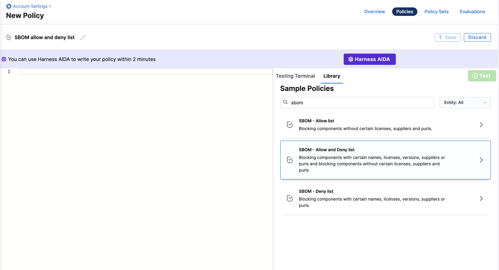
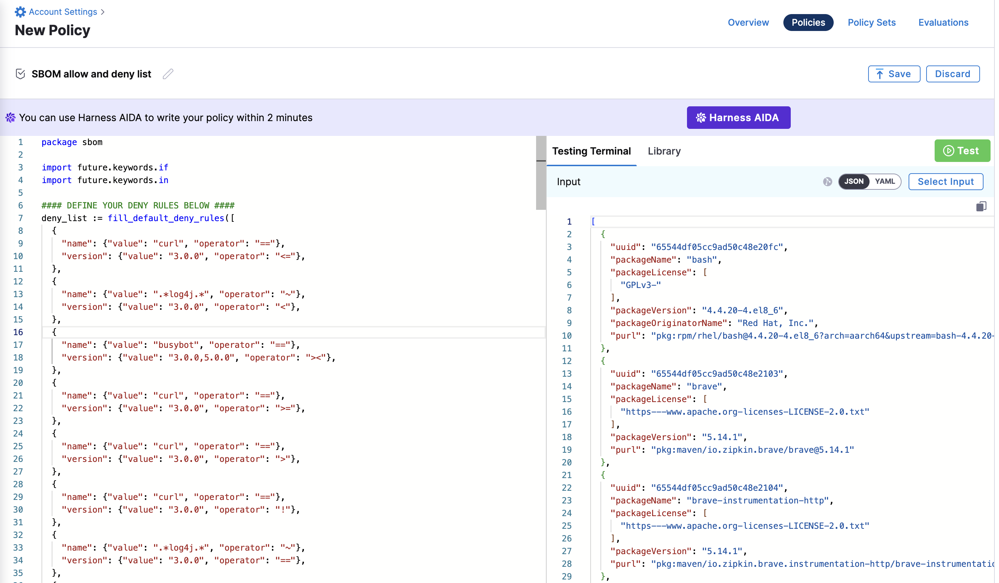
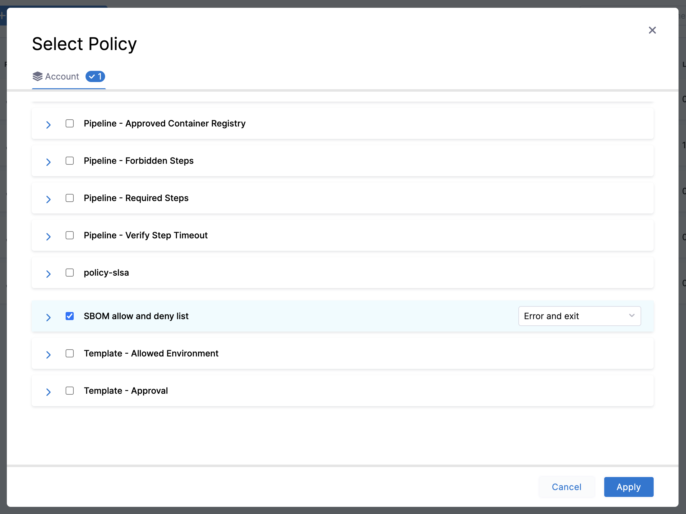

This document provides a step-by-step guide on how to create SSCA Policies. For guidance on how to write these policies, please refer to the section on [write policy definitions](./define-ssca-policies.md). To learn about implementing SSCA policies, follow the instructions in the section on [enforcing SSCA policies](./enforce-ssca-policies.md).

### Before you begin

As you learn to create SSCA policies, ensure you thoroughly review

* [Harness Policy as Code - Overview](https://developer.harness.io/docs/platform/governance/policy-as-code/harness-governance-overview/)
* [Harness Policy as Code - Quickstart](https://developer.harness.io/docs/platform/governance/policy-as-code/harness-governance-quickstart/)

The Harness Policy Library provides sample policies that simplify the process of creating and enforcing them against SBOM. Here's a guide on how to utilize these samples for policy creation.

:::info
Policies can be created at the account, organization, and project levels, this guide will focus on creating a policy at the account level. For instructions on crafting policies for the organization and project levels, please refer to the linked [overview guide](https://developer.harness.io/docs/platform/governance/policy-as-code/harness-governance-overview/), which outlines a similar process.
:::

### Creating an SBOM Policy

Navigate to "Account Settings," proceed to "Policies," and select "Policies" from the options in the top right corner. Then, click on the "+New Policy" button.

In the policy creation window, name the policy "SBOM allow and deny List" and click "Create."

You can then browse the library of sample policies by searching for "sbom" and select the appropriate option according to your needs.

Preview the sample policy of your choice and click on "Use this sample" to proceed.

After selecting the sample, you can modify it as needed and then test the changes to ensure it meets your requirements.

### Creating an SBOM Policy Set

Policies take effect only when they are added into a Policy Set. Within a Policy Set, policies are organized and linked to a specific Harness entity, such as SBOM, in this context. For a policy to be enforced, it must be part of a Policy Set.

To create an SBOM Policy Set, follow these steps:

1. Click on “Account Settings” and navigate to “Policies.”
2. Select “Policy Sets” from the options in the top right corner, then click on the “+New Policy Set” button.
3. Name the policy set and choose “SBOM” for the “Entity Type that this policy set applies to” field.

Set the "On what event should the policy set be evaluated" option to "On Step" and click continue.

Next, you can define what should happen if a policy fails, you can set it to 
- **Warn and continue**: The step will warn about the policy violation and continues the execution.
- **Error and exit**: The step throws and error and terminates the pipeline execution. You can handle this by setting a [failure strategy](https://developer.harness.io/docs/continuous-delivery/x-platform-cd-features/executions/step-and-stage-failure-strategy/).

Then, click on the "+ add policy" button to proceed with adding policies to your Policy Set.

Select the necessary policies you wish to include in the set and add them. You have the option to specify the action to be taken if a policy fails, by choosing either “Error and exit” or “Warn and continue.” After making your selections, click "Apply" and then "Finish."

This process will create a new policy set comprising all the selected policies. You can then select this policy set during the SBOM Enforcement step. For further details on how to enforce SBOM policies, please refer to the ["Enforce SBOM Policies"](./enforce-ssca-policies.md) section.
