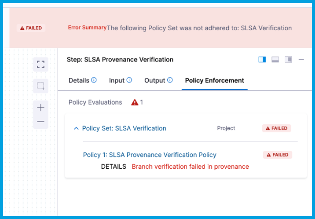

The SBOM, SLSA Provenance, attestations, and policy enforcement results generated by SSCA are stored in Harness or your container registry. This topic explains where to find this data.

## SBOM, SLSA Provenance, and attestations

When an SBOM or SLSA Provenance is generated, along with a signed attestation, in a Harness pipeline run, the signed attestation (which includes the SBOM or SLSA Provenance) is stored, as an `.att` file, in the artifact repository along with the image.

<!--  -->

<docimage path={require('./static/view-result-att-in-docker-hub.png')} />

On the **Execution details** page in Harness, you can view and download the SBOM from the **SBOM** column on the **Artifacts** tab.

<!--  -->

<docimage path={require('./static/view-result-sbom-artifact.png')} />

You can get the SLSA Provenance from the **Artifact Type** column on the **Artifacts** tab.

<!--  -->

<docimage path={require('./static/view-result-slsa-artifact.png')} />

:::tip

If your pipeline has multiple stages, the **Artifacts** tab is filtered by stage. Use the dropdown menu to select the relevant stage.

:::

## SSCA policy violations

If your pipeline included an **SSCA Enforcement** step, you can see the number of policy violations in the **Violations** column on the **Artifacts** tab.

<!--  -->

<docimage path={require('./static/view-result-policy-violations.png')} />

Select the number to inspect the details of the violations.

<!--  -->

<docimage path={require('./static/view-result-policy-violations-detail.png')} />

:::tip

If your pipeline has multiple stages, the **Artifacts** tab is filtered by stage. Use the dropdown menu to select the relevant stage.

:::

## SLSA verification results

In the **SLSA Verification** column on the **Artifacts** tab, you can see if the verification passed or failed.

<!--  -->

<docimage path={require('./static/view-result-slsa-verify-pass-fail.png')} />

:::tip

If your pipeline has multiple stages, the **Artifacts** tab is filtered by stage. Use the dropdown menu to select the relevant stage.

:::

To inspect which policies failed, select the **Pipeline** tab, select the **SLSA Verification** step, and then select the **Policy Enforcement** tab.

<!--  -->

<docimage path={require('./static/view-result-slsa-policy-violations.png')} />
