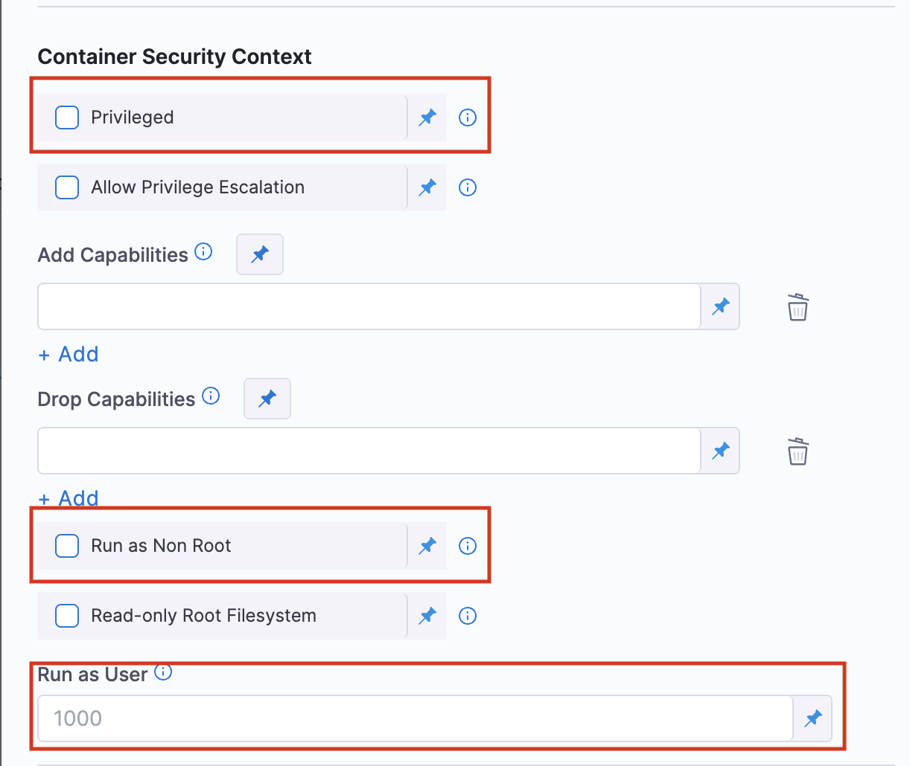

 The logic that Harness has in place to handle configuration collision between the privilege levels of step groups and its steps inside a containerized step group is flawed. The Run Step configuration runs into an unspecified behavior when the access configuration of a step group differs from the access configuration of steps inside it.

The logic has now been updated to reflect a more intuitive and secure access model. 

This KB article will go into detail on every upcoming behavior change from this update and how you could fix it if it caused one of your pipelines to fail. 

The new logic follows these steps:
1. Use the Run Step configuration.
2. If there isn’t a Run Step configuration, use the Step Group configuration.

Earlier, the second step was skipped, and instead defaulted to some unspecified behavior. 
The relevant fields are:
1. `Privileged` - Select this option to run the container with elevated privileges. Accepts boolean values. 
2. `Run as Non Root` - Select this option to mandate that the step group or step cannot be run as a root. Accepts boolean values. 
3. `Run as User` - A text box where you can define the Id of the user here. User 0 is the root user. Accepts integers.. 

The settings can be found in optional configuration of the step group or step as seen here: 

## Consider the following use cases to understand the new behavior:

### Case 1: 'Run as User' with 'Run as Non Root' set to False.
This use case looks at the `Run as User` setting and assumes a False value for `Run as Non Root` at the Step Group level. User 0 is the root user. 

#### Previous behavior:

|                              | Step Group (User 0) | Step Group (User 100) | Step Group (Nothing Specified) |
|------------------------------|---------------------|-----------------------|--------------------------------|
| Run Step (Nothing Specified) | User 0              | User 0                | User 0                         |

#### New behavior:
With the new logic in place, each step is properly using the inherited user from the step group. This means that some steps that were root user previously may not now run as root if your step group has nothing specified or the `Run as User` field set to anything other than 0. This loss of status can break pipelines that were relying on the higher level permissions.
 
|                              | Step Group (User 0) | Step Group (User 100) | Step Group (Nothing Specified) |
|------------------------------|---------------------|-----------------------|--------------------------------|
| Run Step (Nothing Specified) | User 0              | User 100              | Default user in the image      |

### Case 2: 'Run as User' with 'Run as Non Root' is true/checked.

This use case looks at the `Run as User` setting and assumes a True value for `Run as Non Root` at the Step Group level. User 0 is the root user.  

#### Previous behavior:

|                              | Step Group (User 0)                                                        | Step Group (User 100)                                                      | Step Group (Nothing Specified)                                             |
|------------------------------|----------------------------------------------------------------------------|----------------------------------------------------------------------------|----------------------------------------------------------------------------|
| Run Step (Nothing Specified) | Fail (Initialize step) Error: container's runAsUser breaks non-root policy | Fail (Initialize step) Error: container's runAsUser breaks non-root policy | Fail (Initialize step) Error: container's runAsUser breaks non-root policy |

 
#### New behavior:
Previously, the Run Step would default to User 0 if the `Run as User` field was left unspecified. This would cause the step to fail in every case where `Run as Non Root` was set to True in the Step Group since the Step would violate the Step Group’s non-root policy. Now, the user id will be properly inherited from the Step Group in cases where the Run Step user is unspecified and the Step Group is meaning there will be new successful pipelines where there were failures before. 
 
|                              | Step Group (User 0)                                                        | Step Group (User 100) | Step Group (Nothing Specified) |
|------------------------------|----------------------------------------------------------------------------|-----------------------|--------------------------------|
| Run Step (Nothing Specified) | Fail (Initialize step) Error: container's runAsUser breaks non-root policy | User 100              | Default user in the image      |

### Case 3: The 'Privileged; field is checked with a subset of Steps
The `Privileged` field interacts differently depending on which step is being used. For this case, we will look at the behavior changes for the following steps: 
- Git Clone Step 
- Background Step 
- Plugin Step 
- Run Step
- All 3 SSCA (Software Supply Chain Assurance) Steps

#### Previous Behavior:

| Level (Privileged field) | Step group (true) | Step group (false) | Step group ( ) |
|--------------------------|-------------------|--------------------|----------------|
| Step Level ()            | true              | true               | true           |

#### New Behavior:
The containers that were being run as privileged before can no longer have those permissions. This can cause pipelines to fail. Make sure that your step is privileged if your pipeline fails.

| Level (Privileged field) | Step group (true) | Step group (false) | Step group ( ) |
|--------------------------|-------------------|--------------------|----------------|
| Step Level ()            | true              | false              | false          |

### Case 4: The 'Privileged' field is checked
Outside the steps listed in case 3, this case describes the behavior if the `Privileged` field is checked.

#### Previous Behavior:

| Level (Privileged field) | Step group (true) | Step group (false) | Step group ( ) |
|--------------------------|-------------------|--------------------|----------------|
| Step Level ()            | false             | false              | false          |

#### New Behavior:
Previously, if a step had ‘Privileged’ unspecified (neither true nor false) then it would default to a value of ‘False’. Now, the field’s value is properly inherited from the Step Group, meaning some steps that were supposed to have privilege before now do. This may cause unexpected behavior in some containers if that status is unneeded.

| Level (Privileged field) | Step group (true) | Step group (false) | Step group ( ) |
|--------------------------|-------------------|--------------------|----------------|
| Step Level ()            | true              | false              | false          |