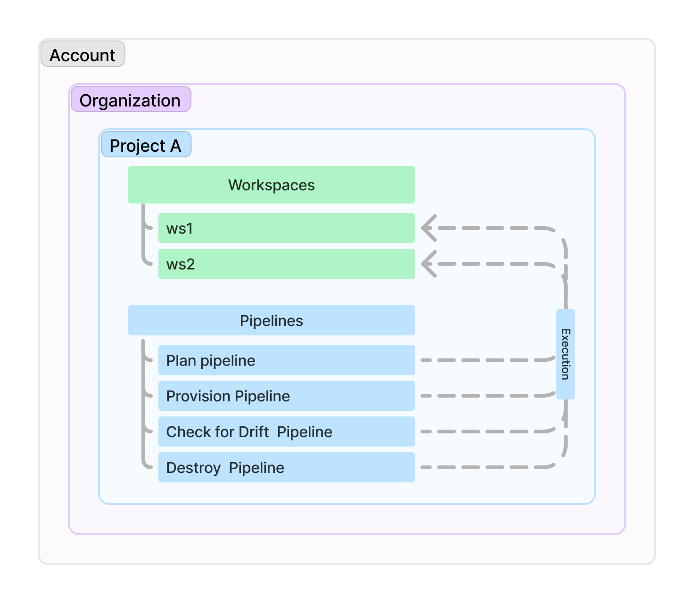

import HarnessApiData from '../../../src/components/HarnessApiData/index.tsx';

Harness Infrastructure as Code allows you to define, deploy, and manage infrastructure across environments, ensuring compliance and control. Key features include cost estimation, approval steps, PR automation, policy enforcement, and drift detection, which can integrate seamlessly with other Harness modules and third-party services, enhancing your DevOps lifecycle.

This document provides a set of best practices and guidelines aimed at helping teams implement and manage IaCM effectively. It serves as a reference to navigate the complexities of infrastructure management, offering clear, actionable recommendations to optimize performance, enhance security, and prevent common pitfalls.

## Workflow hierarchy

- **Account** is the root level, containing multiple Organizations.  
    - **Organizations** contain multiple Projects.  
        - **Projects** contain multiple Workspaces.  
            - **Workspaces** are isolated environments for IaC execution within a Project.
            - **Pipelines** are independent entities that can be executed against any Workspace within a Project.

### Supported IaC Frameworks
:::info opentofu / terraform
Harness IaCM currently supports integration with all **OpenTofu** versions<HarnessApiData
    query="https://app.harness.io/gateway/iacm/api/provisioners/supported/opentofu"
    token="process.env.HARNESS_GENERIC_READ_ONLY_KEY"
    fallback=""
    parse='.[-1] | " (latest: v\(.))"'></HarnessApiData>.
    
 For **Terraform**, we support all MPL versions up to **1.5.x**, any BSL versions (from 1.6.0) are not supported.
:::

### Configuration Guidelines

As a first step, we recommend configuring your Cloud Provider and Code repository **connectors** to help streamline further configurations like workspace and pipeline creation so they can be easily selected.  

Go to [What's supported](https://developer.harness.io/docs/infra-as-code-management/whats-supported#supported-workspace-connectors) to see what cloud provider and code repository vendors are supported by Harness. 

## Recommended Workflows and Performance Optimization
### Reusable components
For general use cases to reduce unnecessary complexity and to optimize performance, we encourage reuse wherever possible.

Some reusable options can be to:
- Create reusable pipelines and set them as default pipelines to trigger quickly from any workspace within a project.
- Use [pipeline variables](https://developer.harness.io/docs/infra-as-code-management/project-setup/input-variables) to ensure consistency.
- Use built-in plugins such as [drift detection](https://developer.harness.io/docs/infra-as-code-management/pipelines/operations/drift-detection), [PR automation](https://developer.harness.io/docs/infra-as-code-management/pipelines/operations/pr-automation) and [IaCM Approval steps](https://developer.harness.io/docs/infra-as-code-management/pipelines/iacm-plugins/approval-step).
- Utilize [built-in OPA policies](https://developer.harness.io/docs/infra-as-code-management/policies/terraform-plan-cost-policy) to add protection and ensure your pipelines warn or fail if certain conditions are not met, e.g. if your total monthly infrastructure costs exceed a specified amount.
<!-- placeholder for module registry -->
<!-- placeholder for workspace templates -->

### Trade-offs and considerations
Harness seamlessly integrates with third-party services like external code repositories and secret managers, providing flexibility in tool choice. However, using Harness’s native services like [Harness Code Repository](https://developer.harness.io/docs/code-repository/) and [Harness Secret Manager](https://developer.harness.io/docs/platform/secrets/secrets-management/harness-secret-manager-overview/) can offer key performance and operational benefits.

- **Reduced Latency:** Avoids external API calls, leading to faster execution and reduced overhead.
- **Simplified Authentication:** Minimizes multiple authentication mechanisms, reducing complexity and potential security risks.
- **Streamlined Management:** Centralizes configuration, simplifying updates and secret rotation.
- **Enhanced Visibility:** Provides a single point of control for auditing and policy enforcement.
- **Reduced Dependencies:** Lowers reliance on external services, increasing system resilience.

## Security
- **Access Controls:** [Role-based access control (RBAC)](https://developer.harness.io/docs/platform/role-based-access-control/rbac-in-harness/) lets you control who can access your resources and what actions they can perform on the resources. To do this, a Harness account administrator assigns resource-related permissions to members of user groups.
- **Secret Management:** Go to the [secret management page](https://developer.harness.io/docs/category/secrets-management) to see all supported secret management option available in the Harness Platform and determine what option is best suited for your needs. As mentioned above, Harness offer integration with multiple secret management options but recommend [Harness secret manager](https://developer.harness.io/docs/platform/secrets/secrets-management/harness-secret-manager-overview/) to help offer optimal performance.
- **OPA Policies:** Use [OPA policies](https://developer.harness.io/docs/platform/governance/policy-as-code/harness-governance-overview/) to implement governance and trigger pipeline warnings or failures when policy conditions are not met. 
- 

### State Management
- **Remote State Storage:** Use remote state backends like AWS S3, GCP Cloud Storage, or Azure Blob Storage for reliable and scalable state management. Ensure state files are stored securely and versioned to prevent accidental data loss or corruption. Go to [initialize remote backends](https://developer.harness.io/docs/infra-as-code-management/remote-backends/init-configuration) for more information.
- **State Locking and Security:** Implement state locking to prevent multiple users or processes from modifying the state simultaneously, reducing the risk of conflicting changes and state corruption. For example, tools like OpenTofu or Terraform provide native support for state locking, typically using a shared backend like a database or cloud storage service. This ensures that only one operation can modify the state at a time, protecting the integrity of your infrastructure configurations.

### Error Handling and Debugging
- **Common Errors:** Common IaCM errors include misconfigurations, authentication failures, and resource conflicts. To troubleshoot these, check the error messages in your pipeline execution logs, which provide detailed information about the cause and location of the issue.
- **Pipeline Execution Logs:** Utilize pipeline execution history to view detailed logs for each pipeline run. These logs capture step-by-step execution details, making it easier to identify and resolve issues.