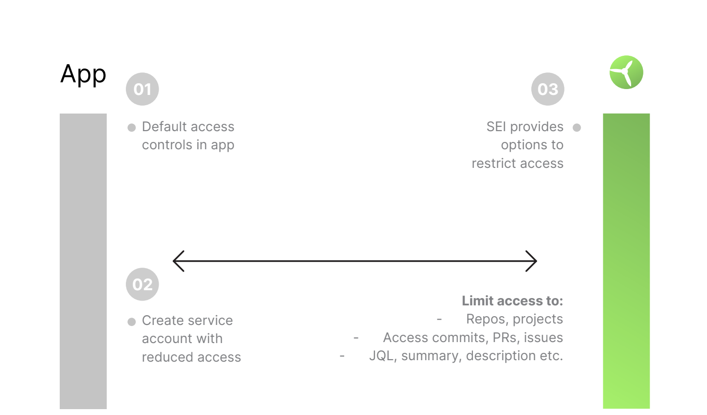

This topic outlines the architecture for the Harness Software Engineering Insights module, including its ingestion process and data flow across the integrations.

## Data flow architecture

* **Ingestion Satellite:** The SEI Ingestion Satellite connects outbound to on-premise systems like Jira and GitHub to fetch metadata through APIs. The authentication tokens used for these connections remain within the user's environment and are never exposed externally.
* **Outbound Data Flow:** The Ingestion Satellite establishes a secure outbound connection to the Harness SEI SaaS API, where it posts the collected metadata.
* **SaaS Connections:** Harness SEI connects directly to SaaS-based SDLC tools, such as Jira Cloud and GitHub Cloud, using APIs to pull metadata without requiring on-premise infrastructure.
* **Jenkins integration**: The Harness SEI Jenkins Plugin is installed on the user’s Jenkins server. This plugin securely connects outbound to the Harness SEI SaaS application, allowing licensed users to access the SEI UI portal via secure transport.

## Harness SEI architecture

The diagram illustrates the architecture of the Harness Software Engineering Insights (SEI) module on the Harness platform, providing an overview of its key components and how data flows through the system.

The Ingestion Satellite connects to external 3rd-party APIs (like Jira, GitHub) to pull metadata from on-premise systems and cloud services. The satellite sends the data through a gateway to the SEI backend in the Harness SaaS environment.

The backend processes data ingested from various sources and manages it through several internal services.

* **Ingestion:** At the heart of the ingestion process are the Ingestion Control Plane and Ingestion Agent. The Control Plane orchestrates the ingestion process, while the Agent handles raw data storage and connects to external systems using secrets (authentication credentials). The Ingestion DB stores metadata related to the ingestion process, such as cursors, results, errors, and the intermediate state.

* **Aggregations:** This service processes the ingested data to generate meaningful insights. It interacts with the Events API, which triggers actions and propels downstream processing, using event-based mechanisms.

* **Faceted Search and Storage:** Data is stored and made searchable using technologies like Elastic Search, supporting advanced querying and reporting.

* **Server API:** This API layer handles caching (via Redis) and serves as an intermediary between the data ingestion layer and the frontend services, ensuring efficient data retrieval.

[Propels](/docs/software-engineering-insights/sei-propels-scripts/propels-overview) in SEI are responsible for triggering workflows or processes based on the ingested data. 
These workflows could be part of larger processing pipelines, responding to various types of events.

The frontend for users is powered by a micro-frontend architecture that interacts with the backend services via the Access Control and Gateway.
Integration with tools like Slack or GitHub is handled via webhooks, which push real-time updates into the SEI system.
Ingested data flows through various components, including aggregation services, storage systems, and search mechanisms.
Insights and results are then made available to the frontend via APIs and are cached to improve performance.

## REST API Polling

* For on-premises applications, the SEI Ingestion Satellite installed within your environment connects to the API endpoints of the application.
* For SaaS applications, SEI directly connects to the cloud-based APIs.
* SEI works seamlessly with most applications using their basic/default permissions.

## Webhook based access

* Webhooks are used for forward-looking scans
* In some applications, Admin-level permissions may be required to configure webhook access.

## Authentication

## Data access control

