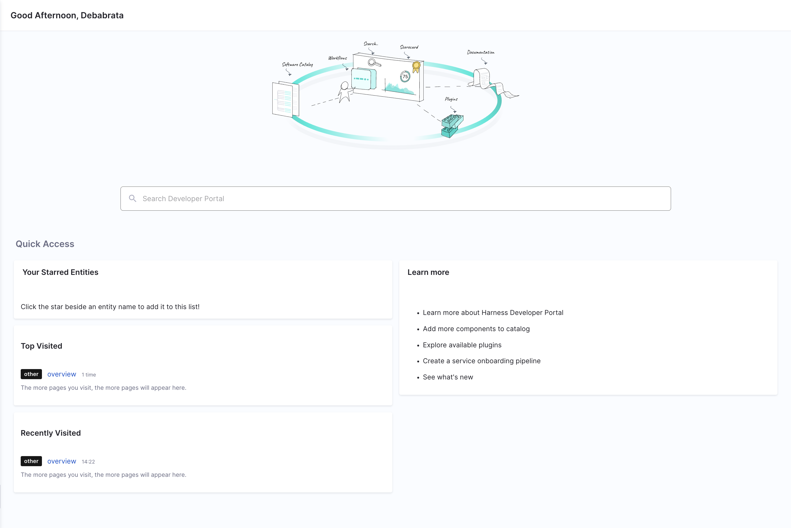
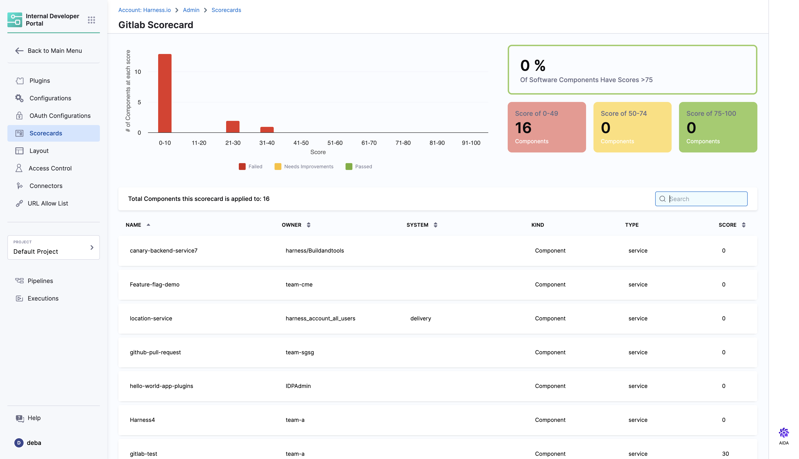
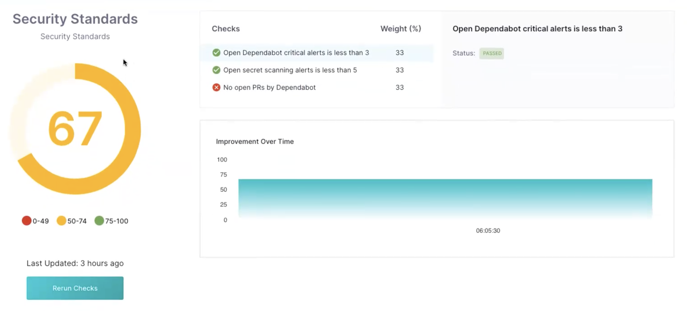

<DocsButton icon = "fa-solid fa-square-rss" text="Subscribe via RSS" link="/release-notes/internal-developer-portal/rss.xml" />

Review the notes below for details about recent changes to Harness Internal Developer Portal.

:::info About Harness Release Notes

* **Progressive deployment:** Harness deploys changes to Harness SaaS clusters on a progressive basis. This means that the features described in these release notes may not be immediately available in your cluster. To identify the cluster that hosts your account, go to your **Account Overview** page in Harness. In the new UI, go to **Account Settings**, **Account Details**, **General**, **Account Details**, and then **Platform Service Versions**.
* **Security advisories:** Harness publishes security advisories for every release. Go to the [Harness Trust Center](https://trust.harness.io/?itemUid=c41ff7d5-98e7-4d79-9594-fd8ef93a2838&source=documents_card) to request access to the security advisories.
* **More release notes:** Go to [Harness Release Notes](/release-notes) to explore all Harness release notes, including module, delegate, Self-Managed Enterprise Edition, and FirstGen release notes.

:::

## December 2023

### Version 0.17.0

<!-- Dec 21, 2023 -->

Jingle bells, jingle bells, jingle all the way to Harness IDP's End-of-Year Release! 🛷 As we close the chapter on a year of incredible milestones, we want to express our heartfelt thanks to our amazing customers and prospects. Your support, feedback, and enthusiasm have been the North Star 🌟 guiding us in enhancing and evolving Harness IDP. The debut of our new module and the strides we've made together are testaments to your invaluable collaboration and spirit.

In this release, we're excited to unveil features like the HTTP actions support in the scaffolder-backend 🌐, the innovative Developer Portal stage for seamless self-service flows 🚀, and the integration of OPA/Governance policies to ensure streamlined and secure management 🛡️. Plus, we've squashed some pesky bugs 🐛 to make your experience smoother than ever!

- **Docs:** [Supported Custom Actions](https://developer.harness.io/docs/internal-developer-portal/flows/custom-actions), [Supported OPA Policies in IDP](/docs/internal-developer-portal/scorecards/opa-implementation), [New IDP Stage](https://developer.harness.io/docs/internal-developer-portal/flows/idp-stage)

- **Tutorial:** [Harness Policy As Code for Services using Scorecards](/tutorials/internal-developer-portal/opa-scorecards)

#### Early access features

- Added a [new stage](/docs/internal-developer-portal/flows/idp-stage), specifically for IDP, knows as Developer Portal to help with the self service flows (presently this feature is behind a Feature Flag) [IDP-1425]


- Added a [Cookiecutter step](https://developer.harness.io/docs/internal-developer-portal/flows/idp-stage#2-cookiecutter) to enable use of cookiecutter based templates in the IDP stage.[IDP-1437]
- Added a [step](https://developer.harness.io/docs/internal-developer-portal/flows/idp-stage#6-register-catalog) to register software components in IDP catalog.[IDP-1438]
- Added a [step](https://developer.harness.io/docs/internal-developer-portal/flows/idp-stage#3-create-repo) to create a repository in your git provider and push contents along with catalog-info.yaml. [IDP-1436]

This feature is behind the feature flag `IDP_ENABLE_STAGE`, also has dependency on other services which might delay it's releases untill those services are on their latest release. To enable the feature, contact [Harness Support](mailto:support@harness.io).

#### New features and enhancements

- Added support for [http actions](https://roadie.io/backstage/plugins/scaffolder-http-requests/) in the scaffolder-backend.  [IDP-1853]. 
- Added [OPA/Governance policies](/docs/internal-developer-portal/scorecards/opa-implementation) for Backstage entities. [IDP-1514]

#### Bug Fixes

- Fixed support for special character “-”(hyphen) in the URLs.[IDP-1804]
- Fixed URL replace in JIRA Plugin to fetch host details.[IDP-1863]
- Fixed display of Secret deleted error message added on OAuth Page. [IDP-1811]

### Version 0.16.0

<!-- Dec 8, 2023 -->

🌟 "Ho, ho, ho! Santa's elves aren't the only ones delivering gifts this season! 🎅 In our latest release, we're decking the IDP with some shiny new home page and jolly additions to our scorecards. 

- **Blogs:** [Harness SRM Plugin - Release Announcement](https://www.harness.io/blog/announcing-the-harness-srm-backstage-plugin)
- **Docs:** [Key Concepts](https://developer.harness.io/docs/internal-developer-portal/key-concepts)
- **Tutorial:** [How to track migrations using Scorecards](https://developer.harness.io/tutorials/internal-developer-portal/how-to-track-migrations)

#### New features and enhancements

- New Plugin support added for [Dynatrace Plugin](https://developer.harness.io/docs/internal-developer-portal/plugins/available-plugins/dynatrace) [IDP-1759]
- New intuitive Homepage with added [Home Plugin](https://backstage.spotify.com/marketplace/spotify/plugin/home/) support [IDP-1694].



- New Parser for file contents of git providers(GitLab and Bitbucket) to support new data points in git-providers datasource. [IDP-1691]
- New data points added to extract, filter and match file contents in git providers data sources.[IDP-1682]

#### Fixed Issues

- Fixed data non-availability in Bar charts for single-component scorecards.[IDP-1698]

## November 2023

### Version 0.15.0

<!-- Nov 23, 2023 -->

Since last release, we have released some interesting docs and video tutorials to help you get started with Harness IDP:

- **Video Tutorial:** [How to use self-service-onboarding](https://youtu.be/0GoK3SD1rxs?si=1Z28hvZ9nihYtdmL), [How to register your software components in Software Catalog](https://youtu.be/YgtIMDGMzJE?si=wiFzozj8Zo9dEEOF)
- **Tutorial:** [How to add API docs in Harness IDP](https://developer.harness.io/docs/internal-developer-portal/get-started/add-api-docs)
- **Docs:** [Software System Model](https://developer.harness.io/docs/internal-developer-portal/get-started/system-model), [API Spec Reference](https://developer.harness.io/docs/internal-developer-portal/features/api-reference)

#### New features and enhancements

- We have added a new overview page for [Scorecards](https://developer.harness.io/docs/internal-developer-portal/features/scorecard#scorecard-overview-page) and [Individual checks](https://developer.harness.io/docs/internal-developer-portal/features/checks-datasources#checks-overview) in the scorecards.[IDP-1480] [IDP-1481]

 
 

- The new overview pages for Scorecards and Checks have API support added to it.[IDP-1482]
- Added support for two new Plugins [OpsGenie](https://developer.harness.io/docs/internal-developer-portal/plugins/available-plugins/opsgenie) and [Datadog](https://developer.harness.io/docs/internal-developer-portal/plugins/available-plugins/datadog) Plugin.[IDP-1662] [IDP-1351]
- We have released a new [Harness Service Reliability Backstage Plugin](https://developer.harness.io/docs/internal-developer-portal/plugins/available-plugins/harness-srm), that tracks the SLOs and Error Budgets for monitored services in Harness SRM module

#### Fixed Issues

- Improved error scenario Handling in HarnessProcessor, with removal of irrelevant raw error metadata. [IDP-1663]
- Resolved the error related to creation of a new check having the same name as a deleted check. [IDP-1450]


### Version 0.14.0

<!-- Nov 7, 2023 -->

[Backstagecon](https://events.linuxfoundation.org/kubecon-cloudnativecon-north-america/co-located-events/backstagecon/) & Kubecon is round the corner, consider catching up with Harness' team in the event at **Booth B15**. Also here’s a [sneak peak](https://www.harness.io/blog/road-to-backstagecon-2023-a-sneak-peek-into-an-exciting-lineup-a-recap-of-2022) of what’s happening in this year's edition of the event. Here’s some of the content updates.

- **Himanshu’s(Product Manager for IDP) Backstagecon Talk:** [What Does Backstage Really Offer?](https://www.youtube.com/watch?v=4FTkeJY2Hcc)
- **Docs:** [Updated Onboarding Guide](https://developer.harness.io/docs/internal-developer-portal/get-started/onboarding-guide/), [Public API](https://developer.harness.io/docs/internal-developer-portal/public-api) 
- **Tutorial:** [How to add Links in Software Components](https://developer.harness.io/tutorials/internal-developer-portal/add-links-in-components) 

#### New features and enhancements

- We've introduced more explicit error messages when removing secrets to ensure users are fully aware and cautious of this action. [IDP-1520] 
- Backstage, powering the IDP platform has been upgraded to v1.17, take a look at the [release notes](https://backstage.io/docs/releases/v1.17.0) to find out the updates in this version.[IDP-1179]

#### Fixed Issues

- Fixed text overflows on the “Create Scorecards” page. [IDP-1417]
- Fixed page navigation for IDP get-started page by adding the exit icon. [IDP-1524]

## October 2023

### Version 0.13.0

<!-- Oct 26, 2023 -->

Post-public preview, we've taken your genius tips and mixed them into the Internal Developer Portal. Also, we've fixed a few bugs along the way. Dive in and see what's new! But before that here are some links of recently released tutorials and docs to help you get started with IDP. 

- **Blogs:** [Got Monorepos Instead of Microservices? This is How Harness IDP Has Got You Covered](https://www.harness.io/blog/mono-repos-harness-idp)
- **Video Tutorial:** [Scorecards](https://youtu.be/jvLDdWS3rFE?si=EBoE9TXh4HCVNU3i) 
- **Tutorial:** [How to register Software Components in Catalog](https://developer.harness.io/tutorials/internal-developer-portal/register-component-in-catalog)
- **Docs:** [Scorecards](https://developer.harness.io/docs/internal-developer-portal/features/scorecard) and [Data Sources](https://developer.harness.io/docs/internal-developer-portal/features/checks-datasources) 

#### New features and enhancements

- Scorecards now support additional data points for GitHub data source, to support advanced GitHub Security features and GitHub Actions [IDP-1408]
  - Advanced GitHub Security
      - Open Dependabot Pull Requests
      - Code Scanning 
      - Security Scanning

  
    
  - GitHub Actions
      - Workflow Count
      - Successful Workflows
      - Time to complete Workflows
  - Other
      - Number of open pull requests by author

- Improved Error message for DSL response to handle multiple input values [IDP-1410]


#### Fixed Issues

- Fixed connector selection issue in the onboarding wizard. [IDP-1363]
- Fixed the Operator for Jira Default Expression as `jira.issuesCount > 5` in Jira Plugin.[IDP-1357]
- Fixed Datapoint identifier mismatch[IDP-1152]

### Version 0.12.0

<!-- Oct 16, 2023 -->

IDP has now graduated from Beta. During [Unscripted](https://www.unscriptedconf.io/) in September, we made a series of announcements. Here are some quick links for your recap.

- [Launch Demo in Keynote](https://youtu.be/6OuK_sl3mLE?feature=shared&t=2065) by Jyoti Bansal and Eric Minick.
- [Platform Engineering Demo](https://youtu.be/c04F98kS96U?feature=shared&t=534) by Alex Valentine.
- [Announcement Blog Post](https://www.harness.io/blog/internal-developer-portal-public-preview) by Himanshu Mishra. 

#### New features and enhancements

- Scorecards are now launched for everyone. It contains several data sources and data points within the framework. There are default checks for you to use. You can create custom checks as well. [Read more](https://developer.harness.io/docs/internal-developer-portal/features/scorecard), Watch this [video tutorial](https://youtu.be/jvLDdWS3rFE?feature=shared) to know more.
- Backstage is now upgraded to [v1.16](https://backstage.io/docs/releases/v1.16.0). 
- [EntityRelationWarning](https://backstage.io/docs/reference/plugin-catalog.entityrelationwarning) is now available to be used in Layout. You can add this in your layout so that a warning alert is displayed if the entity has relations to other entities, which don't exist in the catalog. See **example**. [IDP-993]

```yaml
contents:
  - component: EntityRelationWarning
```

- New Plugins support available in IDP
  - Grafana - Associate alerts and dashboards to components. Read more [here](https://developer.harness.io/docs/internal-developer-portal/plugins/available-plugins/grafana) [IDP-915]
  - SonarQube - Components to display code quality metrics from SonarCloud and SonarQube. Read more [here](https://developer.harness.io/docs/internal-developer-portal/plugins/available-plugins/sonarqube) [IDP-1249]
- Every plugin page now has a plugin docs available. [IDP-923]

#### Fixed Issues

- Improved Error message when pipeline is configured wrong in IDP Software Templates. [IDP-1230]

## September 2023

### Version 0.8.0

<!-- Sept 25, 2023 -->

#### New features and enhancements

- IDP now includes the [GitHub Catalog Discovery](/docs/internal-developer-portal/plugins/available-plugins/github-catalog-discovery) plugin. You can use this to automatically discover `catalog-info.yaml` files from your GitHub organizations and repositories. [IDP-887]

- The following UI pickers are now available for use in software templates:
  - `HarnessOrgPicker`
  - `HarnessProjectPicker` 
  
  You can use these UI pickers in service onboarding workflows for developers to easily select a Harness project and organization. Take a look at this [example](https://github.com/bhavya-sinha/scaffolder-sample-templates/blob/5f52718ec49cb2c27a87e2fbeae075873701911c/fieldExtension.yaml#L78-L85). [IDP-868]

## July 2023

### Version 0.7.0

<!-- July 27, 2023 -->

#### What's new

- IDP now includes the Confluence search plugin to include results from Confluence spaces. To learn more, go to the [plugin documentation](/docs/internal-developer-portal/plugins/available-plugins/confluence). (IDP-845)
- The `harness:create-secret` and `harness:delete-secret` template actions are now available for use in IDP software templates. You can use these actions to receive a secret from a developer, create a Harness secret, and then use it as a pipeline variable to provide runtime input. For more information, go to the [tutorial](/tutorials/internal-developer-portal/using-secret-as-an-input) (IDP-780)
- The interval at which IDP polls Git repositories associated with the software catalog has increased from 5 minutes to 15 minutes. (IDP-749)

#### Fixed issues

- When you used a delegate to connect to a Git provider, the Docs tab failed to load, and the following message was displayed: `Failed to build the docs page: TAR_BAD_ARCHIVE: Unrecognized archive format`. (IDP-687)

  This issue is now fixed.

- If you used a GitHub connector that used a Github App for API authentication and if the private key was a text secret, the catalog import in IDP failed. The failure was caused by Harness Secrets Manager not storing the specified private key with line breaks, which IDP expects along with proper indentation. (IDP-850, ZD-47845)

  Harness Secrets Manager now formats text secrets properly for text secrets used with IDP.

### Version 0.6.0

<!-- July 12, 2023 -->

#### What's new

- You can now access IDP catalog APIs by using the Harness X-API-Key. For more information, go to [API access](/docs/internal-developer-portal/catalog/software-catalog#api-access). (IDP-768)
- A newer version of the Harness CI/CD plugin has been added with new annotations support. It's now possible to filter pipelines across projects and orgs. For more information, go to the [plugin's readme](https://github.com/harness/backstage-plugins/tree/main/plugins/harness-ci-cd). (IDP-758)
- The Harness Feature Flags [plugin](https://github.com/harness/backstage-plugins/tree/main/plugins/harness-feature-flags) is now available in IDP. (IDP-778)
- The `trigger:harness-custom-pipeline` action on the software template `template.yaml` is now synchronous with pipeline execution. The action keeps running during pipeline execution, and it shows the current status of the pipeline.
- Since the `trigger:harness-custom-pipeline` is now synchronous, you can use the `catalog:register` action in a template and register the newly generated software component's `catalog-info.yaml`.

#### Fixed issues

- Fixed a bug with access control around de-registering a software component. (IDP-757)

## June 2023

### Version 0.5.0

#### What's new

- The Backstage version has been upgraded to [1.14](https://backstage.io/docs/releases/v1.14.0). (IDP-632)
- The following GitHub-based plugins are now available in IDP:
  - [GitHub Actions](https://github.com/backstage/backstage/tree/master/plugins/github-actions)
  - [GitHub Insights](https://github.com/RoadieHQ/roadie-backstage-plugins/tree/main/plugins/frontend/backstage-plugin-github-insights)
  - [GitHub Pull Requests](https://github.com/RoadieHQ/roadie-backstage-plugins/tree/main/plugins/frontend/backstage-plugin-github-pull-requests).
- IDP now includes support for GitHub and Google OAuth applications. You can configure a GitHub or Google OAuth application in the IDP Admin view. These applications are used by the GitHub-based plugins to use the logged-in user's credentials when making API requests. (IDP-676, IDP-661, IDP-647)
- IDP now supports a URL allowlist. If the `catalog-info.yaml` references API definitions that are hosted on a provider other than your Git provider, add the URL to the allowlist. (IDP-648)

#### Fixed issues

- Improvements have been made to reduce the time required for onboarding to the IDP module. (IDP-649)

