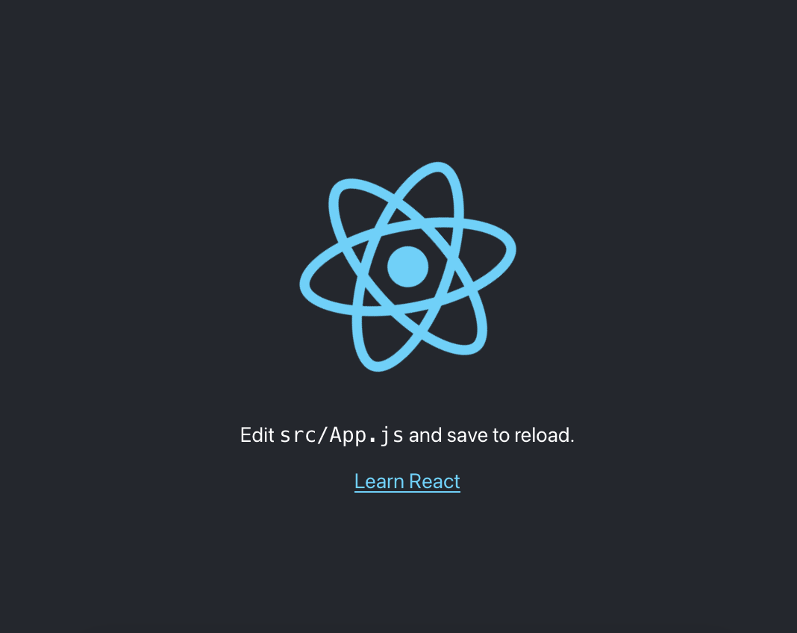

# Demystifying Trunk-Based Development

## What is Trunk-Based Development?

Trunk-based development or TBD is one of a few different branching strategies that your team, or even you can use to bring features in quickly to the main branch of your workflow. When we talk or think about branching strategies, the first one that comes to mind is the GitFlow. GitFlow definitely has its place in the creation of software.‍

In order for your team to run like a well oiled machine, having a branching strategy at the forefront of your development practices will be key to getting code quickly out the door. All branching strategies can achieve that, but TBD, will give you that extra leverage without merge hell. We all love merge hell don’t we lol?‍

By now I am sure we have all heard the term “merge hell” and one of the catalysts for that is what I call the “rebase race”. Hurrying up to rebase changes that are pulled in from main in order to get your changes merged in, and fingers crossed nothing breaks. We have ALL been there. It isn’t fun. Another benefit of TBD is avoiding merge hell with small commits to the main branch.

## Implementing TBD in a React app (without feature flags)

Follow along with this tutorial and learn how to implenent TBD in a React app. There will be a follow up tutorial on implementing TBD with Feature Flags in a React app.

Let's start off by creating a React app. We are going to setup a project with [Create React App](https://create-react-app.dev/docs/getting-started) using `npx`&nbsp;.

1. First open a new terminal and navigate to the directory you want the project to live. Than run this command to spin up a new React project, `npx create-react-app new-proj` . You can replace `new-proj` with whatever the name of your app will be

2. You will want to change directories into your new project using `cd new-proj`

3. Now, kick off your project using `npm start` . Your project will most likely spin up in `localhost:3000` but if you have another project running on that port, your terminal will prompt you to run it elsewhere, most likely in `3001` if you want. You can always shut down whatever is running in `3000` and run it from there

4. Opening `localhost` should look like below



5. Open up your project in your editor of choice, mine is [VS Code](https://code.visualstudio.com/)

6. Create a branch off of main (trunk) and name it whatever you like. I prefer to always use the 'lastname/tasknumber-feature' convention. For me, the branch would look like this `demars/adds-name-link`

- Create a branch like this `git checkout -b branch-name` . **_You will notice in your terminal that you are now inside your branch to start working_**

7. Make changes however you see fit, they can be big, they can be small. If you are just starting off, edit the `App.js` file. I made these changes in mine:

```jsx
<p>
  Trunk-Based Development Demo for my friends!
</p>
<a
  className="App-link"
  href="https://harness.io"
  target="_blank"
  rel="noopener noreferrer"
>
  Head over to Harness's Website to learn more about Feature Flags!
</a>
```

8. Before you run any git commands, run `git init` to initialize your repo. Once you do this you can start tracking changes (adding, committing, pulling, pulling, etc.)

9. You can now add, commit, and run a status on your files and directories. I encourage the use of `git status` all the time to make sure you know exactly what is happening in your project

10. Run a `git status` to check you work. If all looks good, run `git add` than `git commit -m "initial commit"` . I choose "initial commit" for that very first commit, than for every commit message after that I keep it short and concise with present tense. Instead of "added this copy", it would be "adds this copy"

> **<mark>This branch isn’t going to be long lived. Once you are done with your feature, that can even be behind a feature flag, make sure to submit a PR and get it merged in!</mark>**

> <mark>You can use feature flags to hide any features you are working on but also keep moving that branch back into main to relieve the headaches of merge hell. Throughout the course of the development process, the branch should look like this visually.</mark>


You can see that the branches are small and are merged right back into main once the PR has been reviewed in merged. The branches shouldn't live longer than two days in my opinion.

Even if you haven't finished your work, this is where feature flags come into play. Hide the feature so when/if the main gets deployed, no one can see your hanges. You want to keep these branches short lived to avoid merge hell.

## Trunk-based development best practices

There are a lot of best practices and pros when using trunk-based development as your branching strategy. Below I have listed out some of the important ones.

- Merge hell becomes almost non-existent
- Pulling in code from main should be 1:1 with your branch, or very close to it
- Removing the rebase race from long lived branches being merged in with older code
- Short lived branches
- The main branch is always the source of truth

Go forth and keep hacking!
